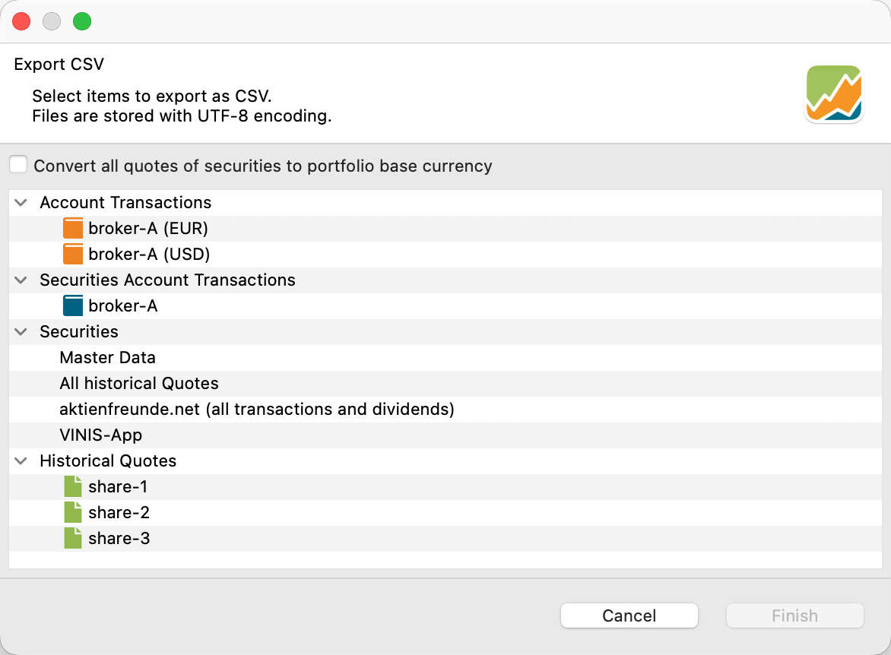

菜单 `文件 > 导出` 只有三个选项：`CSV 文件（逗号分隔值）`、`Portfolio Performance XML` 与 `导出类别`。

## CSV 文件（逗号分隔值） {#csv-files-comma-separated-values}

选择 `CSV 文件` 选项会展开一个附加面板，用于指定要导出的信息类型。导出的 CSV 文件采用 UTF-8 编码，这是一种通用且广泛使用的将文本转换为字节的方法。该编码可以表示 Unicode 标准中的任何字符，涵盖来自各种语言与文字的 140,000 多个字符。编码的重要性在导入 CSV 文件时显现出来。多数程序（如 Excel）都能准确识别该编码。但对于 PP 的导入功能而言，选对编码至关重要。


图： 从 demo-portfolio-04.xml 导出 CSV 文件的对话框。{pp-figure}




如图 1 所示，其中有两个现金账户（EUR 与 USD）和一个证券账户（broker-A）。USD 现金账户用于以 USD 表示的 share-3。

如果你持有与投资组合基准货币不同货币的证券（如图 1 中的情形），可以勾选 `将所有报价的货币转换为投资组合的基准货币`，把历史报价换算为基准货币。请注意，该选项不会换算可能以其他货币表示的买价、费用等内容。

### 账户账目 {#account-transactions}

对每个*现金*账户，你可以导出全部账目（买入、卖出、存款等）。每笔账目会导出以下字段：`Date, Type, Value, Transaction Currency, Taxes, Shares, ISIN, WKN, Ticker Symbol, Security Name` 与 `Note`。

*不*可能选择多个账户。

### 证券账户账目 {#securities-account-transactions}

证券账户只导出买入与卖出账目，*不*含股息。导出的字段为：`Date, Type, Value, Transaction Currency, Gross Amount	Currency, Gross Amount, Exchange Rate, Fees, Taxes, Shares, ISIN, WKN, Ticker Symbol, Security Name` 与 `Note.` 遗憾的是，日期中包含账目的具体时刻（如 2021-01-15T00:00），在 Excel 中它会成为一个文本字段。你可以在 Excel 中创建自定义日期格式来处理这类日期。

### 证券 {#securities}

- 主要信息：对投资组合中的每项证券，导出以下字段：`ISIN, WKN, Ticker Symbol, Security Name, Currency` 与 `Note`。

- 全部历史报价：所有历史报价按证券分列组织，以股票代码作为列标题。每一个含有历史报价的日期对应一行，相应价格填入相关列。若某项证券在某一天没有记录价格，对应的单元格则留空。

- 全部账目与股息：借助该选项，你可以导出全部买入、卖出与股息账目。导出的字段为（德文）：Datum、ISIN、Name、Typ、Transaktion、Preis、Anzahl、Kommission 与 Steuern。日期格式不含具体时刻。

- VINIS-App：VINIS 应用是一款面向 iPhone 与 Apple Watch 的移动应用，帮助用户设定、追踪并实现财务目标。该应用允许用户创建自定义目标与关键指标，并将其关联到 Google Sheets、Excel 或 Numbers 文档等外部数据源。应用还提供可视化、预测与提醒功能，帮助用户监控进展。导出的字段为：Funds sum、Securities purchase price、Securities market price、Total assets purchase price、Total assets market price、Earnings current year、Earnings last year、Earnings total、Capital gains current year、Capital gains last year、Capital gains total、Realized capital gains current year、Realized capital gains last year、Realized capital gains total。

### 历史报价 {#historical-quotes}

与前文"全部历史报价"的说明类似，导出内容包含所选证券的全部可用价格。导出的数据包含两个字段：`Date`（不含具体时刻）与 `Quote`。


## Portfolio Performance XML {#portfolio-performance-xml}

该命令等同于[文件 > 保存](save.md)命令，或带 XML 选项的 `文件 > 另存为` 菜单命令。

## 导出类别 {#export-taxonomy}

借助该命令，你可以把投资组合中所有可用的类别导出为一个 JSON 文件。该 JSON 文件定义了金融工具是如何分组与分类的。在来自 [demo-project-04.xml](../../assets/portfolios/demo-portfolio-04.xml) 的这个示例中，类别名为 `My Taxonomy`，它把持仓分为两类：`EUR` 与 `Non-EUR`。每一项投资或账户（如 `share-1`、`share-3` 或 `broker-A`）都被列出并归入其中一类。部分投资还带有股票代码，因而可以被清楚识别。百分比（此处为 100%）表示该项投资完全属于该类别。

``` json
    [
        {
            "name": "My Taxonomy",
            "color": "#8de0c2",
            "categories": [
            {
                "name": "EUR",
                "color": "#ada2b4"
            },
            {
                "name": "Non-EUR",
                "color": "#95c387"
            }
            ],
            "instruments": [
            {
                "identifiers": {
                "name": "share-1",
                "ticker": "DTE.DE"
                },
                "categories": [
                {
                    "path": [
                    "EUR"
                    ],
                    "weight": 100.0
                }
                ]
            },
            {
                "identifiers": {
                "name": "share-2",
                "ticker": "TMV.DE"
                },
                "categories": [
                {
                    "path": [
                    "EUR"
                    ],
                    "weight": 100.0
                }
                ]
            },
            {
                "identifiers": {
                "name": "broker-A (EUR)"
                },
                "categories": [
                {
                    "path": [
                    "EUR"
                    ],
                    "weight": 100.0
                }
                ]
            },
            {
                "identifiers": {
                "name": "share-3",
                "ticker": "ADBE"
                },
                "categories": [
                {
                    "path": [
                    "Non-EUR"
                    ],
                    "weight": 100.0
                }
                ]
            },
            {
                "identifiers": {
                "name": "broker-A (USD)"
                },
                "categories": [
                {
                    "path": [
                    "Non-EUR"
                    ],
                    "weight": 100.0
                }
                ]
            }
            ]
        }
    ]
```