# 导入 CSV 文件 {#importing-a-csv-file}

PortfolioPerformance 使用一个向导来引导你完成导入过程，共分三步。每一步你都需要提供额外信息。

**第 1 步**。首先，转到菜单 `文件 > 导入 > CSV 文件（逗号分隔值）`。浏览到相应文件夹并选择所需的 CSV 文件。默认情况下，文件类型筛选器只显示扩展名为 `.csv` 的文件。若要查看所有文件类型，请从下拉菜单中选择 `全部文件 (*.*)`。你也可以使用快捷键 `Cmd + I`（Windows 上为 `Ctrl + I`），再按字母 `C`。

CSV 文件本质上是一个纯文本文件。第一行通常包含字段（列）名称，以逗号之类的分隔符隔开。其后的各行是数据，同样以相同的分隔符隔开。所需字段及其格式取决于所执行的导入类型。列标题可以自由选取，但建议与 PortfolioPerformance 的字段名称保持一致，以简化映射过程（即把每一列与 PortfolioPerformance 中对应的字段关联起来）。

表 1 中所示的示例 CSV 文件包含五个字段（列）与三行数据，可用于把证券导入你的投资组合。

*表 1：导入证券的源数据示例。*
```
Ticker Symbol; ISIN; Security Name; Currency; Info
BAS; DE000BASF111; BASF; ; XETRA
NVDA; ; NVIDIA; USD; NASDAQ
```

在此示例中，字段分隔符使用了分号（`;`）。在欧洲，数字通常以逗号作小数分隔符书写；因此该 CSV 文件使用分号作为标记。请注意，NVIDIA 股票的 ISIN 并未提供。该文件在 Excel 中创建，并以 UTF-8 编码保存。不过，任何电子表格或文本编辑程序都可以用来创建这样的文件。值得注意的是，`.csv` 扩展名并非必需。只要把文件类型筛选器设为 `全部文件 (*.*)`，且布局符合表 1 所示的结构，PortfolioPerformance 同样可以读取纯文本文件。

在向导的**第 2 步**中，你需要提供额外信息，以便正确读取该 CSV 文件（见图 1）。

图： 提供关于 CSV 文件的额外信息。{class=pp-figure}

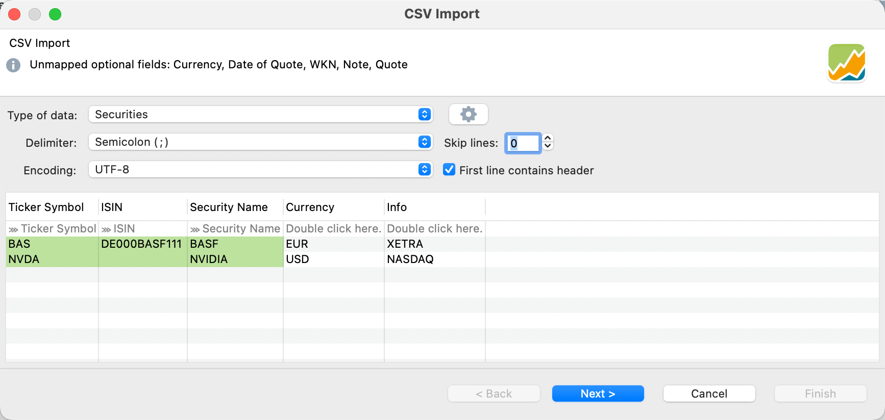

- *信息栏*：额外信息显示在顶部的信息栏中。例如，它可能列出 CSV 文件中未提供的可选字段。

    !!! Note
        虽然 CSV 文件中提供了 `Currency` 字段，但它似乎未被 PortfolioPerformance 识别。

- *数据类型*：PortfolioPerformance 区分 5 种导入类型：`账户账目`、`投资组合账目`、`证券`、`历史报价` 与 `证券账户`（见图 1）。这些模板下文会详细讨论。点击下拉列表选择合适的类型。

- *分隔符*：PortfolioPerformance 很可能已经选中了正确的分隔符；在表 1 的情形下是分号。不过，你也可以手动设置为其他分隔符，例如逗号、分号或制表符。

- *编码*：输出表格中有时会出现"奇怪"的字符，这表明所选编码与源文件编码不匹配。可能的选择有很多，正确的选择取决于创建该文件所用的程序。`UTF-8` 或 `Windows-1250` 通常是合适的选择。

- *忽略行*：你的 CSV 文件开头可能包含无关信息，例如额外的标题或元数据。使用该选项可指定在文件开头要忽略的行数。

- *首行为表头*：如果你的 CSV 第一行包含字段标签（如同表 1），请启用该选项。

- *带映射字段的预览表*：PortfolioPerformance 需要从 CSV 中确定与其内部字段相对应的列。如果 PortfolioPerformance 识别出了某个字段，preview 表格第二行会显示 `>>> '字段'` 提示；否则会显示 `请双击此处。`（见图 1）。要把某一列与 PortfolioPerformance 的内部字段关联起来，请双击第二行，然后从可用字段中选择。如果不想关联某个字段，请选择 `---` 选项。PortfolioPerformance 随后会忽略这一列。要更改某一列的格式（例如某个日期列的日期格式），请双击第二行中的列名。

- *保存配置*（齿轮图标）：要保存当前映射，请点击"数据类型"右侧的齿轮图标。此时会显示一份 `内置配置` 列表，例如 comDirect、Consorsbank 等。使用 `保存当前配置` 选项可把你当前的映射配置保存为自定义模板。该模板会出现在 `用户专有配置` 之下。你可以删除、导出与导入配置。导出功能使用 JSON 格式。

**第 3 步**因所选导入类型而异，并且可能包含多个子步骤。例如，导入历史报价时只有一个额外步骤（提供证券名称以关联历史价格）。对于其他所有导入类型，你都必须指定多项额外细节，例如证券账户与现金账户。

### 1. 证券导入 {#1-securities-import}

使用该类型可从 CSV 文件创建新证券。你可以导入八个字段（见表 2）。没有必填字段；***但是***至少要存在一个可标识字段。如果 `ISIN`、`Ticker Symbol`、`WKN` 与 `Security Name` 都不包含在内，则该行会因错误而被拒绝。这些术语的含义请参见[术语表](../../../concepts/portfolio-performance-terminology.md)。

*表 2：证券类型导入的可用字段（取值见表 1）*
```
| Field Name      | Required | Row 1 CSV      | Row 2 CSV |
|-----------------|----------|----------------|-----------|
| Ticker Symbol   |    N     | BAS            | NVDA      |
| ISIN            |    N     | DE000BASF111   | --        |
| Security Name   |    N     | BASF           | NVIDIA    |
| WKN             |    N     | --             | --        |
| Currency        |    N     | --             | USD       |
| Note            |    N     | XETRA          | NASDAQ    |
| Date (of Quote) |    N     | --             | --        |
| Quote           |    N     | --             | --        |
```

若要导入示例数据中的第 3、4 列，可以使用表 1 中的 CSV 文件。请注意，表 2 中的所有字段并未都包含在该 CSV 文件中；例如 `Date` 与 `Quote` 字段就不在其中。`WKN` 字段包含在 CSV 文件中，但对两个待导入的证券都没有取值。字段的导入顺序无关紧要，且导入顺序与表 1 中所示的并不相同。

如图 2 所示，将有两项证券被加入投资组合，即 BASF 与 NVIDIA。前三个字段被正确识别。`Currency` 与 `Info` 字段未被自动识别，需要双击第二行并选择正确的标签（即 `Currency`（原文如此）与 `Note`）来做映射。虽然 BASF 证券在 XETRA 交易（如 `BAS.DE`），CSV 文件中的股票代码却未反映这一点。第二项证券（NVIDIA，在 NASDAQ 交易）的 ISIN 代码在 CSV 文件中不可得。另请注意，NVIDIA 股票以 USD 交易。BASF 股票的货币并未提供，因此使用投资组合的基准货币（EUR）。导入该 CSV 文件时会显示图 2 与图 3 所示的对话框。

图： 导入证券（第 3-1 步）。{class=pp-figure}


在**第 3-2 步**（下图）中，可以看到两项证券的状态都标有绿色对勾，表明导入过程已就绪并将顺利完成。如果某项证券已存在于投资组合中，则不会出现绿色对勾。在这一步中，你还可以指定该证券所关联的现金账户与证券账户。点击**完成**以最终完成导入过程。

!!! Note
    通过顶部面板，可以为该 CSV 文件的所有导入行统一设置现金账户与证券账户；见图 3。你也可以把这项信息作为 CSV 文件的一部分提供（加入 Account 与 Securities account 两列）。还可以通过右键菜单设置账户：在表格预览中右击某一行，选择相应的账户。

图： 导入证券（第 3-2 步）。{class=pp-figure}

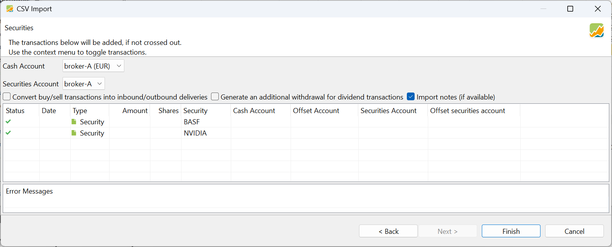

证券现已创建完毕，并出现在 `全部证券` 列表中。请注意，还有若干其他字段（如日历、附加属性与类别）无法通过 CSV 导入添加。历史价格的报价馈送可在下一步中部分添加（见图 4）。

图： 导入证券（第 3-3 步）。{class=pp-figure}

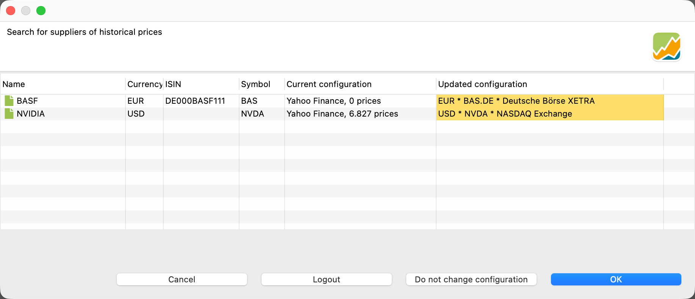

证券创建之后，还有一个额外步骤可让你搜索合适的报价馈送。系统会搜索 [Yahoo Finance](../../../how-to/downloading-historical-prices/yahoo-finance.md) 与[内置的 PortfolioPerformance 提供方](../../../how-to/downloading-historical-prices/portfolioperformance.md)。更新后并以黄色标示的配置将被应用，除非你点击 `不更改配置` 按钮。要真正从内置提供方读取历史报价，你必须处于登录状态（见[内置提供方](../../../how-to/downloading-historical-prices/portfolioperformance.md)）。点击 `取消` 将跳过这一步，点击 `确定` 则读取历史价格。请注意，NVIDIA 股票的 ISIN 已填入，股票代码也已更正为正确的 `BAS.DE`。

### 2. 历史报价导入 {#2-historical-quotes-import}
大多数证券的历史价格已由内置报价提供方或其他来源涵盖（见上文）。不过，你有时仍需通过手工创建的 CSV 文件导入历史价格。为此，你只需要 CSV 文件中的两列：一列用于日期，另一列用于相应的报价。两者都是*必填*字段。没有*可选*字段。这些历史价格所属证券的名称必须在第二步中提供。如果任何必填字段缺失或拼写有误，你都无法进入下一步。

*表 3：历史报价类型导入的可用字段*
```
| Field Name      | Required | Row 1 CSV   | Row 2 CSV  |
|-----------------|----------|-------------|------------|
| Date            |    Y     | 2024-01-09  | 2024-01-08 |
| Quote           |    Y     | 22,51       | 22,54      |
```

请注意，图 5 中的日期采用 `YYYY-MM-DD` 格式。双击输出面板的第二行（如 `>>> 'Date'`）可选择其他日期格式；例如 MM-DD-YY 或 dd-MMM-yyyy（当前语言），如 01-Feb-2026。请从 20 多种格式的列表中选出正确的一项。

在图 5 中，`下一步` 与 `完成` 按钮呈灰色，因为必要信息尚不齐全。顶部的消息"未映射必要字段：Quote," 给出了线索。在 CSV 文件中使用的字段名是 `Price`。它应映射到内部的 `Quote` 字段。双击该列并选择相应的映射字段，例如 `Quote`。随后 `下一步` 与 `完成` 按钮即可使用。在那里，你还可以选择小数点或逗号。

图： 导入历史报价（第 2 步）。{class=pp-figure}

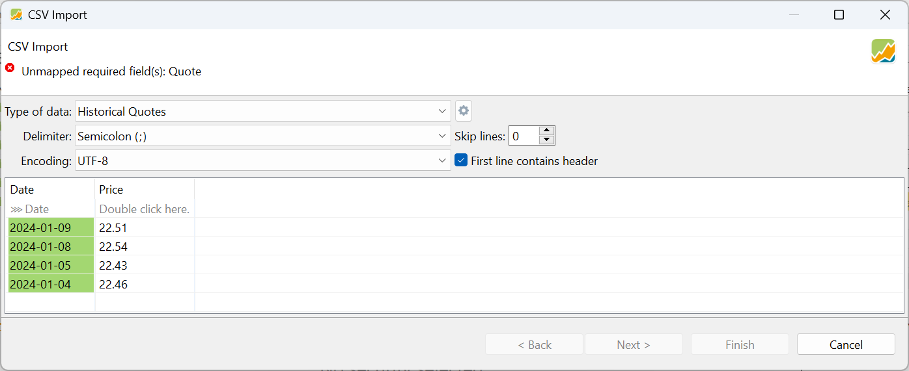

在向导的又一步中，你可以选择要把价格添加到哪一项证券。如果所选证券已有历史价格，新报价会被追加，而不会覆盖已有数据。


图： 导入历史报价（第 3 步）。{class=pp-figure}

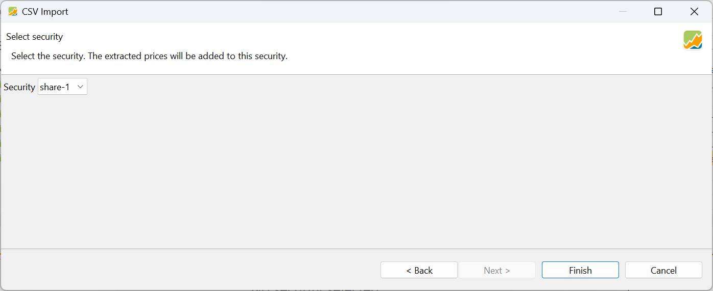


### 3. 证券账户导入 {#3-securities-account-import}

使用该导入类型，你可以在添加第一笔 `买入` 账目的同时创建一项新证券（见上文）。表 4 列出可接受的字段；只有 `Shares` 与 `Value` 是必填的，另外还需要 `Ticker Symbol`、`ISIN`、`WKN` 或 `Security Name` 之一。你可以提供 `Quote` 与 `Date of Quote`。这会在该日期上创建一条历史价格。不过，该报价不用于计算账目的价值（例如，Value = Shares x Quote）。与手动创建 `买入` 账目时一样，你可以创建一笔 '报价' 不同于历史价格的账目。在表 4 的示例 1 中，该笔账目的计算报价为 45 EUR（=900/20）。

*表 4：证券类型导入的可用字段*
```
| Field Name         | Required | Row 1 CSV      | Row 2 CSV |
|--------------------|----------|----------------|-----------|
| Shares             |    Y     | 20             | 5         |
| Value              |    Y     | 900            | 750       |
| Ticker Symbol      |    N     | BAS            | NVDA      |
| ISIN               |    N     | DE000BASF111   | --        |
| Security Name      |    N     | BASF           | NVIDIA    |
| WKN                |    N     | --             | --        |
| Currency           |    N     | EUR            | USD       |
| Note               |    N     | --             | --        |
| Date of Quote      |    N     | --             | --        |
| Quote              |    N     | --             | --        |
| Date of Value      |    N     | 2026-04-05     | 2026-04-06|
| Time               |    N     | --             | --        |
| Cash Account       |    N     | --             | --        |
| Securities Account |    N     | --             | --        |
```

将创建两项证券，同时也会记录两笔 `买入` 账目（以 900 EUR 买入 20 份 BASF，以 750 USD 买入 5 份 NVIDIA）。无法包含费用或税款。为此，你需要使用 `账户账目` 或 `投资组合账目` 导入类型（见下文）。

如图 7 所示，证券与现金账户既可以通过对话框（上半部分）指定，也可以通过 CSV 文件指定。以 CSV 文件的取值为准。只有当 CSV 文件中未提供这些值时，程序才会回退到用户所选的账户。


图： 导入证券账户。{class=pp-figure}

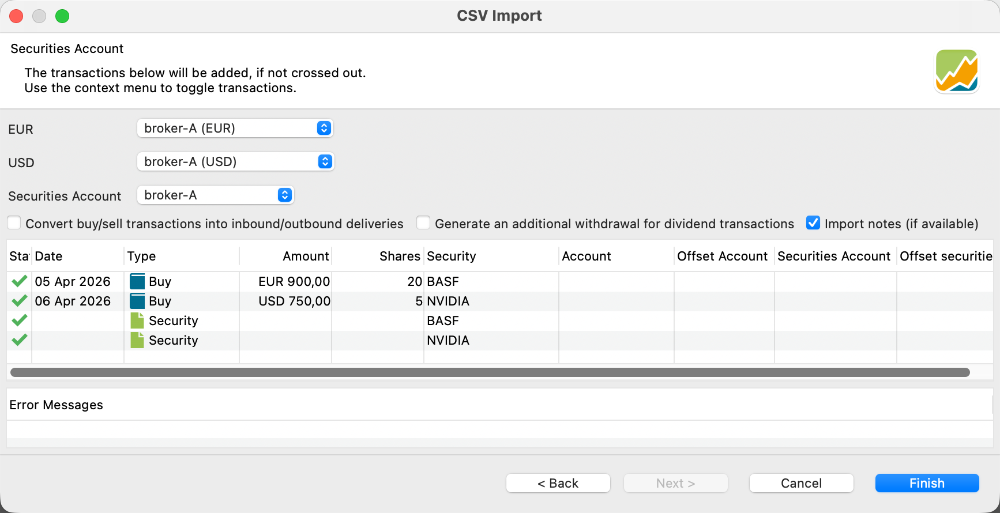

请注意，由于该证券的 `Currency` 被设为 `EUR` 或 `USD`，因此可以自动选出正确的现金账户。

### 4. 账户账目导入 {#4-account-transactions-import}

`账户账目` 导入类型用于登记现金账户上的账目，例如存款、取款、利息等。这等同于使用账目菜单选项（第三组）手动记录一笔账目。必填字段为 `Date` 与 `Value`。

!!! Important
    账户账目与投资组合账目这两种导入类型非常相似。在内部，账户账目专用于处理现金账户及其账目（如存款）。投资组合账目则处理投资品及其账目：买入、卖出、证券转入/转出等。然而，买入／卖出账目同时具备两种成分：证券账户中有东西被增加／移除，同时现金账户中有资金被扣减／增加。在这种情形下，两种导入类型都可使用。

    :warning:
    <span style="color:orange">良好实践！！！ <br/></br>存款、取款等请使用账户账目类型，买入、卖出等请使用投资组合账目类型。</span>

*表 5：账户账目类型导入的可用字段*
```
| Field Name            | Required | Row 1 CSV       | Row 2 CSV       | Row 3 CSV           | Row 4 CSV       |
|-----------------------|----------|-----------------|-----------------|---------------------|-----------------|
| Value                 | Y        | 150             | 150             | 100                 | 2               |
| Date (of Value)       | Y        | 2026-03-04      | 2026-03-04      | 2026-03-04          | 2026-04-06      |
| Time                  | N        | --              | --              | --                  | --              |
| Type (1)              | N        | Withdrawal      | Deposit         | Transfer (Outbound) | Fees            |
| Shares                | N        | --              | --              | --                  | --              |
| Ticker Symbol         | N        | --              | --              | --                  | --              |
| ISIN                  | N        | --              | --              | --                  | --              |
| Security Name         | N        | --              | --              | --                  | --              |
| WKN                   | N        | --              | --              | --                  | --              |
| Note                  | N        | --              | --              | --                  | --              |
| Gross Amount          | N        | --              | --              | 110                 | --              |
| Fees                  | N        | --              | --              | --                  | --              |
| Taxes                 | N        | --              | --              | --                  | --              |
| Transaction Currency  | N        | --              | --              | --                  | --              |
| Currency Gross Amount | N        | --              | --              | USD                 | --              |
| Exchange Rate         | N        | --              | --              | --                  | --              |
| Cash Account          | N        | broker-B (EUR)  | broker-A (EUR)  | broker-A (EUR)      | broker-A (EUR)  |
| Securities Account    | N        | --              | --              | --                  | --              |
| Offset Account        | N        | --              | --              | broker-A (USD)      | --              |
```
**(1)** 表 5 中 `Type` 字段可接受的取值为 `Deposit`、`Withdrawal (or removal)`、`Dividend`、`Interest`、`Interest Charge`、`Fees`、`Fees Refund`、`Taxes`、`Tax Refund`、`Transfer (Inbound)`、`Transfer (Outbound)`。也可以使用 `Buy` 与 `Sell`，但如前所述，用投资组合账目类型来做这件事是更好的实践。如表 5 所示，`Type` 是可选的。若省略该字段，当 `Value` 为负数时视为 `Buy`，为正数时视为 `Sell`。

表 5 与图 8 展示了该 CSV 文件中记录的四笔账目。请注意，允许的字段中只有一小部分具有实际取值：

- 2026-03-04 从现金账户 `broker-B (EUR)` 中取出 150 EUR
- 2026-03-04 向现金账户 `broker-A (EUR)` 中存入 150 EUR
- 从现金账户 `broker-A (EUR)` 向现金账户 `broker-A (USD)` 转账 100 EUR。由于目标账户以 USD 设置（即 Currency Gross Amount），该 CSV 文件还指定了 `Gross Amount`（= 110 USD）。由此得到的 `Exchange Rate` 为 0,9091 USD/EUR。目前尚不能指定汇率并让 PortfolioPerformance 计算 `Gross Amount`。这种情况用转账账目处理比用"从 `broker-A (EUR)` 取款 100 EUR 与向 broker-A (USD) 存款 110 USD"两笔账目来处理更好。在 Portfolio Performance 中，存款与取款账目被视为外部现金流，因此会影响绩效计算。而这笔转账纯属内部转账，不应以任何方式影响绩效。
- 一笔 2 EUR 的费用，由 `broker-A (EUR)` 账户为货币兑换而支付。

图 8 显示了此次导入的结果。请注意，字段 `Gross Amount` 与 `Currency Gross Amount` 未在此预览中显示，但确实已被登记。

图： 导入账户账目 - 第 2 步。{class=pp-figure}

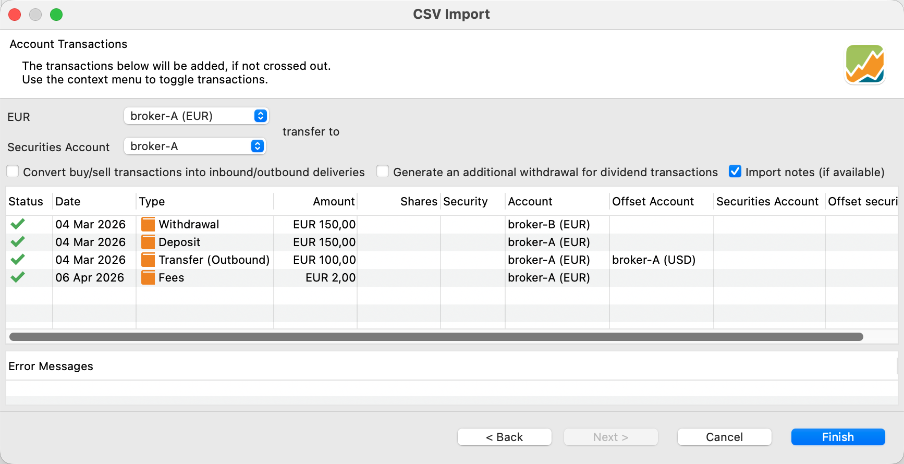


#### 股息账目 {#dividend-transaction}

需要特别注意的是，由于股息账目有其独特复杂性，尤其是境外股息，因此应单独处理。例如，当以某种货币支付的股息存入以另一种货币计价的账户时，可能会出现问题。

举例来说，3 份股票每股 5 USD 的股息，总额为 $15。按 0.9333 EUR/USD 的汇率换算后为 €14，并存入 `broker-A (EUR)` 现金账户。

该 CSV 文件包含日期、账目类型（如股息）、证券名称（NVIDIA）与份额数列。
```
Date; Type; Security Name; Shares; Value; Cash Account; Gross Amount; Currency Gross Amount;
2024-01-13; Dividend; NVIDIA; 3; 14; broker-A (EUR); 15; USD;
```
由于我们以 EUR 存入这笔股息，现金账户为 `broker-A (EUR)`，金额为 €14。这对应于总额 $15 USD。由于该笔账目是股息，现金必须由投资组合中某项货币与 `Currency Gross Amount` 一致的已有证券产生。

图： 股息导入的结果。{class=pp-figure}

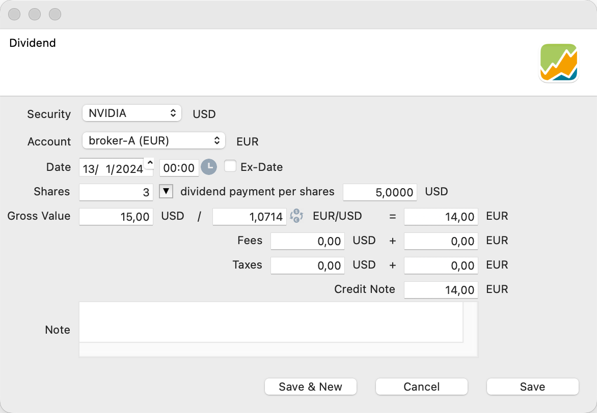

!!! Important
      遗憾的是，当前版本的 PortfolioPerformance 软件尚不支持在 CSV 导入过程中同时包含本币与外币的费用和税款。

### 5. 投资组合账目导入 {#5-portfolio-transactions-import}

值得一提的是，可以通过 CSV 文件中的专门列，把 `Fees` 与 `Taxes` 纳入 `买入` 或 `卖出` 账目。在这种情况下，税款与费用是从总值字段中扣除的（Value = Gross Amount + Taxes + Fees）。或者，你也可以创建一笔类型为 "Fees" 或 "Taxes" 的独立账目，并在 Value 列中指定金额。在这种情形下，费用与税款是加到该数值上的。

!!! Important
    如果你的账目涉及以多种货币计价的证券，良好实践是在 CSV 文件中明确写出 `Securities Account` 与 `Cash Account` 字段。由于 `Date` 是必填字段，请注意日期格式。

```
| Field Name            | Required | Row 1 CSV      | Row 2 CSV       |
|-----------------------|----------|----------------|-----------------|
| Date                  | Y        | 2024-01-04     | 2024-01-13      |
| Value                 | Y        | 90             | 1740,98         |
| Shares                | Y        | 2              | 3               |
| Type (1)              | N        | Sell           | Buy             |
| Time                  | N        | --             | --              |
| ISIN                  | N        | --             | --              |
| Ticker Symbol         | N        | --             | --              |
| WKN                   | N        | --             | --              |
| Security Name         | N        | BASF           | NVIDIA          |
| Transaction Currency  | N        | --             | --              |
| Fees                  | N        | 5              | 15              |
| Taxes                 | N        | 3              | 10              |
| Gross Amount          | N        | --             | --              |
| Currency Gross Amount | N        | --             | --              |
| Exchange Rate         | N        | --             | 1,0837          |
| Note                  | N        | --             | --              |
| Cash Account          | N        | broker-A (EUR) | broker-A (EUR)  |
| Securities Account    | N        | broker-A       | broker-A        |
| Offset Account        | N        | --             | --              |
```

**(1)** Type 的允许取值为：`Buy`、`Sell`、`Delivery (Inbound)`、`Delivery (Outbound)`、`Transfer (Inbound)` 与 `Transfer (Outbound)`。

该导入类型需要三个字段：`Shares`、`Date` 与 `Value`，以及 `ISIN`、`WKN`、`Ticker Symbol` 或 `Security Name` 之一。在利息支付的情形下，`Shares` 字段并非必需。

假设你希望导入两笔投资组合账目：一笔是以 EUR 卖出 2 份 BASF，另一笔是以 USD 买入 3 份 NVIDIA。由于两种情形下都使用同一个 EUR 现金账户，那笔 USD 账目必须换算为 EUR。在这种情况下，PortfolioPerformance 会自动处理，因为 NVIDIA 证券以 USD 计价，而证券账户以 EUR 计价。或者，你也可以把 `Currency Gross Amount` 列指定为 `USD`。不过，更高效的工作流可能是定义 `Cash Account`，也可能还包括 `Securities Account`。这样可以避免导入时回退到诸如本例中的 `broker-A` 与 `broker-A (EUR)` 等标准账户。

图 11 展示了 `已映射为字段` 对话框。所有字段都被正确识别。建议确认所选格式与你的语言设置相符，尤其是在像本例这样以逗号作小数点时（可通过双击 Value 列访问）。

该 CSV 文件应如下所示。

```
Date;Type;Shares;Security Name;Value;Exchange rate;fees;taxes;Securities Account;Cash Account
2024-01-04; Sell; 2; BASF; 90; ;5; 3; broker-A; broker-A (EUR)
2024-01-13; Buy; 3; NVIDIA; 1740,98; 1,0837; 15; 10; broker-A; broker-A (EUR)
```
由于 `(Net) Value` 字段是必需的，再添加 `Gross Value` 就没有意义，反正它也会被覆盖（Gross Value = Value + Fees + Taxes）。因此，我们在这种情况下使用 `Exchange Rate` 字段。请注意，在 BASF 那笔账目中该字段为空（或为零）。图 11 展示了此次导入账目的结果。


图： 上述导入的结果。{class=pp-figure}

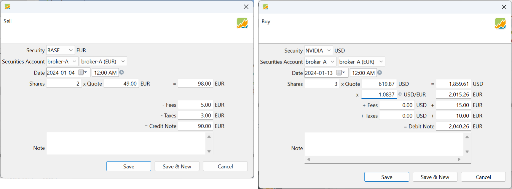

图 11 展示了导入向导的第一步。请确保在第 1 步中选中了投资组合账目这一类型；否则在第 2 步会出现错误。

图： 上述导入的结果。{class=pp-figure}

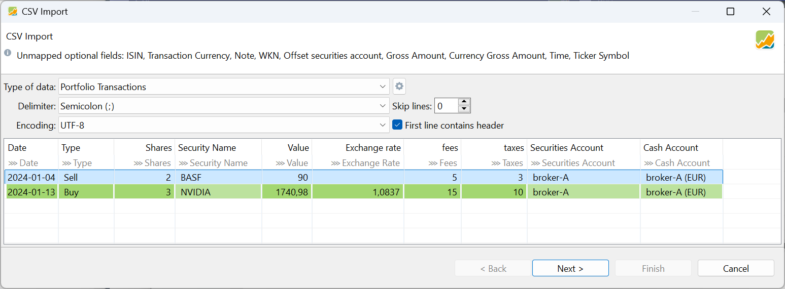

系统会进行一致性检查，以确保你卖出的证券没有超过投资组合中可持有的数量（见图 12）。

图： 一致性检查。{class=pp-figure}

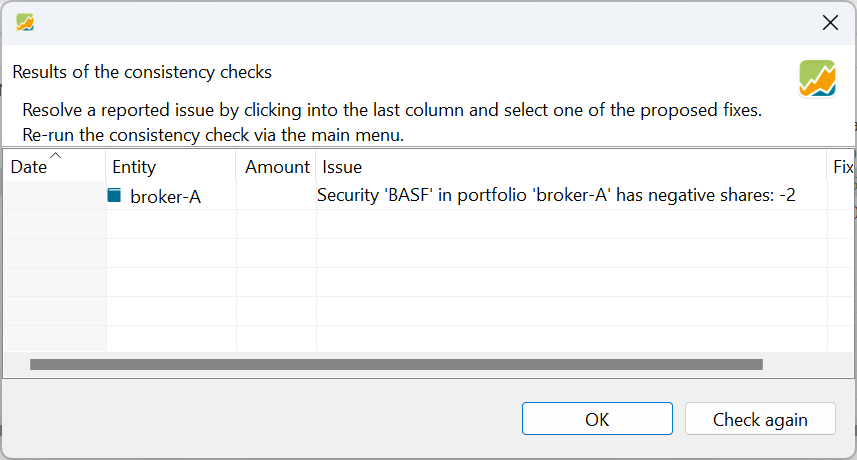