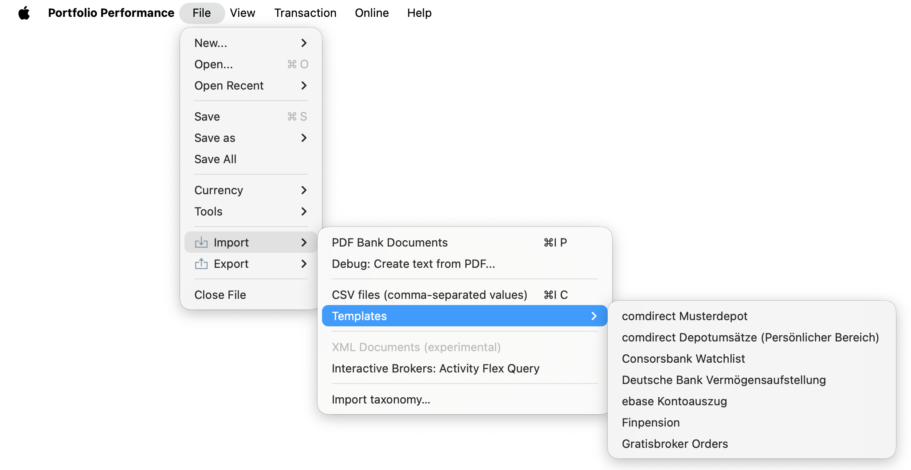

# 导入文档

在 Portfolio Performance 中，你可以手动录入数据（买入、卖出、股息、历史报价……），也可以从 CSV 文件（逗号分隔值）或 PDF 文档中*导入*这些信息。图 1 展示的是展开后的 `文件 > 导入` 菜单。

数据来源有多种：[PDF 文档](pdf-import.md)、[CSV 文件](csv-import.md)，以及 [Interactive Brokers Flex Queries](ibflex-import.md) 等券商专用格式。一些券商或银行可能以专有格式提供这些信息。手册提供了主流银行与券商的模板。

图： 菜单 文件 > 导入。{class=pp-figure}

类别（[taxonomies](../../view/taxonomies/index.md)）也支持批量导入（与导出），所用的是一个 JSON 文件，其中以结构化方式定义了你的金融工具是如何分组与分类的。
