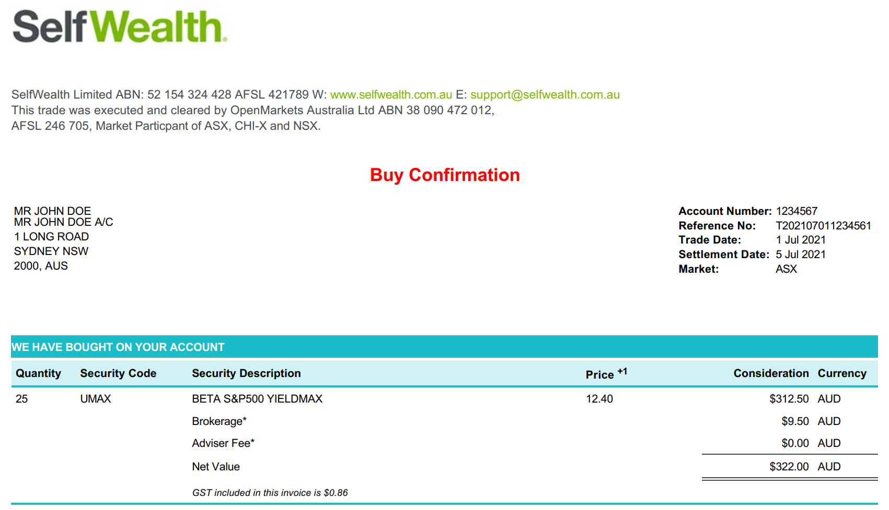
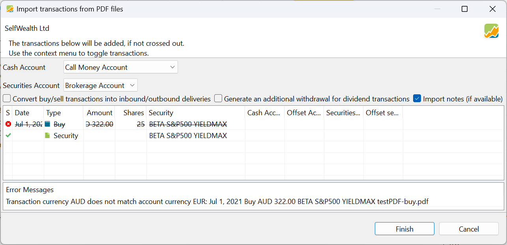
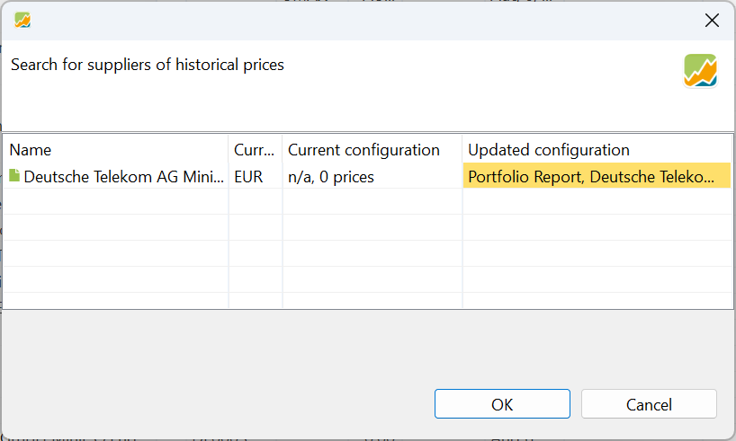

银行与券商常常为图方便，以纸质或 PDF 格式提供对账单（买入、卖出、股息等）。Portfolio Performance 能够读取 90 多家银行与券商的 PDF 文档，并导入其中所述的账目。图 1 中的 PDF 描述了一笔来自某澳大利亚券商的（虚构的）买入账目。若你想跟着示例操作，可以[下载](../../../assets/SelfwealthBuy01.pdf)该 PDF 文档。

图： SelfWealth 的买入对账单，25 份 Beta SP500 YieldMax。{class=pp-figure}

## 检查导入器是否存在 {#checking-the-existence-of-the-importer}

Portfolio Performance 必须对来自你的银行或券商的 PDF 文档"了解"一些细节。例如，图 1 中账目的类型由标题 "Buy Confirmation"（买入确认）标识，股票代码（UMAX）则标在 "Security Code"（证券代码）列标题之下。Portfolio Performance 必须能识别每一笔账目的这些细节，才能从 PDF 中提取所需内容。因此，对于每一家受支持的银行或券商，Portfolio Performance 都开发了一个了解不同[账目类型](../../transaction/index.md)的专用导入器（解析器）。开发这些导入器时，Portfolio Performance 依靠用户提供的信息（见[申请新的导入器](pdf-import.md#requesting-a-new-importer)）。

要确认你的银行或券商是否受支持，请尝试导入一份 PDF 文档（见下一节）。导入向导要么会自动识别它，要么会显示一条错误信息，列出它已尝试过的所有银行／券商。你也可以用 `PDF import` 或 `PDF import [name-of-your-bank-or-broker]` 作为关键词搜索[论坛](https://forum.portfolio-performance.info/c/english/)，看看你所在机构是否已有导入器，以及是否存在相关问题。如果导入器已存在，你可以继续下一节；否则，你需要先申请一个新的导入器（见[申请新的导入器](pdf-import.md#requesting-a-new-importer)）。

## 导入 PDF {#importing-a-pdf}

使用菜单 `文件 > 导入 > 导入 PDF 银行文档` 或快捷键 `CTRL+I, P`，然后在本地系统中找到该 PDF 文档。你可以选择*一份以上*PDF 文档。如果某份文档能被 Portfolio Performance 识别（即该文档所属银行或券商已有导入器），就会显示如图 2 所示的 `导入账目` 对话框。

在这个特定案例中，存在一个小问题，导致导入操作无法完整执行。底部的错误信息给出了提示：来自演示用 Kommer 投资组合的现金账户 `Call Money Account` 被用于该笔账目的现金处理，但这个现金账户以 EUR 计价，而该账目的货币是 AUD。选择（或新建）一个 AUD 现金账户即可解决该问题。请注意，图 2 中安排了两项操作：(1) 该笔买入账目，以及 (2) 创建证券 `Beta S&P500 Yieldmax`。如果该证券已存在于投资组合中，导入向导会使用已有的证券。

图： 从图 1 的 PDF 导入的账目。{class=pp-figure}

图： 搜索报价提供方（示例见 Portfolio Report）。{class=align-right style="width:60%"}

如果涉及的是一项新证券，则会显示一个 `搜索报价历史提供方` 框。如果该证券已在 [Portfolio Performance（内置）](../../../how-to/downloading-historical-prices/portfolioperformance.md) 中列出，则历史价格可自动添加。否则，该证券仍会被创建，但你需要手动编辑数据源，才能[下载历史价格](../../../how-to/downloading-historical-prices/index.md)。

 

## 申请新的导入器 {#requesting-a-new-importer}

如果 Portfolio Performance 没有你所在银行／券商的 PDF 导入器，也没有你所需的特定账目类型的导入器，你可以申请开发该导入器。更多信息请见[操作指南 > 申请新的 PDF 导入器](../../../how-to/requesting-new-importer.md)。