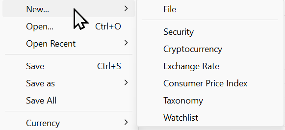
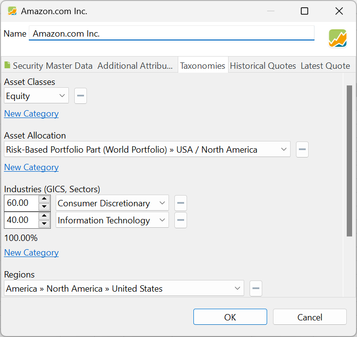
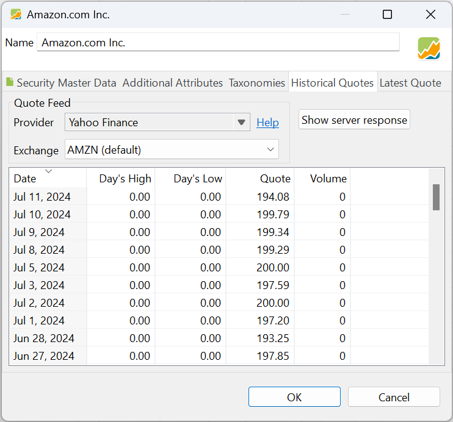
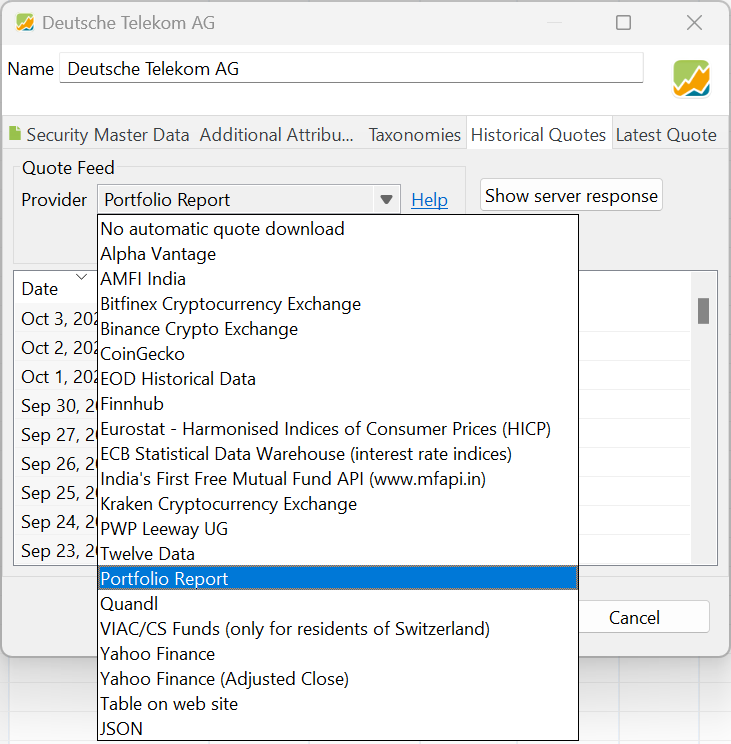
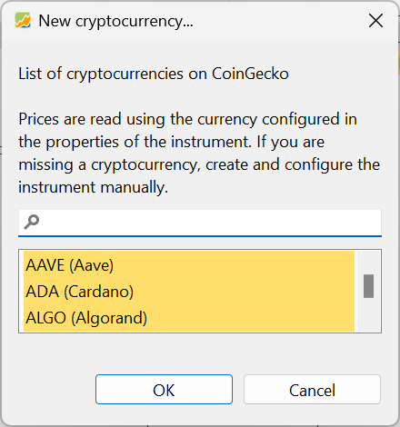
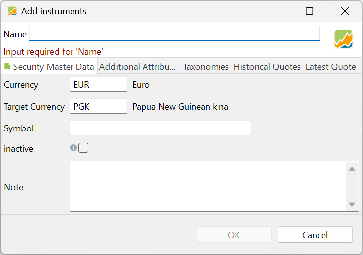
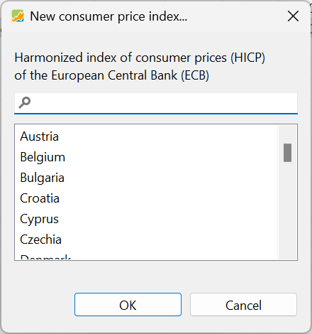
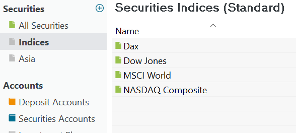

# 文件 > 新建

通过 `文件 > 新建` 菜单，你可以创建 Portfolio Performance 能够管理的各种资产。

图： 文件 > 新建子菜单。{class=pp-figure}

## 投资组合（文件） {#portfolio-file}

`文件 > 新建 > 文件` 选项会启动一个用于创建新投资组合的向导。在该向导中，你需要设置投资组合的基准货币、创建证券与现金账户（必需），并可添加其他现金账户、纳入证券与类别（可选）。关于该向导的详细说明，见[快速上手 > 创建投资组合文件](../../getting-started/create-portfolio.md)。

## 证券 {#security}

菜单选项 `文件 > 新建 > 证券` 一望而知：它让你创建一项新证券。在界面中的其他位置也可以这样做；例如在创建投资组合的向导中（见上文），或使用侧边栏 `证券` 旁边的小绿色图标 :octicons-plus-circle-16:{.green}，以及在 `全部证券`视图中。

图： 文件 > 新建 > 证券菜单。{class=pp-figure}

你可以创建一个新的空白投资品（左下角），也可以搜索已有的投资品。
在搜索框中输入证券名称的一部分（如 `NVI`），然后点击 `搜索`。
请注意，搜索词不区分大小写。所有包含该搜索词的投资品都会被返回（如 Veolia eNVIronment）。

使用 `EUR`、`USD`、`Share`、`Cryptocurrency` 或 `Commodity` 这些按钮，可以把搜索结果限定为指定货币或指定类型的投资品。如果有多页结果（如 1/20），可以用 `>` 或 `<` 按钮翻页（见图 2）。

每个投资品会显示以下信息：

- 投资品名称，如 NVIDIA CORP
- 类型（如股票、交易所交易产品 (ETP) 如交易所交易基金 (ETF)，或能源、金属等大宗商品）
- 该投资品交易的货币
- 该投资品的 ISIN 编号
- 历史价格的提供方（CoinGecko、Yahoo Finance，或 Portfolio Performance 内置数据源）

各术语的定义见[基本概念 > Portfolio Performance 术语表](../../concepts/portfolio-performance-terminology.md)。

选定投资品后，`下一步` 按钮即可使用，据此可以选择具体的交易所（伦敦证券交易所 (LSE)、德意志交易所 (XETRA)、NASDAQ 等）。点击 `下一步` 会显示最近三个月的历史价格以供核对。若选错了，你随时可以退回上一步。点击 `应用` 将使用所有可用的历史价格创建该投资品。

某些信息（如名称、货币、代码与历史报价）会依据所选数据源自动填入。你应始终核对这些信息，尤其是证券交易所。所有细节都可以更改——连名称也可以。

你也可以从一个空白证券开始（见图 3），手动输入所需信息。

图： 创建证券的输入面板。{class=pp-figure}

其中只有 `名称`是必填的，但还有若干其他字段需要注意。它们分为 5 个子面板，在图 3 中以黄线标出。

 - ### **证券主要信息** {#security-master-data}

本面板在图 3 中完整可见。`货币`字段必须与该证券交易所使用的货币一致。一旦用该证券记录了账目，货币便不可更改。点击货币框会展开一个包含所有可用货币的下拉列表。

`ISIN`、`证券代码` 与 `WKN` 字段已在前文说明。代码字段尤其关键，因为历史报价的报价馈送会用到它（详见下文）。

`日历` 下拉列表让你可以选择特定的证券市场日历，如 Euronext、伦敦证券交易所、纽约证券交易所等。这些日历包含关于交易日与（银行）节假日的信息，会影响某些计算、价格缺口的显示以及储蓄计划的执行。更详细的说明见 `帮助 > 首选项 > 日历` 菜单。

一项证券可以设为启用或`停用`。若设为停用，该证券不会出现在买入或卖出对话框中，历史价格也不会自动更新。

在图 3 的底部，你可以为该证券添加一条个人`备注`。

- ### **附加属性** {#additional-attributes}

    除了证券主要信息中的属性外，你还可以使用其他属性；例如一个标志图案。这些附加属性可以加入 `报告 > 收益 > 证券` 之类的表格。这些属性的值必须手动输入，且不能用于计算。

    附加属性在 `(左侧) 侧边栏 > 常规数据 > 设置 > 属性 : 证券`（位于底部）中定义。[更多信息见此处。](../view/general-data/settings.md#attributes-securities)

- ### **类别** {#taxonomies}

    类别是你证券的一套分类体系。类别通常按行业、板块、地理区域、市值或资产类别等共同特征对证券分组。例如，现有的 `资产类别` 类别可让你把证券归入 *现金*、*权益*、*债权*、*房地产* 或 *大宗商品* 等等类。

    在新投资组合中首次打开类别面板（见图 4）时，它会是空的。要开始使用类别，你需要为投资组合创建一个或多个类别。在图 4 中可以看到四个类别：资产类别、资产配置、行业 (GICS、行业板块) 与地区。这些类别同样会出现在视图菜单中。

    图： 类别面板。{class=pp-figure}

    

    要把一项证券归入某个类别，请点击该类别下方的 `添加分类` 按钮。此时会展开一个下拉菜单，列出所有可能的类别以及一个权重输入框。你可以把一项证券归入多个类别。同一类别的多个分类也可以同时归入，只要合计权重不超过 100%。若类别旁未显示权重（见图 4），则其权重为 100%。点击类别旁边的减号按钮（-）可将其从类别归属中移除。上述操作也可以在类别视图中完成（更为便捷）。

    关于如何创建、管理和使用类别的详细说明，见手册中的[参考 > 视图 > 类别](../view/taxonomies/index.md)一节。

- ### **历史报价** {#historical-quotes}

    要评估投资组合，你需要证券的当前价格与历史价格。在此面板中（见图 4），你可以设置 `报价馈送` 的数据源。作为 `提供方`，你可以在若干选项中选择：Yahoo Finance、Alpha Vantage、Quandl 等（见图 5）。你甚至可以指定一个包含这些历史数据的网页（如某个投资者站点）；[从 Morningstar 导入基金数据](../../how-to/downloading-historical-prices/morningstar.md)中给出了一个例子。你也可以自己创建这些数据，并从 csv 文件中导入报价。

    图： 历史报价面板。{class=pp-figure}

    

    具体取决于所选的提供方，你可能需要输入额外信息。如果提供方是一个网站，你需要指定 URL。如果提供方涵盖多个`交易所`，你需要选出正确的那一个。

    图： 历史报价面板。{class=pp-figure}

    

    为大盘股（大公司）下载历史价格相对直接。但获取冷门股票、共同基金、债券、比特币等的数据有时会更有难度。我们在操作指南一章的[下载历史价格](../../how-to/downloading-historical-prices/index.md)中深入探讨了这些话题。

- ### **最新报价** {#latest-quote}

    最新报价面板与历史报价面板非常相似。在这里，你可以配置**实时数值**，例如最新价、最新成交、当日最高、当日最低与成交量。

## 加密货币 {#cryptocurrency}

图： 创建新的加密货币。{class=align-right style="width:30%"}

加密货币是基于区块链系统的数字资产。市场上已有数千种不同的加密货币，其中最为人熟知的是比特币。与传统资产不同，加密货币背后没有任何有形或无形的价值支撑。相反，其价值完全由市场需求以及投资者愿意为其支付的金额决定。

在 PP 中，加密货币与其他证券（如股票）一视同仁。你可以买入和卖出加密货币，但不能持有以加密货币计价的现金账户。

图 7 中列出的加密货币来自知名的 [CoinGecko 网站](https://www.coingecko.com/)。你可以用搜索框在这份很长的列表中查找特定的加密货币。如果所需的加密货币未列出，你应创建一个新的[空白证券](#security)；请记住在 PP 中加密货币与证券并无区别。不过，你还需要找到一种方式，为这项新的加密货币证券获取历史价格数据。

## 汇率 {#exchange-rate}

图： 创建新的汇率。{class=align-right style="width:30%"}

Portfolio Performance 使用[欧洲中央银行](https://www.ecb.europa.eu/stats/policy_and_exchange_rates/euro_reference_exchange_rates/html/index.en.html)的汇率。你可以在[视图 > 货币菜单](../view/general-data/currencies.md)下找到约 40 个可用汇率的列表。在少数情况下，你可能需要某个不在可用列表中的汇率。

要创建自定义汇率，请使用 `文件 > 新建 > 汇率` 菜单。你需要为想添加的货币提供一个报价提供方，例如某个 JSON 源或网页。创建自定义汇率之后，它会被加入货币列表，在 `提供方` 列中显示名称 `Security based exchange rate provider`。

## 消费者物价指数 {#consumer-price-index}

图： 创建新的消费者物价指数。{class=align-right style="width:30%"}

调和消费者物价指数 (HICP) 取自 [Eurostat 网站](https://ec.europa.eu/eurostat/databrowser/view/teicp000/default/table?lang=en)，代表欧元区家庭购买的商品与服务的月度通胀率。HICP 之所以"调和"，是因为欧盟所有国家都采用相同的方法来计算它。以 2015 年为基期，基数为 100。

选定国家后，会创建一个名为 [name of country] (HICP) 的证券，其日历为[每月第一天](../help/preferences.md#calendar)，报价馈送提供方为 `Eurostat - Harmonised Indices of Consumer Prices (HICP)`。

不过，由于它是一个指数，这些数据序列通常不会被当作常规证券（买入或卖出）来使用。它们可以作为你其他投资的[基准](../../how-to/benchmarking.md)。

## 类别 {#taxonomy}

要创建新类别，请从菜单中选择 `文件 > 新建 > 类别`。这会打开 `创建新类别` 输入框，你可以在其中为类别命名，并选择是创建新的空结构，还是使用预定义模板，例如资产类别或行业 (GICS)。有关创建和管理类别的更多信息，见参考手册中[类别](../view/taxonomies/index.md)一节。

## 关注列表 {#watchlist}

图： 两个关注列表。{class=align-right style="width:50%"}

关注列表是对证券的手工分组。要创建新列表，请在菜单中转到 `文件 > 新建 > 关注列表`。创建之后，它会出现在 `全部证券`标题之下。例如，图 10 显示了两个名为 `Indices` 与 `Asia` 的关注列表，其中第一个包含四项证券指数，如 DAX 与道琼斯。你可以在 PP 中创建任意多个关注列表。

使用关注列表的右键菜单（在列表上右击），你可以在侧边栏中重命名、删除或移动该关注列表。删除关注列表实际上不会删除其中的证券；只是把该列表从侧边栏中移除。

向关注列表添加证券是手工过程；从 `全部证券` 视图中拖动一项或多项证券，拖放到该关注列表上即可。要从关注列表中移除某项证券，右击该项证券并选择'从 *Your_Watchlist* 中移除'。该操作不会删除证券，只是把它从关注列表中移除。该证券仍可在 `全部证券` 视图中找到。其他菜单选项见[右键菜单](../view/securities/context-menu.md)。

关注列表会继承 `全部证券` 的视图设置，共享相同的列及其配置，如宽度、列名与排序顺序。在某个关注列表中对视图所做的更改会应用到所有其他关注列表，包括 `全部证券`。不过，像 `持仓份额 = 0` 这样的筛选设置则是每个关注列表各自单独记住的。