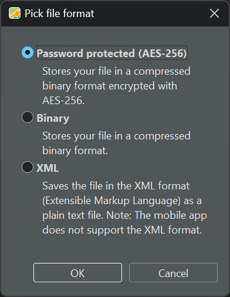
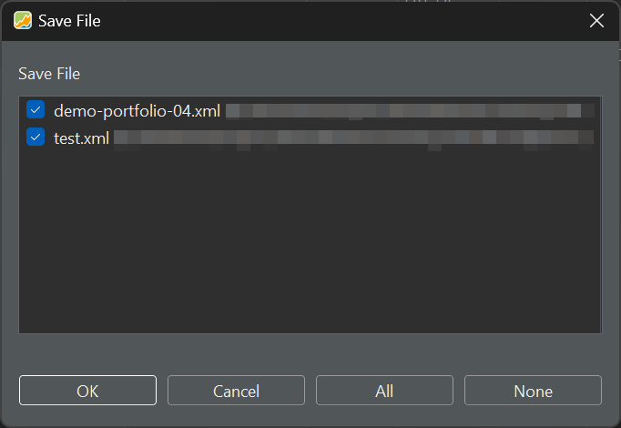
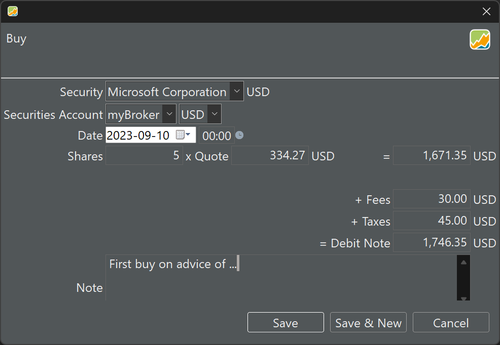
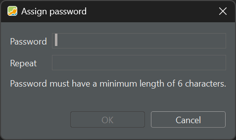

# 文件 &rsaquo; 保存 - 另存为 - 全部保存

## 保存 {#save}

图： 文件格式选择器。{class=align-right style="width:20%"}



使用菜单 `文件 > 保存`，你可以沿用现有的名称与文件格式保存投资组合，不再有任何其他干预。如果此前从未保存过该文件，则会出现 `请选择文件格式` 对话框（见图 1），提供三个选项。这些选项将在下一节中说明。选择文件格式之后，其余操作就等同于从菜单中选择 `文件 > 另存为`。

## 另存为 {#save-as}

`文件 > 另存为` 选项把这三个文件格式作为子菜单呈现出来。在接下来的步骤中，你可以输入文件名并指定文件位置。该选项允许你把此前保存的文件以不同文件格式和／或不同名称创建一份新副本，同时保持原文件不变。

## 全部保存 {#save-all}

如果打开了多个投资组合，上述命令只会保存当前活动的投资组合。请使用 `全部保存` 选项同时保存所有已打开的文件。

图： 关闭应用时（两个投资组合已更新）的对话框。{class=pp-figure}



关闭一个自打开以来已被修改的投资组合，会弹出对话框 `'xxx.xml 已修改。是否保存更改？'`。在有多个已更新项目的情况下关闭应用程序，则会弹出图 2 所示的对话框。

## XML 格式 {#xml-format}

投资组合的全部数据都存储在一个 XML 文件（eXtensible Markup Language，可扩展标记语言）中。这是一种人类可读的文件格式。例如，下面的 xml 文件 [test.xml](../../assets/test.xml) 是一个最简单的投资组合，只含一项证券（`share-1`）和两笔账目（一笔存款与一笔买入）。你可以用文本编辑器（如 Notepad++）打开该文件来查看其 xml 内容。下面简要说明各主要元素：

- `<securities>`：包含证券信息，包括 UUID、名称、货币代码、股票代码、数据源、历史价格与属性等细节。
    `<prices>`：包含某项证券的历史价格信息。
    `<latest>`：提供某项证券的最新细节，包括最高价、最低价与成交量。

- `<accounts>`：包含客户账户的详细信息，包括 UUID、名称、货币代码与账目。

- `<transactions>`：表示账户内的金融账目，包括 UUID、日期、货币代码、金额与类型等细节。

- `<portfolios>`：包含与账户关联的投资组合引用。

- `<dashboards>`：包含客户仪表板的信息，包括名称、配置、列与组件。

- `<properties>`：保存客户特定的属性，例如证券图表细节。
- `<settings>`：包含各种设置，包括书签与属性类型。
- `<configurationSets>`：存储带特定数据的配置集。

下面是图 3 中买入账目的 xml 代码。

图： 买入账目示例。{class=pp-figure}



这一笔买入账目由以下 XML 代码表示。

``` xml
<transactions>
   <portfolio-transaction>
      <uuid>72bf2b32-60a5-4c99-ba6d-d3ab695624e5</uuid>
      <date>2023-09-10T00:00</date>
      <currencyCode>USD</currencyCode>
      <amount>174635</amount>
      <security reference="../../../../../../../../../securities/security"/>
      <crossEntry class="buysell" reference="../../../.."/>
      <shares>500000000</shares>
      <note>First buy on advice of ...</note>
      <units>
         <unit type="FEE">
            <amount currency="USD" amount="3000"/>
          </unit>
         <unit type="TAX">
            <amount currency="USD" amount="4500"/>
         </unit>
      </units>
      <updatedAt>2023-09-10T18:43:28.135529700Z</updatedAt>
         <type>BUY</type>
   </portfolio-transaction>
</transactions>

```
如你所见，买入账目的输入表单与 XML 之间几乎是一一对应的。请注意，Portfolio Performance 在*内部*对份额数使用 nano 单位 (10^9)，对价格使用 hecto 单位 (10^2)。

2024 年 2 月推出的 PortfolioPerformance 移动应用不支持 XML 文件格式。


## 密码保护（AES-256） {#password-protected-aes-256}

AES-256 加密是一种数据保护方法，它把数据转换成只有凭唯一密钥才能访问的代码。这项加密技术使用 256 位密钥（即由 256 个零与一组成的字符串）来加密与解密数据。数据经 AES-256 加密后，会变成一串随机字符，没有密钥就无法解读。要生成该密钥，Portfolio Performance 需要一个至少 6 个字符的密码。不过，更长、更复杂的密码具有更强的随机性与不可预测性，也就更难被猜中。

图： 以 AES-256 加密保存投资组合需要密码。{class=pp-figure}




## 二进制 {#binary}

XML 文件是一种人类可读的文件格式（示例见上文）。二进制格式更紧凑、更高效，因此文件的打开与保存要快得多。但它不再是人类可读的。更多信息见 [Issue #2363](https://github.com/portfolio-performance/portfolio/issues/2363)；比如可以看看其中对含 720 项证券与 1.3 MB 历史价格的项目在打开速度上的比较。

通过查看文件扩展名，可以把密码保护或二进制文件与常规 XML 文件区分开来。加密文件与二进制文件的扩展名是 .portfolio，而不是 XML。