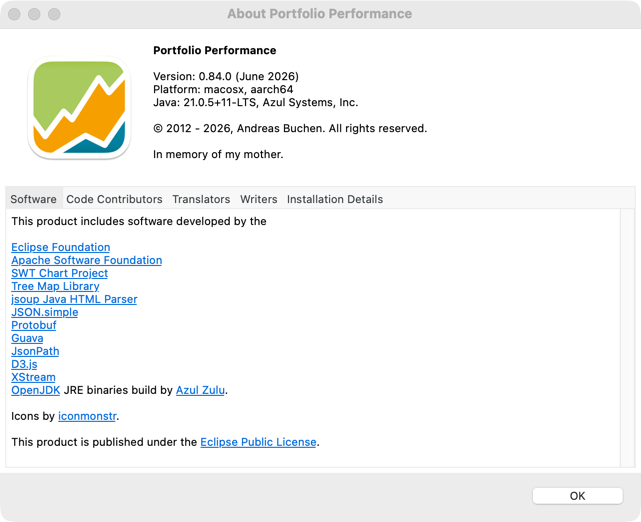
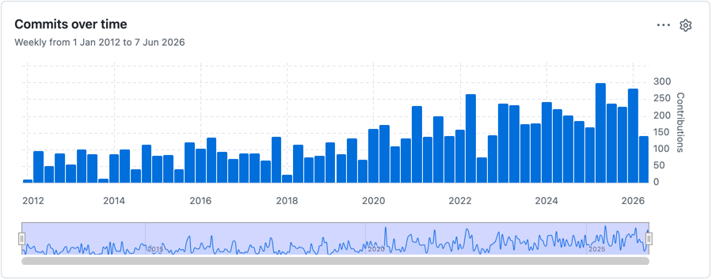

# 关于 Portfolio Performance

有关 **Portfolio Performance** 程序的详细信息，可在以下菜单下查看：  
`帮助 > 关于 Portfolio Performance`。

---

## 关于面板概览 {#about-panel-overview}

图： 关于 Portfolio Performance 面板{class="pp-figure"}

---

### 上半部分 {#top-section}

- **版本：** 0.76.2（2025 年 5 月）
- **平台：** Windows（win32, x86*64）、Linux 或 macOS  
  详见[安装](../../getting-started/installation.md)。
- **Java 版本：** 所用的 Java 运行时环境 (JRE) 或 Java 开发工具包 (JDK) 版本  
  Portfolio Performance 使用 **Java** 开发。建议使用最新的**长期支持 (LTS)** OpenJDK 版本，可从 [Azul Zulu](https://www.azul.com/downloads/?package=jdk#zulu) 获取。
- 本项目由 **Andreas Buchen** 于 2012 年发起。

---

### 下半部分 {#bottom-section}

- 程序所用的**软件**
- **代码贡献者**
- **[翻译者](./join-translation-teams.md)**
- 文档**撰写者**
- **[安装详情](../../getting-started/installation.md)**  
  有关 Portfolio Performance 所运行环境的详细信息（操作系统、Java 与 Eclipse 组件、日志文件路径等）。

---

## 主要软件组件与库 {#key-software-components-libraries}

Portfolio Performance 借助一套稳健的开源库和框架来实现各项功能、确保跨平台兼容性，并提供原生的使用体验：

- **[Eclipse Foundation](https://www.eclipse.org/)**  
  Portfolio Performance 的开发平台基础。Eclipse 提供**集成开发环境 (IDE)** 和**标准部件工具包 (SWT)**——一套用于创建跨平台原生外观图形界面的 GUI 工具包。SWT 通过调用底层操作系统部件，使组件在 Windows、Linux 和 macOS 上的渲染效果保持一致。

- **[Apache Software Foundation](https://apache.org/)**  
  提供多个基础库。例如：

  - PDF 解析与元数据提取（使 Portfolio Performance 能够处理用于报告或文档处理的 PDF）。
  - 管理网络通信的 HTTP 客户端库，包括向在线价格数据提供方和 Portfolio Report 服务发出的请求。

- **[SWT Chart Project](https://github.com/eclipse/swtchart/wiki)**  
  为 SWT 扩展了丰富的图表绘制能力。Portfolio Performance 用它来渲染折线图、饼图及其他财务数据的可视化呈现，从而确保图形既可交互又具备较高品质。

- **[Tree Map Library](https://github.com/smurf667/treemaplib)**  
  实现树状图可视化——一种用嵌套矩形表示层级数据、占用空间较少的方式。在类别菜单中即用它来可视化投资组合的资产分布与分类。

- **[jsoup Java HTML Parser](https://jsoup.org/)**  
  一套强大且易用的 HTML 和 XML 解析库。Portfolio Performance 使用 jsoup 解析真实网页（即使其格式糟糕）以抓取历史价格数据及其他相关信息。

- **[JSON.simple](https://github.com/fangyidong/json-simple)**  
  一套用于 JSON 文本编码与解码的轻量级 Java 工具包。处理来自 JSON API 的数据下载（如获取历史报价馈送及其他在线数据源）时不可或缺。

- **[Protocol Buffers (Protobuf)](https://github.com/protocolbuffers/protobuf)**  
  Google 高效且与语言、平台无关的序列化机制。Portfolio Performance 用 protobuf 将投资组合基于 XML 的数据结构转换为经过优化的 Java 对象，以便更快地读取和操作。

- **[Guava](https://github.com/google/guava)**  
  Google 核心 Java 库的扩展。Guava 提供不可变集合、缓存工具、并发库以及其他工具类，使代码库更稳健、更便于开发。

- **[JsonPath](https://github.com/json-path/JsonPath)**  
  一种面向 JSON 的查询语言，设计灵感来自 XML 的 XPath。Portfolio Performance 使用 JsonPath 从大型 JSON 文档中高效地提取特定信息。

- **[D3.js](https://d3js.org/)**  
  D3.js 主要是一个用于在 web 上创建动态交互式数据可视化的 JavaScript 库；Portfolio Performance 在其报表组件（如 Portfolio Report）中用它生成嵌入应用内、内容丰富的 web 图表和图形。

- **[XStream](https://github.com/x-stream/xstream)**  
  在 Java 对象与 XML、JSON 格式之间进行序列化与反序列化。该库帮助 Portfolio Performance 顺畅地持久化和加载复杂的投资组合数据结构。

- **[OpenJDK](https://openjdk.org/)**  
  运行 Portfolio Performance 所需的开源 Java 开发工具包。推荐的构建版本来自 [Azul Zulu](https://www.azul.com/downloads/?package=jdk#zulu)，以确保跨平台的稳定性与长期支持。

---

## 贡献者 {#contributors}

Portfolio Performance 由一个遍布全球的大型贡献者社区开发和维护。来自世界各地的数百名开发者持续改进着这款软件。  
自 2012 年以来全部贡献者及其活跃情况的完整概览，可参见 [GitHub 贡献者图表](https://github.com/portfolio-performance/portfolio/graphs/contributors)。

图： 贡献者{class="pp-figure"}

---

## 翻译 {#translations}

Portfolio Performance 已被本地化为多种语言，其中包括：  
西班牙语、荷兰语、葡萄牙语、巴西葡萄牙语、法语、意大利语、捷克语、俄语、斯洛伐克语、波兰语、简体中文、繁体中文、丹麦语、土耳其语、越南语、加泰罗尼亚语、芬兰语和德语。

你可以通过[加入 POEditor 项目](https://poeditor.com/join/project?hash=4lYKLpEWOY)参与翻译工作。

---

## 文档撰写者 {#documentation-writers}

文档的主要来源是：

- **论坛：** [德语](https://forum.portfolio-performance.info/c/deutsch/10) | [英语](https://forum.portfolio-performance.info/c/english/16)
- **手册：** [德语](https://help.portfolio-performance.info/de/) | [英语](https://help.portfolio-performance.info/en/)

---

## 安装详情 {#installation-details}

**[安装详情](../../getting-started/installation.md)** 选项卡提供一份关于 Portfolio Performance 所运行环境的综合报告，其中包括：  
操作系统详情、Java 和 Eclipse 组件版本、配置路径以及日志文件的位置。
