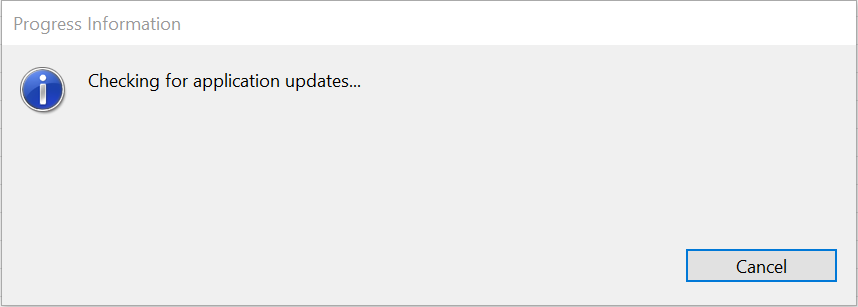
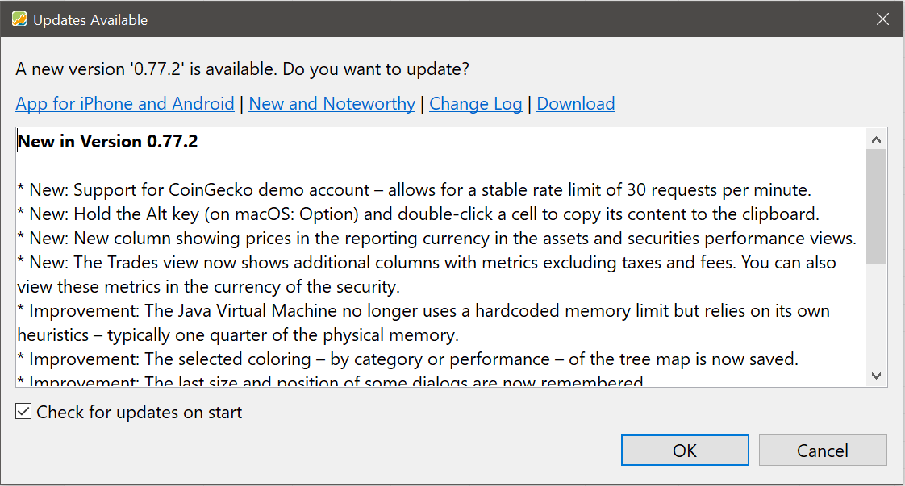
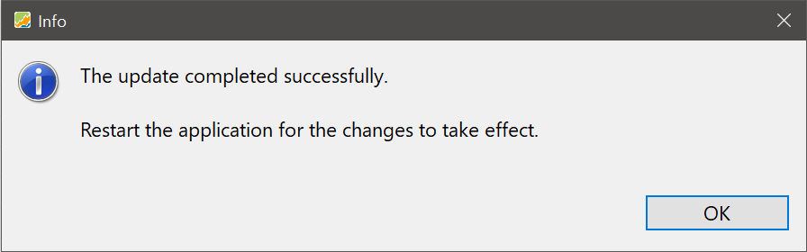
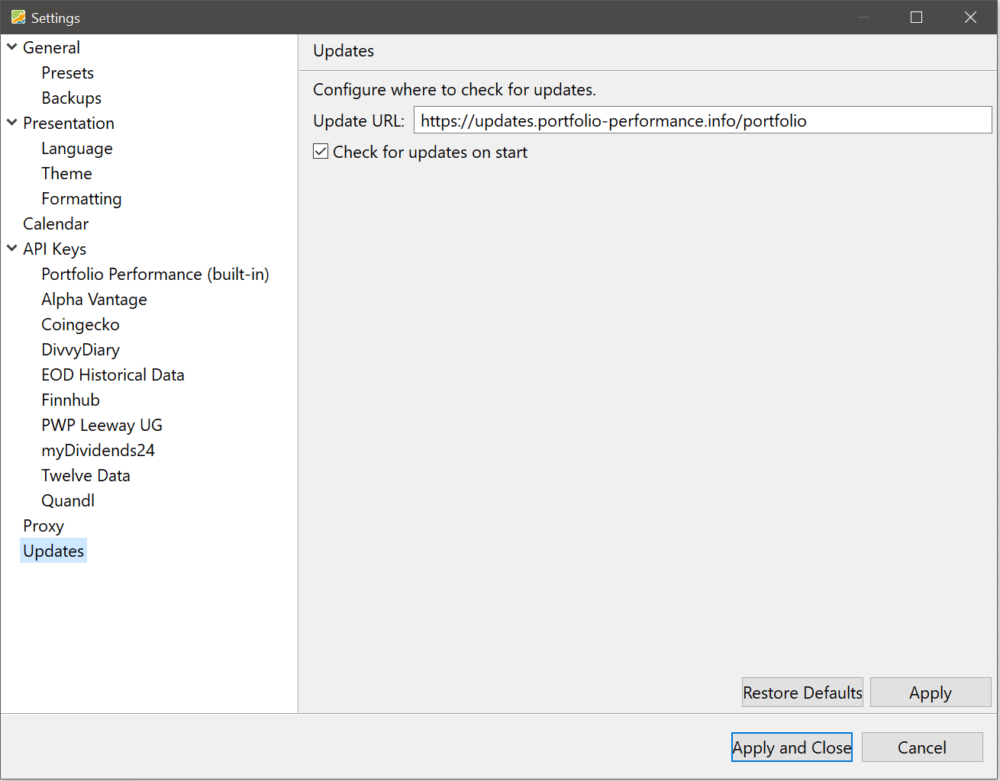

安装完成后，你可以手动检查更新，也可以让程序在启动时自动检查。

## 手动检查更新 {#manual-check-for-updates}

要手动检查，请选择 `帮助 > 检查更新 ...`。如下所示的对话框会短暂出现：

图： 正在检查更新。{class="pp-figure"}

如果没有可用更新，你会看到一条确认信息，说明你的版本已是最新。否则会出现更新对话框（所示版本号会有所不同）：

图： 有可用更新。{class="pp-figure"}

点击 `确定` 可安装最新版本，点击 `取消` 则保留当前版本。

更新面板顶部有三个有用的链接：

- [iPhone 和 Android 应用程序](https://www.portfolio-performance.app)：有关移动端配套应用程序的信息，以及指向 App Store 和 Google Play 的链接。
- [新功能与变动](https://forum.portfolio-performance.info/t/new-noteworthy/17945/last)：关于最新及以往发布版本的详细信息。
- [更新日志](https://github.com/portfolio-performance/portfolio/releases)：列出所有发布版本的 GitHub 页面。
- [下载](https://www.portfolio-performance.info/)：官方主页，提供 Linux、Windows 和 macOS 的安装程序（见[快速上手 > 安装](../../getting-started/installation.md)）。

链接下方是最近两个发布版本变更内容的摘要。右下角可以启用或停用自动检查更新（见下一节）。

如果接受更新并成功安装，会出现一条确认信息：

图： 更新安装成功{class="pp-figure"}

!!! Tip
    如果更新过程失败（例如因缺少权限或网络问题），你随时可以从[官方网站](https://www.portfolio-performance.info/)手动下载并安装最新版本。

## 自动检查更新 {#automatic-check-for-updates}

自动检查更新默认启用。要更改此设置，请转到 `帮助 > 设置 > 更新`，然后切换 `启动时检查更新`：

图： 自动检查更新设置{class="pp-figure"}

!!! Note
    自动检查仅在应用程序启动时执行。不会在后台下载，也不会静默安装。

!!! Info "技术信息"
    更新检查从 [https://updates.portfolio-performance.info/portfolio](https://updates.portfolio-performance.info/portfolio) 获取数据。如果更新检查失败，请检查你的网络连接或防火墙/代理设置。你始终可以通过[下载页面](https://www.portfolio-performance.info/)手动更新。
