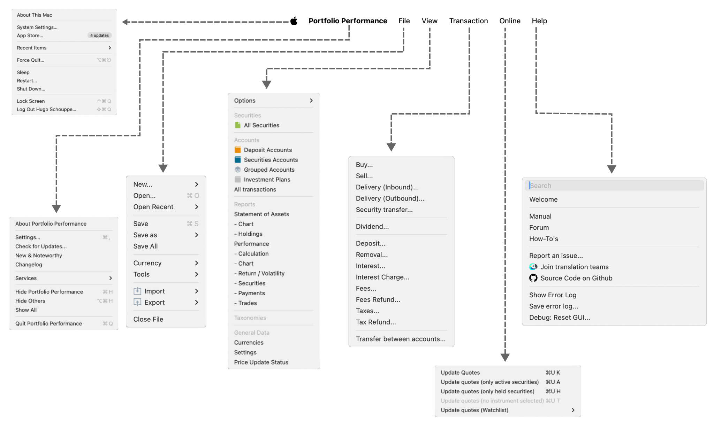
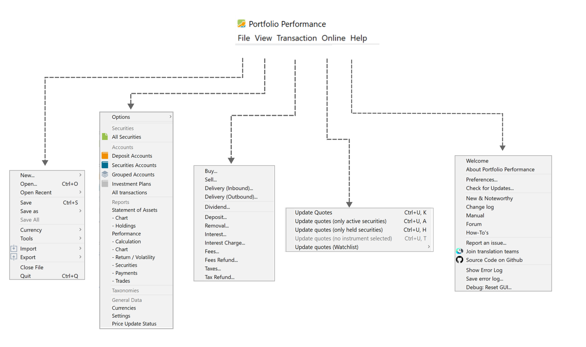

macOS 与 Windows 的菜单系统存在细微差异（macOS 见图 1，Windows 见图 2）。尤其是，Windows 上的帮助菜单把 macOS 上的应用程序菜单**和**帮助菜单合并在一起。此外，自定义选项在 macOS 上称为 `设置`，在 Windows 上称为 `首选项`。

=== "Apple 菜单"

    图： Apple 电脑的顶部菜单。{class=pp-figure}

    

=== "Windows 菜单"

    图： Windows 电脑的顶部菜单。{class=pp-figure}

    
