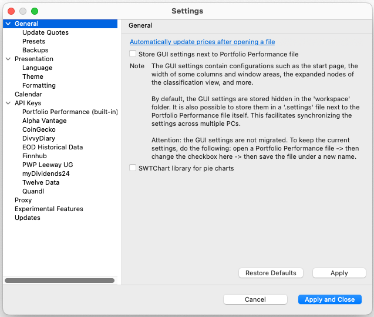
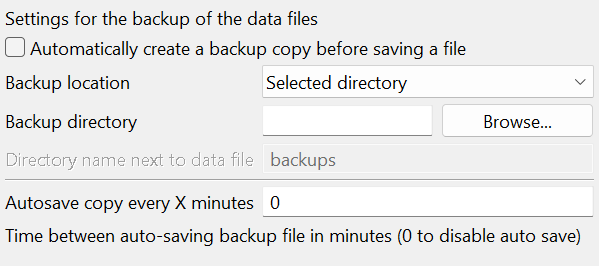
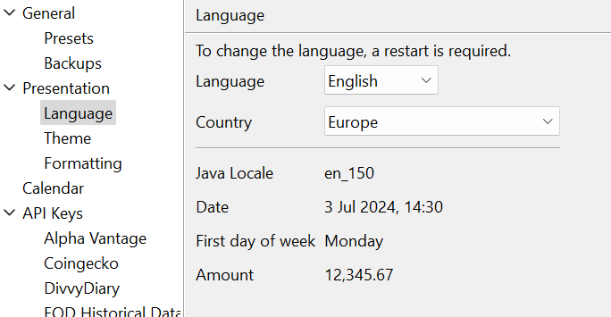
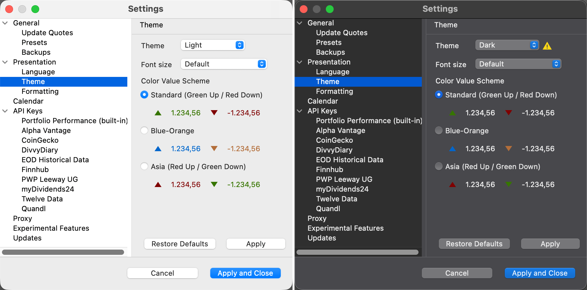

Portfolio Performance 软件中有两个不同的位置可以自定义用户界面 (UI) 和程序的整体行为：(1) `视图 > 设置` 菜单，以及 (2) `帮助 > 首选项` 菜单（Windows）或 `Portfolio Performance > 设置` 菜单（Mac）。

!!! Note
    请注意，在 Windows 上该选项称为 `首选项`，位于 `帮助` 菜单中。在 macOS 上它称为 `设置`，位于应用程序菜单中。Windows 与 Mac 的菜单栏略有不同。在 macOS 上，菜单栏始终位于屏幕最顶端。此外，Mac 程序还有两个额外菜单：左上角的 Apple 菜单（），以及应用程序菜单（例如 `Portfolio Performance`），它是从左数第二个菜单。

图： 视图 > 设置 菜单中的常规选项。{class=align-right style="width:50%"}

应用程序菜单（macOS）或帮助菜单（Windows）中的 `设置`/`首选项`具有系统范围的影响，会应用于 Portfolio Performance 管理的所有投资组合。相比之下，视图菜单中的 `设置`只影响做出该设置时所在的哪一个投资组合。

全局设置窗口带有一个左侧边栏，如图 1 所示，该边栏进一步分为七个子菜单：`常规`、`外观`、`日历`、`API 密钥`、`代理`、`实验性功能` 和 `更新`。

## 常规 {#general}

在 `设置` 对话框的侧边栏中选择 `常规` 菜单项（见图 1）后，你将看到两个选项：

- `将 GUI 设置保存至 Portfolio Performance 文件旁`：列宽、窗口大小等图形用户界面 (GUI) 设置会保存在一个单独的文件中。该文件的位置为：(1) 与投资组合文件所在的同一文件夹中（若勾选该选项）。文件名为 [name-of-portfolio].settings；例如 `demo-portfolio-03.settings`。或者 (2) 若未勾选该选项，则位于 Portfolio Performance 应用程序工作区文件夹的子文件夹中。文件名是一串唯一的随机字符串，扩展名为 "txt"，例如`prf_c4c742f0f7312d48355beadb57dc4a09.txt`。该文件默认不可见。你可以在工作区文件夹的子文件夹 `.metadata\.plugins\name.abuchen.portfolio.ui` 中找到它：

        - macOS：`~/Library/Application Support/name.abuchen.portfolio.product/workspace`
        - Windows：`%LOCALAPPDATA%\PortfolioPerformance\workspace`
        - Linux：`~/. PortfolioPerformance/workspace`

    把投资组合转移到另一台计算机时，设置文件的位置至关重要。如果设置文件与源投资组合文件相邻存放，转移过程就会简化；你只需把两个文件都复制到新位置。但是，如果设置文件存放在工作区文件夹内，那么在新计算机上安装 Portfolio Performance 应用程序时，它不会被自动重新生成。这种情况下，你必须手动把该文件从旧计算机复制出来，并粘贴到新计算机上相应的位置，以确保配置正确。

- `用 SWTChart 库绘制饼图`：在某些操作系统（如 Linux）上，必须启用该选项才能正确显示饼图。

### 更新报价 {#update-quotes}

`打开文件时自动更新报价`：可以为每支证券指定一个外部数据源，用于[下载历史报价](../../how-to/downloading-historical-prices/index.md)。你可以通过[在线菜单](../online.md)手动启动下载过程，也可以启用该选项，在打开投资组合时自动下载历史报价。

`定期更新报价`：若启用，将每 30 分钟下载一次最新价格，每 6 小时下载一次较早的历史价格。这些数值是硬编码的（见 
 模块 name.abuchen.portfolio.ui/src/name/abuchen/portfolio/ui/editor/ClientInput.java 中的源代码）

`更新模式`：为加快更新过程，你可以限制需要更新的证券数量。可选项包括全部已启用证券（即 `已启用` 属性被设置的证券），或全部已买入（持有）的证券。如果你在投资组合中定义了[关注列表](../file/new.md#watchlist)，还可以把更新限制为某个特定关注列表中的证券。
    

### 预设 {#presets}

只有一个预设可以配置，即新输入数据（例如一次买入账目的时间）的时间值。默认设置为 `当天零点`（= `00:00`）。你也可以选择 `当前时间`，新条目将使用你计算机时钟上的时间。

### 备份 {#backups}

图： 数据文件的备份设置。{class=align-right style="width:40%"}

第一个选项会启用投资组合的自动备份：在用当前版本覆盖（保存）上一版本之前，先创建一份副本。这样可以在你不慎修改了投资组合中的内容、需要恢复到之前状态时提供保障。

备份位置有三种选择：

- `数据文件的目录`：备份保存在与原投资组合相同的文件夹中，文件名后追加文本 `.backup`；例如 `myPortfolio.backup.xml`。
- `指定目录`：备份保存在"备份位置"旁边的文件夹位置。这可能是一个完全不同的目录或驱动器。使用"浏览"按钮选择合适的文件夹（见图 2）。
- `数据文件目录的子目录`：备份保存在与投资组合文件同一层级的文件夹中。文件夹名称在下方指定（例如图 2 中的 `backups`）；但"浏览"按钮是禁用的。

!!! Note
    事实上，打开备份选项后，你一打开自己的投资组合就会生成一个诸如 `myPortfolio.backup-after-open.xml` 之类的文件。该文件包含你原投资组合在任何改动之前的状态。

- `每 X 分钟进行备份`：你可以在提供的文本框中指定分钟数。启用该选项后，投资组合文件的当前状态将每 X 分钟自动保存一次。已有的自动备份文件会被覆盖。要停用此功能，请输入零 (0) 分钟。自动备份文件将命名为 `[name-of-portfolio].autosave.[extension]`，并与原投资组合存放在同一文件夹中。

## 外观 {#presentation}

- `使用间接汇率`：每个投资组合都有一个基准货币，在[创建投资组合](../../getting-started/create-portfolio.md)时设定，之后可在[资产明细](../view/reports/statement/index.md)视图中调整。当进行涉及外币（相对于基准货币而言的外币）的账目时，必须应用一个汇率。采用间接汇率时，汇率表示买入一个单位基准货币需要多少外币。相反，直接汇率则说明获取一个单位外币需要多少基准货币。

    例如，若你的基准货币为 EUR，则与 USD 的汇率表示如下：

    - **间接汇率**：0.9321 USD/EUR（一个单位基准货币需要 0.9321 单位外币）
        
    - **直接汇率**：1.0729 EUR/USD（一个单位外币需要 1.0729 单位基准货币）

- `始终在金额前显示货币`：若不勾选该选项，Portfolio Performance 只会在货币与基准货币不同时显示货币代码（如 USD），视图因而更简洁、不那么杂乱。
- `将 "p.a." 添加至年化收益率`：内部收益率 (IRR) 按定义即是一种年化收益率。时间加权收益率 (TTWROR) 则按报告期计算（因而可能未年化）。启用该选项后，会一致地附加后缀 "p.a."，以标明该收益率是年化的。

### 语言 {#language}

图： 语言、国家和 Java 区域设置的设置。{class=align-right style="width:30%"}

通过语言下拉菜单，你可以修改 Portfolio Performance 软件的用户界面语言，例如菜单和对话框。共有十三种不同语言可用：Deutsch（德语）、English（英语）、Español（西班牙语）、Français（法语）、Italiano（意大利语）、Nederlands（荷兰语）、Português（葡萄牙语）、čeština（捷克语）、русский（俄语）、Slovenská（斯洛伐克语）、Polskie（波兰语）、中文（汉语）、Dansk（丹麦语）、Türk（土耳其语）、Tiếng Việt（越南语）、Català（加泰罗尼亚语）和 Suomi（芬兰语）。

所选语言还会影响可用的国家选项。例如，荷兰语在七个国家使用：阿鲁巴、比利时、库拉索、荷兰、荷属安的列斯、圣马丁和苏里南。

如果选择英语作为界面语言，则可以选择若干国家，其中还包括欧洲和世界两个选项。语言与国家的组合决定 Java 区域设置。例如，选择语言"荷兰语"和国家"比利时"将得到 Java 区域设置 "nl_BE"。选择"英语"和"欧洲"将得到 Java 区域设置 "en_150"。

Java 区域设置负责日期、货币、小数分隔符和分组分隔符的格式，以及一周的第一天。例如，英语与比利时的组合产生 Java 区域设置 "en_BE"，它会把日期显示为 "03 Oct 2024 15:49"（英语语言但比利时写法），以周一为一周的第一天，并以逗号 (,) 作小数分隔符、句点作分组符号。

另一方面，英语与美国的组合 (en_US) 得到的日期格式形如 "Jul 3, 2024, 3:49 PM"，以周日为一周的第一天，数字格式形如 12,345.67。

### 主题 {#theme}

图： 主题设置——浅色主题与深色主题示例。{class=pp-figure}

在 `设置 > 主题` 一节中，你可以选择浅色或深色主题（参见图 4），也可以选用系统设置。如果选择自动选项，将由系统时钟决定应用浅色还是深色主题。

默认字号设为 11 像素，但你可以根据自己的偏好调整，范围从 8 像素到 20 像素。

采用标准涨跌配色时，正值显示为绿色、负值显示为红色。但这对色觉障碍人士来说并不好用。此外，在亚洲，红色代表正值。在设置中，你现在可以在三种配色方案之间选择：`标准 (绿涨 / 红跌)`、`蓝–橙` 和 `亚洲 (红涨 / 绿跌)`。

### 格式 {#formatting}

在本节中，你可以调整份额数量的显示精度（默认四舍五入到 1 位小数）以及计算报价的显示精度（默认值=2）。请注意，这些更改只会体现在带小数的数字上（即在只读视图中，如资产明细视图，需要四舍五入到指定的小数位数）。在输入表单中（如买入输入表单），你仍可输入带更多小数位的更精确数值。

## 日历 {#calendar}

日历用于指定某个年份的节假日（你所属交易所的节假日）或非交易日。日历在 PP 的计算、部分图表视图以及投资计划中起着关键作用。例如，如果某个每月[投资计划](../view/accounts/investment-plans.md)的起始日期恰逢节假日，该笔账目将被顺延至下一个工作日。

Portfolio Performance 提供 14 个不同的证券交易所日历，其中包括澳大利亚证券交易所 (ASX)、Euronext、德国证券交易所 (DE)、IBOV 圣保罗证券交易所（巴西）、ISE 意大利证券交易所 (ISE)、伦敦证券交易所 (LSE)、莫斯科交易所 (MICEX-RTS)、纽约证券交易所 (NYSE)、圣地亚哥证券交易所 (SSE)、瑞士交易所 (SIX)、多伦多证券交易所 (TSE) 和维也纳证券交易所 (VSE)。另有 4 个通用日历：

- （无）：一年中的每一天，从 1 月 1 日到 12 月 31 日，都被视为交易日。
- 默认日历：指定七个近乎通用的节假日，例如元旦。
- 每月第一天：该日历会把每个月的第一天（如 1 月 1 日、2 月 1 日……）标记为交易日，排除其他所有日期。此日历可与[报告期](../../concepts/reporting-period.md)结合使用，以定义一个从每月第一天开始的期间。
- TARGET2（欧元区银行日）：泛欧自动实时全额结算快速转账系统 (TARGET) 的节假日，该系统允许欧洲各银行之间即时转账。

从下拉列表中选择某个日历后，它会显示所选日历和年份对应的节假日。

!!! Note
    对日历设置所做的任何更改，都只有在重启 Portfolio Performance 程序后才会生效。 

## API 密钥 {#api-keys}

API（应用程序编程接口）是一组规则和协议，允许不同的软件应用程序相互通信。API 密钥是一个唯一标识符，用于向应用程序编程接口 (API) 验证用户身份。API 密钥用于跟踪和控制 API 的使用方式、防止滥用，并授予对特定服务或数据的访问权限；若干示例见[下载历史价格](../../how-to/downloading-historical-prices/index.md)。

例如，Alpha Vantage 是一个提供金融数据访问权限的热门 API。要使用 Alpha Vantage API，你首先需要在其网站上注册并获取一个 API 密钥。然后，你就可以发出如下 HTTP 请求：`https://www.alphavantage.co/query?function=TIME_SERIES_DAILY&symbol=AAPL&apikey=your_api_key`。为免反复输入你的 API 密钥，你可以把它保存在设置一节中。

## 代理 {#proxy}

下载历史价格需要访问 Yahoo Finance 等外部 web 服务器。使用代理服务器可以隐藏你的 IP 地址，使你的在线活动更具匿名性。在企业环境中，代理常用于执行互联网使用策略、监控员工活动，并确保符合监管要求。

## 实验性功能 {#experimental-features}

`启用实验性功能`：此功能仅为开发者或希望试用新实验性功能（如某种新文件格式）的"大胆"用户而设

## 更新 {#updates}

Portfolio Performance 会被定期维护和更新。要手动检查更新，你可以访问[主页](https://www.portfolio-performance.info/en/)。版本号（如 0.74.0）显示在下载链接上方。此外，你还可以在 GitHub 上找到[最新发布版本](https://github.com/portfolio-performance/portfolio)。

在设置一节中启用 `启动时检查更新` 选项后，Portfolio Performance 会在启动时自动检查、下载并安装最新版本（如有需要）。更新过程通过 URL `https://updates.portfolio-performance.info/portfolio` 进行。

在 Mac 上，你可以在应用程序菜单 Portfolio Performance 中找到该选项。
