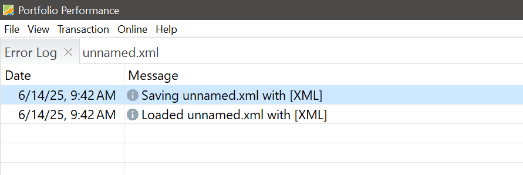
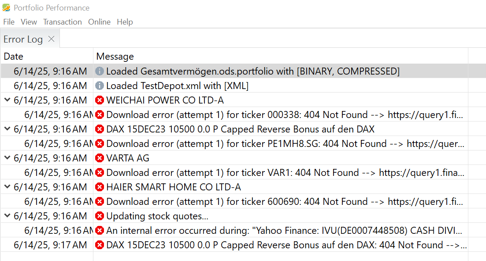
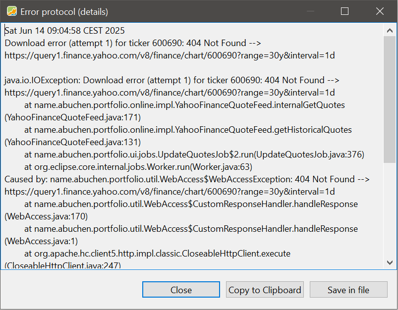
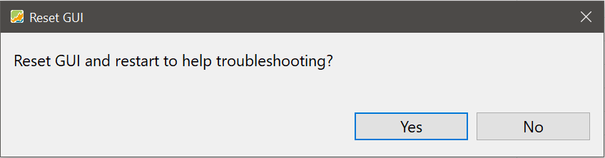
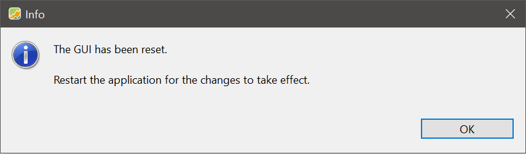
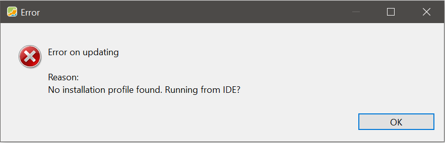

在极少数情况下，Portfolio Performance 应用程序可能出现故障或崩溃。在**帮助**菜单下，有三个关键选项可在此时提供协助。

## 显示错误日志 {#show-error-log}

每次启动应用程序时，它都会生成一个日志文件。你可以通过 `帮助 > 显示错误日志` 在应用程序内查看该日志。双击某条消息会显示完整条目。如果没有发生错误，日志内容会非常少：

图： 成功启动后的日志{class="pp-figure"}



发生错误时，它们会按顺序列出：

图： 操作失败后的日志{class="pp-figure"}



双击某个错误条目会打开更详细的信息：

图： 错误详情视图{class="pp-figure"}



如果投资组合仍能打开，你应当修正相关证券的历史价格数据源。如果打不开，则用文本编辑器打开该 XML 文件，手动删除有问题的数据源。

例如在[论坛](https://forum.portfolio-performance.info/)求助时，你可以把日志文本复制到剪贴板，也可以将其保存为文件。

## 保存错误日志 {#save-error-log}

日志文件会自动保存在你的用户目录下。其默认位置取决于你的操作系统：

- **Windows**：  
  `C:\Users\Your-name\AppData\Local\PortfolioPerformance\workspace\.metadata\`

- **macOS**：  
  `/Users/Your-name/Library/Application Support/name.abuchen.portfolio.ui/workspace/.metadata/`

- **Linux**：  
  `/home/Your-name/.portfolio-performance/workspace/.metadata/`

要导出当前日志为 `.log` 文件，请使用 `帮助 > 保存错误日志` 命令。

这个版本包含比应用程序内错误窗口更多的技术细节：

```
!SESSION 2025-06-07 14:12:08.240 -----------------------------------------------
eclipse.buildId=0.76.3.
java.version=21.0.5
java.vendor=Azul Systems, Inc.
BootLoader constants: OS=win32, ARCH=x86_64, WS=win32, NL=de_DE
Command-line arguments:  -os win32 -ws win32 -arch x86_64

This is a continuation of log file C:\Users\[Your-name]\AppData\Local\PortfolioPerformance\workspace\.metadata\.bak_0.log
Created Time: 2025-06-07 14:27:55.719

!ENTRY name.abuchen.portfolio.ui 4 0 2025-06-07 14:27:55.719
!MESSAGE Widget is disposed
!STACK 0
org.eclipse.swt.SWTException: Widget is disposed
	at org.eclipse.swt.SWT.error(SWT.java:4922)
	at org.eclipse.swt.SWT.error(SWT.java:4837)
...
```

在 [GitHub](https://github.com/portfolio-performance/portfolio/issues) 上报告问题时，请附上此日志文件。避免上传包含敏感数据的投资组合。

## 调试：重置界面 {#debug-reset-ui}

`帮助 > 调试：重置界面` 选项会打开一个对话框。确认后，请重新启动应用程序：

图： 重置 GUI 对话框{class="pp-figure"}



图： 重置成功的确认信息{class="pp-figure"}



重置界面**不会**影响：

- 已创建的视图
- 自定义报告期
- 近期文件列表

它**确实会**重置：

- 窗口大小和位置
- 面板的可见性/布局
- 已打开的文件（重启后不会重新打开）

排查界面问题时，请将**重置界面**作为影响最小的第一步。

## 更新错误 {#update-error}

如果安装已损坏或文件缺失，自动更新可能会失败。这种情况下会出现一条错误信息：

图： 更新错误信息{class="pp-figure"}



推荐的解决方案是卸载并重新安装应用程序。
