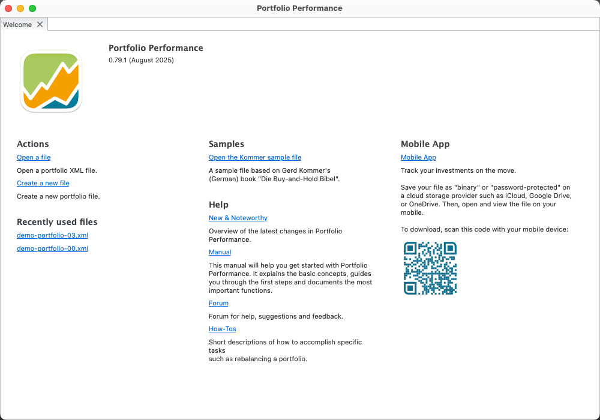

启动 Portfolio Performance 应用程序会自动显示欢迎页面（见图 1），同时显示你上次使用本程序时打开的投资组合。关闭欢迎页面后，可通过 `帮助 > 欢迎` 菜单再次显示它。

图： PortfolioPerformance 应用程序的欢迎页面。{class=pp-figure}

欢迎页面左侧显示应用程序版本（例如 2025 年 8 月的 0.79.1）、一份操作列表（如打开文件或新建投资组合文件）以及一份近期文件列表。你可以通过 `文件 > 打开最近文件 > 清空列表` 菜单清空该列表。中间部分提供一个用于打开示例文件（名为 *Kommer*）的链接，以及若干指向文档网站的链接，本手册即该网站的一部分。右侧有一个下载 Portfolio Performance 移动应用程序的链接。
