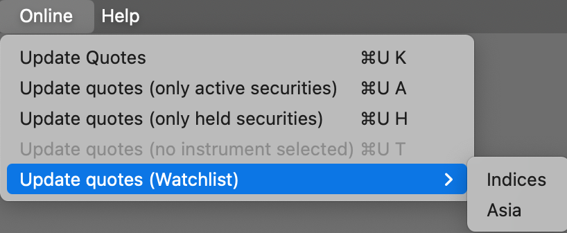
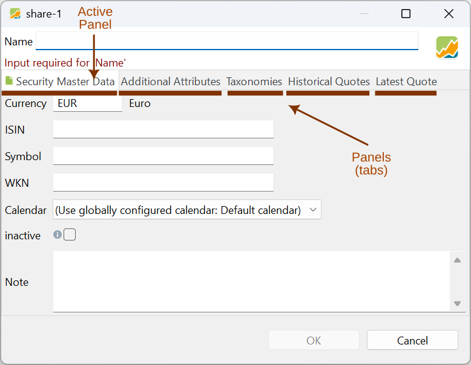

要评估你的投资组合绩效，必须为所有证券准备历史价格或报价。你可以手动输入这些数据，或者更方便地通过报价馈送获取。报价馈送可能是某个网站上的表格，也可能是其他在线数据源。使用菜单 `在线` 即可更新这些历史价格。

图： 菜单 在线。{class=pp-figure}

## 更新报价 {#update-quotes}
对于所有已连接在线报价馈送提供方的证券，此命令会向在线服务发出请求，获取从第一条历史报价到当前日期为止的最新报价。

此前已下载但随后被删除的报价会被恢复。不过，在线下载之后被手动修改过的报价，以及历史价格表格中在线无法获取的报价（例如久远过去的报价），在此操作中保持不变。

窗口左下角会短暂显示一条 `xxx operations remaining`（剩余 xxx 项操作）消息，指示更新过程的进度。该过程在后台进行，不会影响其他操作。

如果你想了解更新过程的更多细节，可查看专门的[价格更新状态](./view/general-data/price-update-status.md)视图。

## 更新报价（仅限已启用的证券） {#update-quotes-only-active-securities}

在证券属性面板的证券主数据标签页中，可以把证券设为启用或停用（见图 2，靠近底部）。

图： 证券主数据标签页中的停用设置。{class=pp-figure}

此命令只更新选项 `停用`未打开的证券。

## 更新报价（仅限已持有的证券） {#update-quotes-only-held-securities}

通过此菜单，你可以把价格更新限制在你实际拥有（持有）的证券，或是已加入关注列表的证券（即*未*记录买入的证券）。

## 更新报价（未选择投资品/已选择 xxx 个投资品） {#update-quotes-no-instrument-selectedxxx-instruments-selected}

在 `全部证券`之类的表格视图中，可以选择一项或多项证券。若要连续选择，请点击第一行，按住 Shift，再点击最后一行。若要非连续选择，请使用 Ctrl 键。

菜单会显示所选证券的数量（xxx）。只有这些证券会被更新。

## 更新报价（关注列表） {#update-quotes-watchlist}

[关注列表](../reference/file/new.md#watchlist)是手动创建的证券分组。在图 1 中，建立了两个关注列表（名为 `指数` 和 `亚洲`）。使用此菜单，你可以只更新这些关注列表中证券的历史价格。