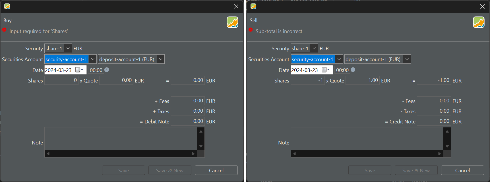
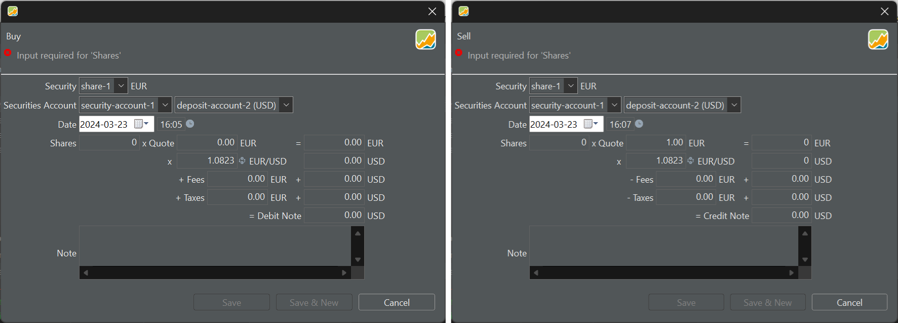

买入或卖出证券时，就现金账户的货币而言，主要有两种情形需要考虑。 

在第一种情形中，如果证券与现金账户使用相同货币，这笔账目就很直接。买方或卖方只需支付或收取与证券价值相当的金额，该金额会从其现金账户中借记或贷记。

在第二种情形中，如果证券与现金账户使用不同货币，就需要进行货币换算。如果你的券商或银行以本币向你收取税款与费用，而你使用的现金账户又以证券的外币计价，同样会产生货币换算的需要。

## 单一货币 {#one-currency}

图： 单一货币下的买入与卖出账目。{class=pp-figure}

在图 1 中，证券与现金账户均以 EUR 计价。因此，对于这家特定的券商而言，由于费用与税款也以 EUR 计价，故无需进行货币换算。`证券`、`证券账户`、`现金账户`、`份额` 和 `借记` 是必填字段。在所有条件都满足之前，顶部会一直显示一条错误消息，如图 1 所示。

你可以用键盘上的 Tab 键在这些字段之间移动，也可以使用鼠标。

- **证券** ： `证券`字段通常会预填 `全部证券`列表中的第一项或所选证券。当然，你也可以从下拉列表中选择其他证券。请注意，货币会自动填好，因为每项证券都有一个参考货币，它在[创建证券](../../getting-started/create-portfolio.md)时设定。
- **证券账户** ：从下拉菜单中选择。其旁边的关联现金账户会自动添加。 
- **现金账户**：从下拉菜单中选择，或保留与该证券相关联的[账户](../../reference/view/accounts/index.md)的预填值。如果所选现金账户的货币与证券货币不同，你就需要换算总额、费用与税款，这需要一个汇率。参见下文。
- **账目日期**：你可以从日历中选取该日期，也可手动输入（格式 = YYYY-MM-DD）。在右侧（00:00）可输入账目时间。采用 12 小时制还是 24 小时制，由菜单设置 `帮助 > 首选项 > 语言 > 国家` 决定。例如，英国使用 12 小时制（含上午与下午），而比利时使用 24 小时制。默认为 `当天零点`，即 00.00。你可以用菜单 `帮助 > 首选项 > 常规 > 预设` 将其改为 `当前时间`。 
- **份额**：你买入或卖出的证券数量。可以是小数，但不能为零或负数。。
- **报价** ：这是你为每一份证券支付的价格。如果该证券包含历史价格（见[添加证券](../../getting-started/adding-securities.md)），给定日期的正确价格会被自动填入。不过，这一历史价格可能与你的银行提供的数值不一致，因为它基于日终价格，而银行使用的是实时信息。

以上六个字段（加上计算得出的借记）是完成该笔账目的*必填*项。其中大多数会根据所选证券预填。下列字段则属于计算所得或可选。

- **总价值** ：这是份额数乘以报价的结果。如果之后你修改了总价值，报价也会相应调整，以维持 `份额数 * 报价` 这一等式。

- **费用** 与 **税款** ：一笔买入账目通常会产生费用与税款。这些金额可能以证券和/或现金账户的货币计价。

- **借记** ：这是你因这笔买入账目而需要支付的金额。计算方式为 `份额数 * 报价 + 费用 + 税款`。这一金额的其他名称是"价值"或"净额"。

- **备注** ：你可以为每笔账目添加一条文字备注。

录入上述信息的典型流程可能是 `份额数 * 报价（价格） >> 总价值 + 费用 + 税款 >> 借记`。如果事后再作修改，会有若干微妙之处（见图 3）。

图： 份额数与借记之间的计算流程。

{.pp-figure}

- 事后修改*借记*会改变总价值，进而使报价随之调整。份额数保持不变。
- 事后修改*总价值*会改变借记与报价。费用、税款与份额数不受影响。

点击"保存"按钮会相应更新投资组合。如果选择"保存并新建"，则不仅会更新投资组合，还会弹出新的买入/卖出对话框，以便继续录入后续账目。

## 两种货币 {#two-currencies}

有时，证券的货币可能与你所用现金账户的货币不同。在这种情况下，系统会针对预填的日期自动生成一个[汇率](../view/general-data/currencies.md)。该汇率每日取自欧洲中央银行（ECB），且不考虑具体时点。需要注意的是，此后修改日期同样会改变汇率，无论该汇率是自动获取还是手动输入的。

图： 两种货币下的买入与卖出账目。{class=pp-figure}

需要注意的是，报价与（第一笔）总额始终以所交易证券的货币表示（例如图 2 中的 EUR）。另一方面，借记则始终以存款的货币表示（因为它代表实际付款）。而费用与税款则可以以证券的货币（左侧）或现金账户的货币（右侧）录入，甚至可以同时用两种货币录入。
