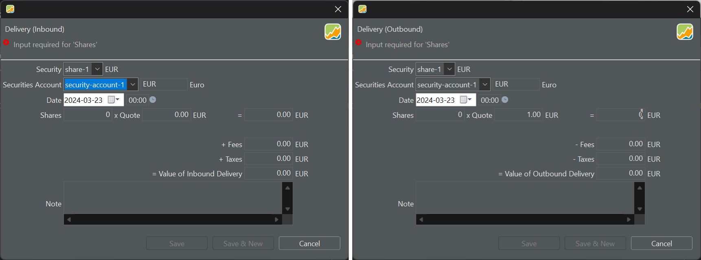
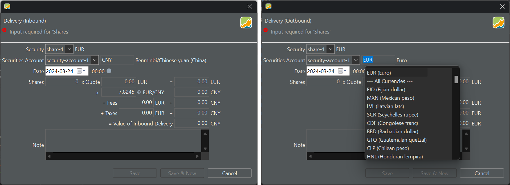

证券转入/转出涉及向证券账户添加或移除证券，而无需一笔存款账目。把证券转入与转出同存款与取款账目做一番比较，有助于理清二者的区别。

这两类账目都涉及资产（资金）的划转，但它们影响的账户类型不同。存款与取款账目只影响现金账户。存款时，现金账户余额增加；反过来，取款时余额减少。同理，证券转入与转出涉及向证券账户添加或移除证券。在两种情形下，无论是现金还是证券，资产要么被计入某个账户，要么从中取出。

证券转入/转出账目在以下情形中尤其有用：

1. **重建投资组合**：你试图依据历史数据重建某个投资组合，却缺少价格、费用甚至日期等具体账目细节。

2. **继承与赠与**：如果你继承了证券或收到他人赠与的证券，你可能并没有全部的历史细节，大概只掌握当前市价的信息。以当前日期和价格记一笔证券转入或许是个解决办法。

3. **货币方面的考虑**：如果某项证券的货币在投资组合中没有对应的现金账户，可以使用证券转入账目把该证券加入投资组合。

4. **公司行为**：分股、合并或收购等某些公司行为，有时用证券转入/转出来实现比用买入/卖出更为方便。

图： 证券转入与证券转出账目 - 单一货币。{pp-figure}

## 单一货币 {#one-currency}

每个证券账户都配有一个相应的现金账户，该账户在创建时会自动添加。由于 security-account-1 关联着一个以 EUR 计价的现金账户，图 1 中便默认建议使用 EUR。方框中的货币标识（EUR）可以修改；其右侧的文字则给出该货币的说明（欧元）。

当所选账目货币与证券（share-1）的货币一致时，无需换算。其他所有字段，如日期、份额、报价等，都与[买入/卖出账目](buy-sell.md)中的相同。

## 两种货币 {#two-currencies}

通过选择其他证券或证券账户，可以改变账目货币。不过，在已选定证券和/或证券账户的情况下，也可以直接更改账目货币。要更改账目的货币，你可以：

- 点击证券账户旁边的文本框。用滚动条找到另一种货币，然后双击它。
- 选中可用的货币（例如 EUR），再输入新货币（例如 ZAR）将其覆盖。
- 点击方框并选中可用的货币（例如 EUR）。然后输入所需货币的首字母（例如 Z for ZAR）。此时会显示所有以字母 Z 开头的可用货币列表，供你从中选择。

系统会给出欧洲中央银行（ECB）的汇率。不过需要注意，费用与税款仅适用于证券的货币，这与买入/卖出账目中的设置不同。

!!! Important

    如图 2 所示，你可以灵活地从[可用货币列表](../view/general-data/currencies.md)中选取任意货币进行换算（超过 50 个选项）。并不要求存在该货币的相应现金账户。例如，在图 2 中，尽管没有 CNY 的现金账户，仍选择了人民币。系统也不会创建该货币的现金账户。需要记住的是，对于证券转入账目，某项证券似乎会"凭空"出现或消失。

图： 证券转入与证券转出账目 - 两种货币。{pp-figure}

