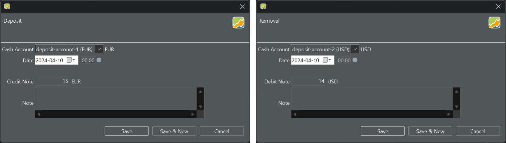

存款是向现金账户添加资金的过程，而取款是从账户中移除资金的过程。deposit account 在 Portfolio Performance 的中文界面中称为 `现金账户`。

图： 以 EUR 存款和以 USD 取款的示例。{class=pp-figure}

图 1 展示了一笔 15 EUR 的存款和一笔 14 USD 的取款。尽管存款会增加（借记）*你的*账户余额，但它被称为 `贷记`，因为这笔资金来自第三方，其账户将相应减少（贷记）。这类似于退货之类的情形，你从公司收到一张贷记单。

账目的货币由所关联的现金账户决定。把货币加到现金账户名称中看似多余，但在从下拉菜单中快速辨认账户时很有帮助。把它们命名为 `deposit-account-1`、`deposit-account-2`，会迫使你记住 account-1 用的是 EUR，account-2 用的是 USD。

隐含的存款或取款也可能通过其他账目发生，例如买入股票，它会自动触发从现金账户中取出等值金额。

初学者常见的一个错误，是没有先确保已存入所需款项，就记录了一笔买入账目。这可能导致现金账户余额为负，进而影响投资组合在报告期末的市值，并因此影响投资组合的绩效。当然，这种影响在单项证券或单个头寸的绩效中是看不到的。

你无法像在银行那样为现金账户附加利率。因此，存入现金账户的资金会保持其确切数值，直至报告期末（MVE）。因此，单独的存款和取款对投资组合的绩效没有影响。假设投资组合在报告期初的市值为 100 EUR（MVB），且在 1 年期间的正中间只有一笔 50 EUR 的存款（计算的更多信息见[基本概念 > 绩效](../../concepts/performance/index.md)）。

- 时间加权收益率：`r = [150/(100 + 50)] - 1 = 0%`。 
- 内部收益率：`150 = 100 x (1 + IRR)^1 + 50 x (1 + IRR)^1/2 = 0%`。

要为现金账户指定利息，可以使用菜单 `账目 > 利息`。