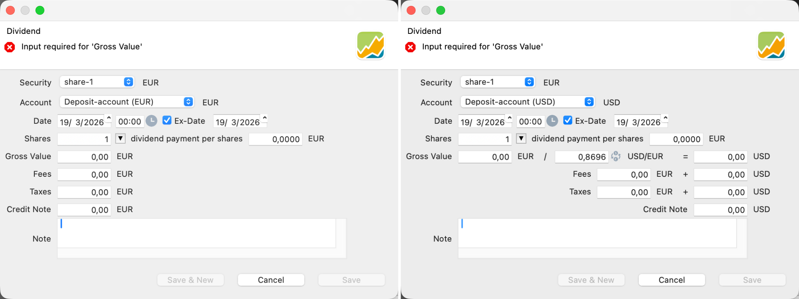

股息是公司向其股东进行的利润分配。当分配以现金形式发放时，应使用此账目类型。有关选择权股息或股票股息，请参见操作指南一节中的[处理选择权股息](../../how-to/handling-choice-dividend.md)。

## 记录股息 {#registering-a-dividend}
通过 `账目 > 股息` 菜单，你可以在投资组合中记录股息支付。你也可以通过右击使用上下文菜单。如果已选定某项证券，`证券`字段会为你预填。

图： 同币种与不同币种支付的股息对话框。{class=pp-figure}

- **证券**：股息与某项证券相关联，通常是公司的一只股票。不过，股息也可以用来记录债券的[利息支付](../../getting-started/manage-portfolio/bonds.md#recording-the-interest-payment)。使用下拉列表选择该股息所来自的证券。
- **账户**：由于股息是现金支付，你需要一个现金账户来记录它。请注意，如果证券与现金账户的货币不一致，对话框中会额外增加一些字段（图 1；右侧面板）。
- **日期**：与股息相关的日期有[四个](https://www.investopedia.com/terms/d/dividend.asp)。支付日期可能是 PP 中最显而易见的一项。你也可以通过勾选复选框并输入日期，可选地记录除权日。除权日是金融工具在交易所进行不含该股息的交易之日。目前该日期尚未被使用，仅作信息参考。它可用于更精确地计算绩效（价格调整发生在除权日），以及更准确地把股息归属到各个头寸；另见下文关于绩效计算的例子。
- **份额**：股息按每股支付。选定日期后，份额数量会自动填入。你可以手动修改该数量；重新选择其他日期会把这个数量重置为该时点实际可用的数量。
- **每股股息**：这是公司商定为每股支付的金额。你的券商会向你提供这一信息。货币由该股票决定。许多金融网站，如 [Yahoo Finance](https://finance.yahoo.com/quote/MSFT/history?filter=div) 或 [investing.com](https://www.investing.com/dividends-calendar/)，都提供股息支付的历史概览。
- **总额**：总额自动计算为份额数乘以每股股息。你可以修改该数值，但这样做会相应改变每股股息的数值。
- **汇率**：当证券与现金账户的货币不一致时，会出现此字段。[汇率](../view/general-data/currencies.md)针对所输入的日期从欧洲中央银行获取。该数值可以手动更改。选择其他日期会从欧洲中央银行获取新的数值。你也可以使用 `反转`按钮改变换算方向，例如从 EUR 换算为 USD，或反之。外币的总额会据此计算，并额外包含费用与税款字段。
- **费用与税款**：可以分别录入；也可以使用外币录入。
- **贷记**：这是计算得出的净额，即总额减去费用与税款。手动修改该数值会影响总额，并进而影响每股股息。
- **备注**：关于这笔股息支付的补充文字信息。

## 对绩效的影响 {#effect-on-performance}

**税款**计入投资组合层面的绩效计算，但在证券层面的绩效计算中予以排除。**费用**则始终计入。原因在于各项指标试图衡量的对象不同：投资组合绩效追踪你的财富如何变化，而证券绩效衡量的是某项工具本身表现如何。

在**投资组合层面**，费用与税款的处理方式完全相同。两者都代表真正永久离开投资组合的资金——支付给券商，或被税务机关扣留。它们会减少现金账户，从而也减少投资组合的期末价值。你支付的费用与税款越多，收益率就越低。

在**证券层面**，关注点转向投资本身，与投资者无关。费用之所以计入，是因为它与该证券密切相关：有些证券的交易成本比其他证券更高。而税款更多取决于投资者——他们生活在哪个国家、收入在何时计税，以及更广泛的财务状况。由于税款并不是证券本身稳定或可比的特征，因此被排除在计算之外，以确保绩效反映的是投资，而非个别投资者。

 关于绩效计算的深入解释，请参见[基本概念 > 绩效](../../concepts/performance/index.md)。