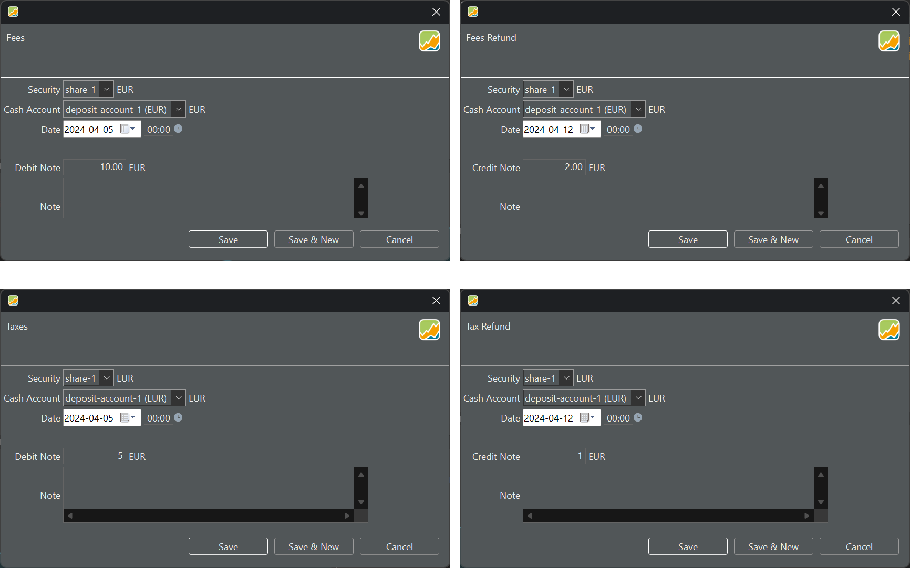
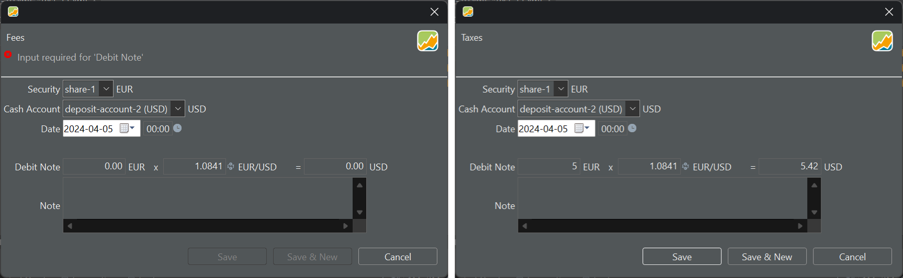

费用与税款通常在[买入或卖出](./buy-sell.md)证券时就已结算。不过，在某些情况下，可能有必要在其他时间记录它们。图 1 中的对话框表明，这几类账目所需的输入数据完全相同：`证券名称`、`现金账户名称`、`账目日期` 和 `金额`（借记或贷记）。

图： 费用、费用退款、税款和退税款账目。{class=pp-figure}

你可以选择货币与证券账户不同的现金账户。此时会显示一个用于换算货币的额外输入框（参见图 2）。

图： 证券与现金账户使用不同货币。{class=pp-figure}

