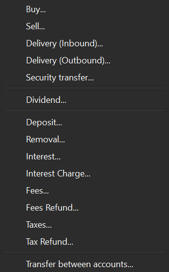
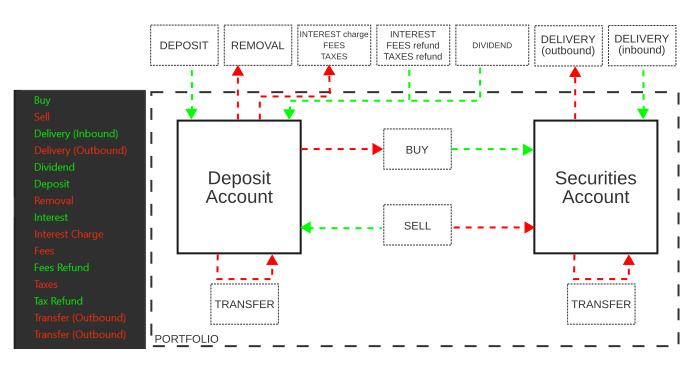

图： 账目菜单。{class=align-right style="width:30%"}

在 Portfolio Performance（PP）中，账目表示一次会改变投资组合状态的操作；例如，一笔存款会增加现金账户的余额。如图 1 所示，共有 15 种账目类型。`证券转移 ...` 与 `账户间转账 ...` 与其他类型略有不同，只有在存在多个证券账户和/或现金账户时才会出现。这些账目可以按作用相反的操作配对分组：

- 买入/卖出：买入一项资产会增加证券账户的价值并减少现金账户的价值，而卖出资产的作用则恰好相反。
- 证券转入/转出（inbound/outbound）：证券转入会向证券账户添加证券，而证券转出则会将其移除。现金账户不受影响。
- 存款/取款：存入或取出资金会分别增加或减少现金账户的价值。
- 利息/利息支出：收取利息意味着现金账户增加，而支付利息则会导致其减少。
- 费用/费用退款：支付费用意味着从现金账户取款，而收到退款则意味着存入。
- 税款/退税款：税款通过从现金账户取出资金来结算；反过来，退税款则是向现金账户存入。

!!! Note
    理论上，Portfolio Performance 只用 8 种账目类型就够用：头寸、证券转入、存款、费用、税款、利息、转账和股息。每笔账目都可以用一个正值或负值表示，例如：卖出或 trade(-)，以及买入或 trade (+)。
    
    事实上，这一点可以从以下事实看出：在 `全部账目` 这样的表格中，双击某个关键词（例如买入），再从下拉列表中选择另一项（卖出、证券转入、证券转出），即可改变账目的类型。这项技巧对费用和税款不适用。    

图 2 展示了全部 15 种账目类型对现金账户与证券账户的影响。分析图 2 有助于厘清每种账目类型对投资组合的影响。

- 证券账户只受买入、卖出、证券转入与转出以及证券转移账目的影响。这大概也解释了为什么它们会被一条分隔线归为一组（见图 1）。需要注意的是，买入/卖出账目同时影响现金账户与证券账户，而证券转入/转出与证券转移账目则不会。证券转入本质上是不涉及存款的买入/卖出账目，并被表述为来自投资组合之外。

- 除证券转入/转出与证券转移之外（见上文），所有账目类型都会影响现金账户。这些影响可能表现为流入（绿色）或流出（红色）。

- 这套配色方案可能有些令人困惑。在图 2 左侧的图片中（来自 `全部证券` 视图），一笔买入账目会导致现金账户的资金流出；但它却被显示为绿色。反之，一笔转账（从一个证券/现金账户转到另一个）却被显示为红色。

- 除利息之外，所有账目类型都与某项具体证券相关联，例如一只股票。而利息只与现金账户相关联。由此带来的一个推论是：如果你希望维持与债券的关联，那么债券的利息在 Portfolio Performance 中应当记为一笔股息。

图： 全部 15 种账目类型及其影响。{class=pp-figure}

