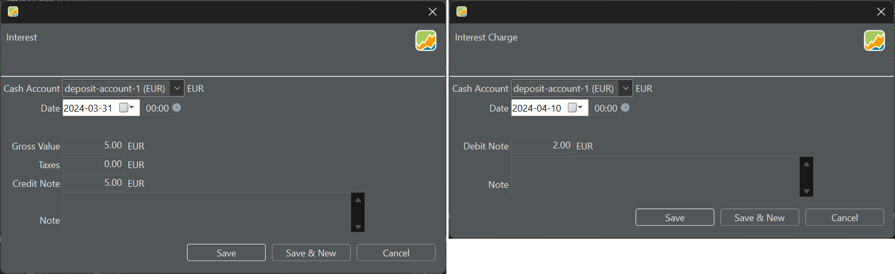
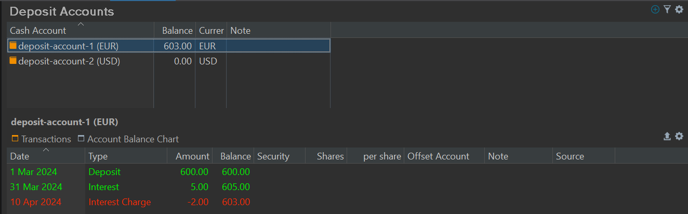

利息是出借资金所获得的回报，例如把资金存入现金账户。它体现了传统的银行安排：你可能会按月或按年从账户中持有的资金上获得利息。这笔账目由银行的贷记发起。税款可以从利息支付中预扣。反过来，利息支出则是借款所产生的费用。当你的（实体）现金账户变为负数时（意味着已发生借款），你需要支付一笔费用，对银行而言这构成一笔借记操作。

图： 利息与利息支出账目。{class=pp-figure}

利息与利息支出账目的结果，是所选现金账户余额的增加或减少（见图 2）。

图： 利息与利息支出账目对余额的影响。{class=pp-figure}

此外，投资组合的绩效也可能受到影响。图 1 中两笔利息账目的净结果为收益 3 EUR。对于 1 年的报告期（2024），基于图 2 的数据，可得：

- 时间加权收益率：`r = 603 / 600 = 0.50%`
- 内部收益率：`603 = 600 x (1 + IRR)^(305/365) for IRR = 0.60%`

请注意，600 EUR 的存款被 Portfolio Performance 视为一笔（绩效中性的）现金流入，但利息与利息支出账目并非如此。它们只影响现金账户的余额，因而也影响投资组合的 MVE。