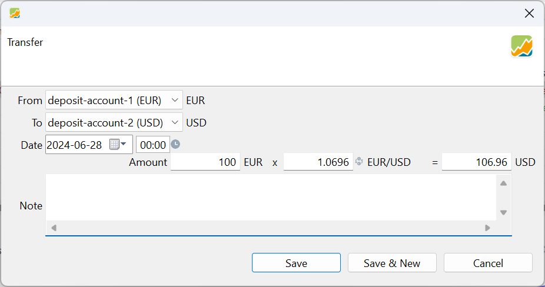
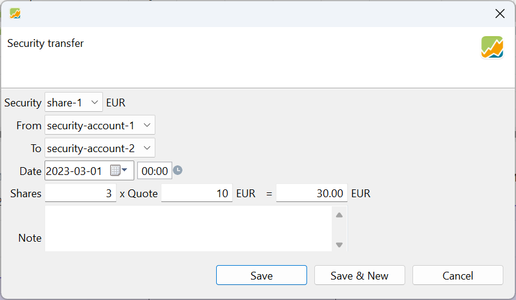
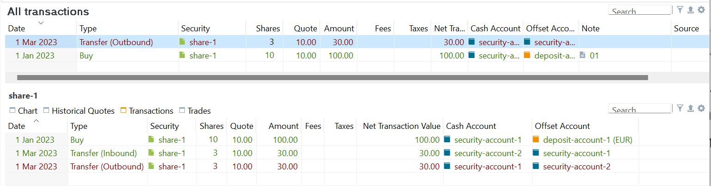
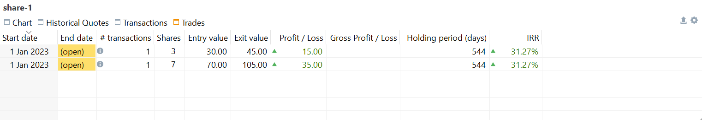
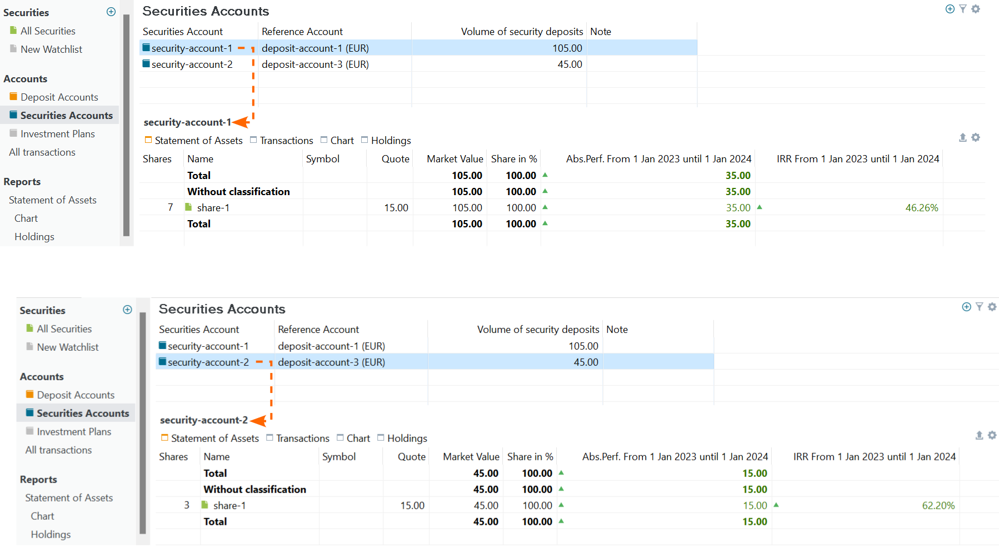

`证券转移` 与 `账户间转账` 这两个菜单选项，只有在存在多个证券账户和/或现金账户时才会显示。

## 账户间转账 {#transfer-between-accounts}

你可以在相同货币或不同货币的现金账户之间转账。例如在图 1 中，100 EUR 从 `deposit-account-1 (EUR)` 转至 `deposit-account-2 (USD)`。按 1.0696 EUR/USD 的汇率计算，后一个账户将存入 106.96 USD。

汇率会针对指定日期自动从[欧洲中央银行](../view/general-data/currencies.md)获取，必要时也可以手动覆盖。

图： EUR 现金账户与 USD 现金账户之间的转账。{class=pp-figure}

 
## 证券转移 {#security-transfer}
 
顾名思义，这笔账目涉及把指定数量的份额从一个证券账户转到另一个证券账户。只有当投资组合包含多个证券账户时，才可以在菜单中访问它。关于只有一个证券账户或多个账户的投资组合的若干讨论，参见主题[参考 > 视图 > 账户 > 证券账户](../view/accounts/security-account.md#one-or-more-security-accounts)。

在许多情形下都可能需要证券转移。例如，如果你有多个券商各自的证券账户，可能需要在它们之间转移某项证券，这类似于现实中把证券从一家券商转到另一家券商的情形。

另一个常见情形是为将来作安排，例如为孩子预留一部分股票。在把这些股票保留于你的投资组合中的同时，你可以从*父*账户向*子*账户转移一部分。这种隔离确保了从父账户卖出股票不会影响子账户的绩效，从而可以分别追踪两者的绩效。

图： 证券转移对话框。{class=pp-figure }

借助三个下拉框，你可以选择证券（`share-1`），以及作为来源（`security-account-1`）和目标（`security-account-2`）的证券账户；见图 2。系统会进行若干校验；例如，你无法转出在来源账户中不存在或数量不足的证券。你还需要提供转账日期、份额数量和报价。

虽然从技术上讲这是一笔账目，但在幕后，Portfolio Performance 会创建两笔"虚拟"账目（参见图 3 的信息窗格）。证券转移被拆分为从 `security-account-1` 转出 3 份的转出账目，随后是一笔转入 `security-account-2` 的转入账目。不过，这两笔账目被视为同一个整体。编辑其中一笔会弹出证券转移对话框。删除其中一笔账目也会同时删除另一笔。

图： 证券转移账目的结果。{class=pp-figure}

证券转移账目的一个后果是会产生两个未结头寸，如图 4 所示。第二个头寸涵盖 `security-account-1` 中剩余的 7 份，而第一个头寸则由 `security-account-2` 中转移过去的 4 份组成。两个头寸都记为从最初买入该股票的日期开始。虽然也可以认为第二个头寸应当从转账日期开始，但事实并非如此。此外，两个头寸采用相同的买价，尽管也有人主张改用转账时的报价。需要指出的是，证券转移时填入的日期与报价在此过程中似乎并未被采用。

图： 证券转移账目产生的头寸。{class=pp-figure}

## 设置报价 {#setting-the-quote-price}

为什么需要报价？应该输入什么价格：买价、转账日期的历史价格，还是零？为什么不能*直接*把份额从一个账户转到另一个？简短的答案是：绩效追踪。

以上述情形为例，转出 3 份（见图 2）。该股票于 2023 年 1 月 1 日以每股 10 EUR 买入。转账当时的历史价格为每股 12 EUR，尽管你实际以每股 10 EUR 转出（见图 3）。如今（2024-01-01），价格已升至每股 15 EUR。在 2023-01-01 至 2024-01-01 这一报告期内，两个证券账户的绩效分别是多少？请记住，报告期从第一天结束之时（例如 2023-01-01）起算，直至最后一天结束之时。

图： 来源账户与目标账户的总收益与内部收益率（转账报价 = 10 EUR）。{class=pp-figure}

[总收益](../view/reports/performance/index.md#absolute-change)的公式为：**MVE - MVB + CFout - CFin**，其中 MVE = 期末市值，MVB = 期初市值，CFout = 流出该账户的现金流，CFin = 流入该账户的现金流。账户的总收益是该账户期初价值与期末价值之差，但须对流入与流出的部分加以修正。

1. 如果报价设为买价（10 EUR）：

    * *总收益*
    
        - 来源：`MVE (7 x 15) - MVB (10 x 10) + CFout (3 x 10) - CFin (0) = 35 EUR`。
        - 目标：`MVE (3 x 15) - MVB (0) + CFout (0) - CFin (3 x 10) = 15 EUR`
        
    * *内部收益率* [[公式](../view/reports/performance/index.md)]

        - 来源：`(7 x 15 EUR) = (10  x 10 EUR) x (1+46%)^(365/365) - (3 x 10) x (1 + 46%)^(306/365)`
        - 目标：`(7 x 15 EUR) = (0  x 10 EUR) x (1+62%)^(365/365) + (3 x 10) x (1 + 62%)^(306/365)`。转账于 2023 年 3 月 1 日执行，距 MVE 还有 306 天。

2. 如果报价设为当时的历史价格（12 EUR）：

    * *父*账户：`(7 x 15) - (10 x 10) + (3 x 12) - 0 = 41 EUR`。
    * *子*账户：`(3 x 15) - 0 + 0 - (3 x 12) = 9 EUR`。

3. 如果报价设为零（在 PP 中实际上无法这样设置；可输入 0.1 进行测试）：

    * *父*账户：`(7 x 15) - (10 x 10) + (3 x 0) - 0 = 5 EUR`。
    * *子*账户：`(3 x 15) - 0 + 0 - (3 x 0) = 45 EUR`。

由此可见，总收益的变化很大：来源账户从正的 +41 EUR 一直降到 5 EUR。这样的糟糕绩效当然很好理解。毫无代价地从来源账户转出 3 份，会严重影响绩效。

投资组合的绩效应当是各账户绩效之和，在上述三种情形中都等于 40 EUR。投资组合的 MVE 为 (7 + 3) * 14 EUR = 140 EUR。MVB = 10 * 10 EUR = 100 EUR。因此投资组合的总收益确实为 40 EUR。