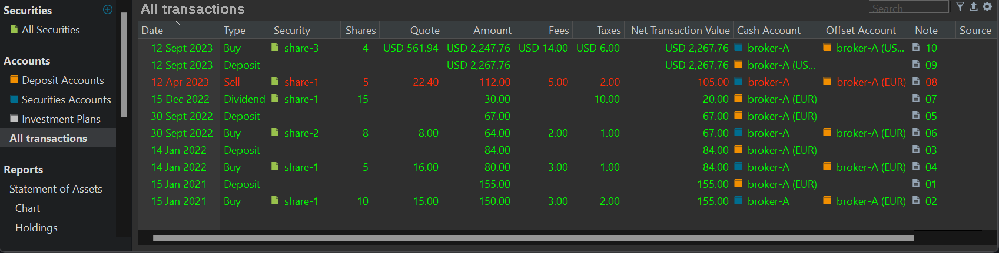
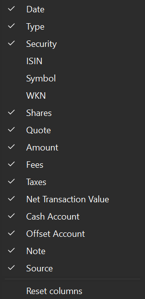
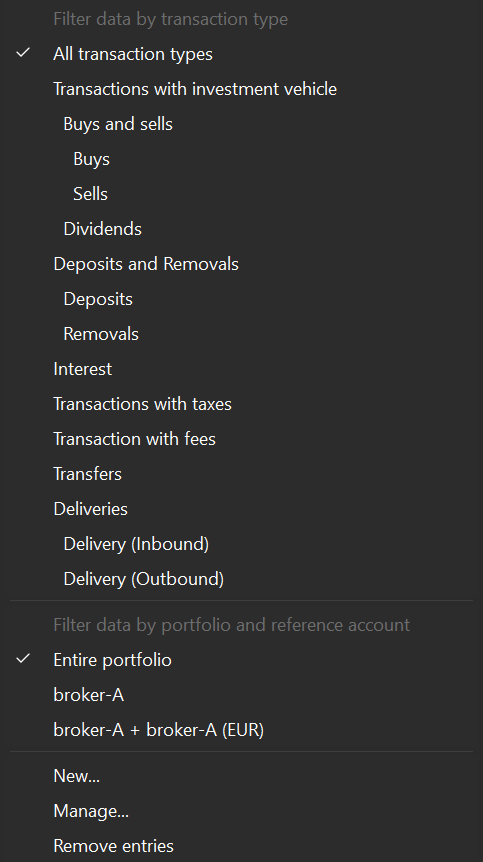
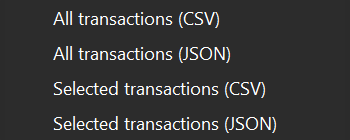

# 视图 &rsaquo; 账户 &rsaquo; 全部账目

`全部账目`视图在主面板中显示一张表格，列出投资组合的所有账目，按账目在投资组合中的创建时间排序（见图 1）。默认视图显示的列有 `日期`、`类型`、`证券`、`份额`、`报价`、`金额`、`费用`、`税款`、`净额`、`现金账户`、`目标账户`、`备注`和`来源`（这些术语的定义见[术语表](../../../concepts/portfolio-performance-terminology.md)）。

图： 全部账目视图。{class=pp-figure}

尽管它的用处不如 `全部证券`视图那么大，但位于底部的信息面板（图 1 中未显示）可以提供与主面板中所选账目相关联的证券的更多细节。

## 设置 {#settings}

图： 显示或隐藏列按钮（齿轮）。{class=align-right style="width:30%"}

点击列标题可按该列以升序 (&and;) 或降序 (&or;) 排列表格。你可以拖动列标题来重新排列任意一列。拖动两列之间的分隔线可调整左列的宽度，双击则可调整为最佳匹配。你可以用上下文菜单（在列标题上右击）重命名或隐藏某一列。添加、删除或把列重置为原始布局，可用"显示或隐藏列"图标（右上角的齿轮符号）完成。默认的列显示在图 1 中；它们在图 2 中也有勾选标记。图 2 给出了所有可用列的清单。

可以看到，除了 `ISIN`、`证券代码`和 ´WKN´ 之外，所有可用列都已显示，这些通常是证券相关术语（见[术语表](../../../concepts/portfolio-performance-terminology.md)）。

## 搜索 {#search}

在一个典型的投资组合中，账目表格可能包含数百行。不过，你可以使用搜索功能来缩小所显示的行范围。该功能会扫描每一列的所有单元格，若某个单元格包含搜索值，则显示相应的账目（行）。例如，在图 1 的搜索框中输入 `share-3`，列表会缩小到第一行。输入 `share`（实际上输入 `sh` 就够了）会显示所有证券列（事实上是每一列）中包含 `share` 一词的账目。该功能会搜索所有可用列，无论它们是否被显示。你不能使用 `*` 或 `?` 之类的通配符，也不能把搜索功能限定在某单独一列。

## 过滤 {#filter}

图： 过滤证券按钮。{class=align-right style="width:30%"}

限制账目数量的另一种方法，是使用位于界面右上角的"过滤证券"按钮。图 3 展示了所有可用的选项。默认情况下，表格中显示的是`整个投资组合`中`全部账目类型`的账目。

过滤分为两个主要组：`以账目类型过滤`与`以投资组合与关联账户过滤数据`。第一组用于选择诸如全部买入或卖出之类的账目。第二组用于选择某个特定证券账户中的账目。各个选项的意义不言自明。德国原文 `Buchungen mit Wertpapier` 的译名 `包含投资品的账目` 不甚理想，更恰当的术语是 `包含证券的账目`。

过滤器以"二者取一"的方式工作。从某组中选择一个选项，会替换该组中此前的任何选择。例如，你可以选择"买入和卖出"，也可以只选"买入"或只选"卖出"。

过滤命令与搜索功能协同配合、互为补充。例如，搜索"USD"并按"存款"过滤，结果只会显示图 1 中的第二行：一笔 USD 存款。

也存在一些限制。例如，你只能按*关联*账户过滤，而不能按任何现金账户（如 `broker-A (USD)`）过滤。不过，借助 `创建...` 选项，你可以为任意（现金）账户创建筛选器。请注意，似乎也无法筛选**不含**税款或费用的账目。

通过 `管理...` 选项，你可以重命名（新建的）自定义筛选器、为其添加元素或删除该筛选器。`移除所有过滤器` 选项会把第二组筛选器重置为整个投资组合。

## 导出 {#export}

图： 导出所选行。{class=align-right style="width:30%"}

通过右上角的导出按钮，你可以选择把所显示的账目表格保存为 CSV 或 JSON 文件。只有当前显示的列和行（包括标题行）会被保存。

如果你在表格中做了选择，导出按钮会提供四个选项而非两个（见图 4），其中也包括仅导出所选账目的可能。

!!! Note
    
    [`文件 > 导出`](../../../reference/file/export.md#account-transactions)将始终导出**全部**账目。如果你只对某个特定选择感兴趣，请使用这个选项。
