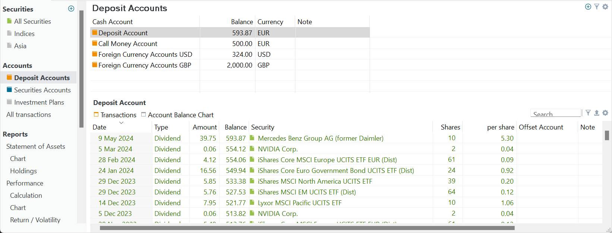
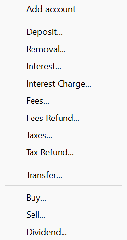
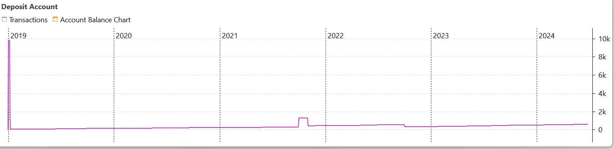

现金账户是管理投资组合内现金流的中心枢纽，让用户能够为投资活动分配资金并跟踪进出账目。你可以把它想象成一份清单，类似购物清单，其中记录着取款与存款等账目。一个投资组合中可以有多个现金账户，例如分别对应不同的交易货币。在安装过程中，已经至少创建了一个证券账户和一个现金账户。

图： 现金账户示例。{class="pp-figure"}

## 主面板 {#main-pane}

在图 1（主面板）中有四个现金账户。由于图 1 的第三列已经为每个现金账户标明了货币，把货币写进账户名称似乎显得多余。然而，在你需要从列表中选择现金账户的情形下（例如买入证券时），把货币写进账户名称会很有帮助。在这种情况下，让账户名称中清楚地显示货币，可以帮助你快速准确地选择正确的账户。

你可以根据自己的偏好和需要为账户取不同的名字。例如，如果你希望把股息和税款分开，可以创建两个分别名为 `Dividends` 与 `Taxes` 的账户。

图： 添加账户。{class=align-right style="width:20%"}

要创建新的现金账户，请点击右上角的绿色 + 图标（参见图 2）。然后选择 `添加账户` 选项。由于你正处于现金账户视图中，将创建一个以投资组合默认货币计价、名为 `No Name` 的新现金账户。要重命名账户，只需双击名称字段并输入所需名称。如有需要，也请双击货币字段（例如 EUR）并从下拉菜单中选择另一种货币来更改货币。在浏览货币列表时，你可以使用所需货币的首字母来加快浏览速度。新创建的现金账户初始余额为零。

现金账户可以是负数。不过，良好的做法是：你应当先存入一笔足够大的款项，以覆盖后续的买入账目，就像你在真实券商处会做的那样。

要停用一个账户，请在该账户上右击，并从上下文菜单中选择 `停用账户`。账户名称会显示为灰色，在录入存款账目时也不再出现在现金账户列表中。通过右上角的筛选图标，你可以隐藏已停用的账户。

你可以使用上下文菜单删除现金账户。但需要注意的是，只有在该账户没有任何相关账目时，才能删除它。

如果你想删除一个已有账目的账户，必须先删除与该账户关联的账目。所有账目都删除之后，才能删除账户本身。

通过 `显示或隐藏列` 选项（可经由右上角的 :gear: 齿轮图标访问），你可以通过隐藏或添加列来自定义视图。可显示的列包括：`现金账户`、`余额`、`货币`、`备注`和`属性`。有关处理该表格的更多详细信息，另见[操作指南 > 用户界面](../../../how-to/user-interface.md)。

## 信息面板 {#information-pane}

位于底部的信息面板显示主面板中所选现金账户的账目。它由两个标签页组成：账目和账户余额图表。账目标签页显示每笔账目的日期、类型、金额和余额等字段。账户余额图表以图形方式呈现账户余额。由于数据点比历史价格图少，图表看上去可能较为块状。图 3 展示了 `Broker-1 (EUR)` 账户的余额，其中早期的尖峰是存入款项后于次日进行买入交易所致。

图： 账户余额图表示例。{class=pp-figure}

在图表上右击可访问上下文菜单，它提供的选项与许多其他图表相同；更多信息请参见[`全部证券`信息面板的图表菜单](../../view/securities/all-securities.md#chart-menu)。没有其他配置项。

## 排查余额差异 {#troubleshoot-balance-discrepancy}

如果你发现某个现金账户中 Portfolio Performance 计算出的余额与银行/券商的实际余额之间存在差异，可以使用上下文菜单排查问题。为此，在主面板中右击该账户，并从菜单中选择"排查余额差异"。

这将打开一个对话框，显示所选现金账户计算得出的逐月余额。在"预期余额"列中，你可以根据银行对账单填入你预期的余额。Portfolio Performance (PP) 随后会利用计算出的差额，尝试找出可能引发差异的账目。例如，Portfolio Performance 可能会发现有些账目记到了其他账户，或者日期落在未来。

<video width="100%"  controls>
  <source src="../images/troubleshoot-balance-discrepancy.mp4" type="video/mp4">
</video>
