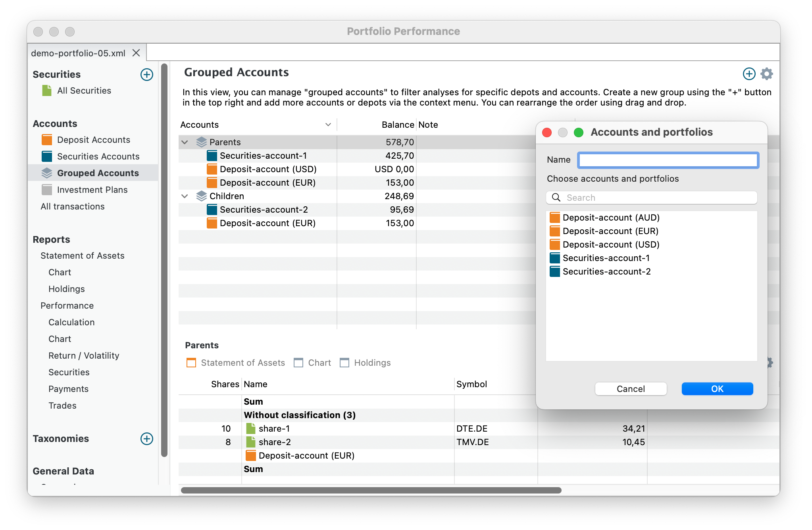

一个投资组合可以包含多个`证券`账户和`现金`账户。例如，你的投资组合可以有分别对应多家券商的证券账户，每个都配有自己的现金账户。或者，你可能希望把作为家长为自己所做的投资与为孩子所做的投资分到不同账户中。

图： 筛选菜单。{class="align-right"}

在带有 :material-layers-triple: 图标的视图中，你可以根据所选账户筛选结果。例如，在[资产明细](../reports/statement/index.md)视图中，你可以按特定账户或账户组合筛选计算结果（见图 1）。

借助 :material-layers-triple: `账户分组`视图，这些筛选器有自己专门的管理视图。点击菜单 `视图 > 账户 > 账户分组`，或在侧边栏中选择相应选项。使用 :octicons-plus-circle-16:{.green} `新过滤器...` 按钮添加新筛选器。

图： 账户分组。{class="pp-figure"}

如图 2 所示，[demo-portfolio-05.xml](../../../assets/portfolios/demo-portfolio-05.xml) 包含两个`证券`账户和三个`现金`账户。名为 `Parents` 的筛选器包含 `Securities-account-1` 以及 EUR 和 USD 现金账户。`Children` 筛选器则只显示 `Securities-account-2` 和 EUR 现金账户的结果。

你可以通过拖放来调整筛选器的顺序。筛选器内账户的排序顺序由该列的排序顺序决定（在列标题上点击 `v` 或 `^`）。最多只能显示三列：`现金账户`、`余额`和`备注`。使用 :gear: `显示或隐藏列` 图标调整可见列。

位于底部的信息面板提供主面板中所选账户的详细信息。更多细节请参见[资产明细](../reports/statement/index.md)、[图表](../reports/statement/statement-chart.md)和[持仓](../reports/statement/holdings.md)各节。这些视图会依据主面板中所选的筛选器进行过滤。

你也可以在其他视图中创建和管理筛选器。点击 :material-layers-triple: 图标即可访问筛选器选项。在其他视图（例如计算视图）中创建的新筛选器，会被自动加入`账户分组`视图，并在其中显示。

