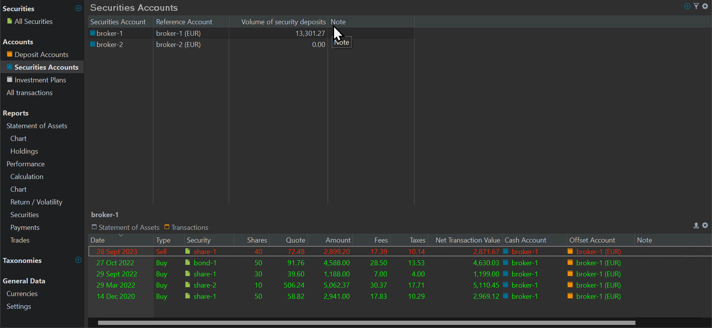

# 账户类型
账户是[账目](../../transaction/index.md)的集合。这些账目可以是某个证券账户中证券（股票等）的买入与卖出账目，也可以是某个现金账户中金钱的取款与存款账目。每个账户都附带一个默认货币。在安装过程中，你已经至少创建了一个证券账户和一个现金账户。

Portfolio Performance (PP) 有两种主要账户类型：[现金账户](./deposit-account.md)与[证券账户](./security-account.md)。Thomas（贡献者）所写的[快速上手指南](https://forum.portfolio-performance.info/t/guide-on-getting-started/5390)对二者有相当详尽的说明；你需要向下滚动较远。其他相关术语还有关联账户、目标账户与现金账户。

图： 现金账户示例。{class="pp-figure"}

图： 证券账户示例。{class = "pp-figure"}

## 相关术语 {#related-terms}

### 关联账户 {#reference-account}

证券账户总是与一个现金账户相关联。若未明确指定其他账户，该证券账户上的任何买入或卖出账目都会使用这个现金账户来结算。该现金账户称为关联账户。在图 2 中，证券账户 `Broker-1` 的关联（现金）账户名为 `Broker-1 (EUR)`。

创建证券账户时必须设置其关联账户（见[创建投资组合](../../../getting-started/create-portfolio.md)一节的图 2）。你随时可以从左侧边栏选择 `账户 > 证券账户` 来更改关联账户。双击相应的关联账户货币，然后从下拉菜单中选择另一个（见图 2；第二列）。

### 目标账户 {#offset-account}

目标账户（或对手账户）是处理证券账目时不可或缺的组成部分。它充当证券账户的对应方。换句话说，证券账户中发生的每一笔账目，都会在目标账户中记录一笔金额相等、方向相反的分录。

当你在证券账户中执行买入或卖出证券等操作时，这些账目会由目标账户中的对应分录来平衡。例如，当你买入证券时，所购证券被加入证券账户，同时从目标账户中支取等额现金。这确保了你的账户总余额保持为零或保持平衡。

不过，"目标账户"也是一个相对概念。请对比图 1 与图 2 的底部面板。对`现金账户`（图 1）而言，它指向`证券账户`，反之亦然。
