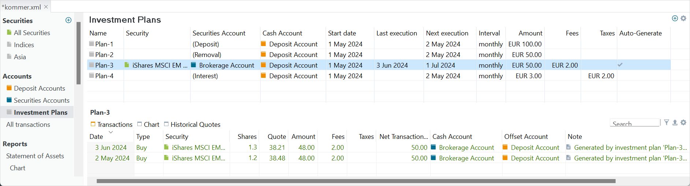
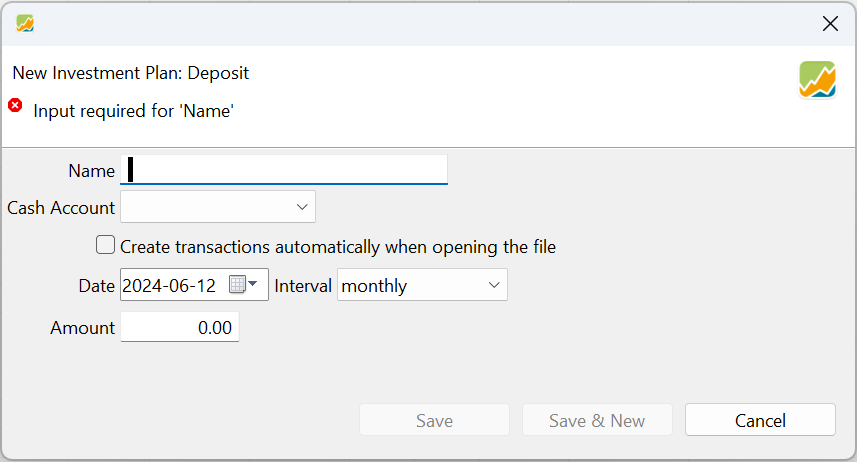
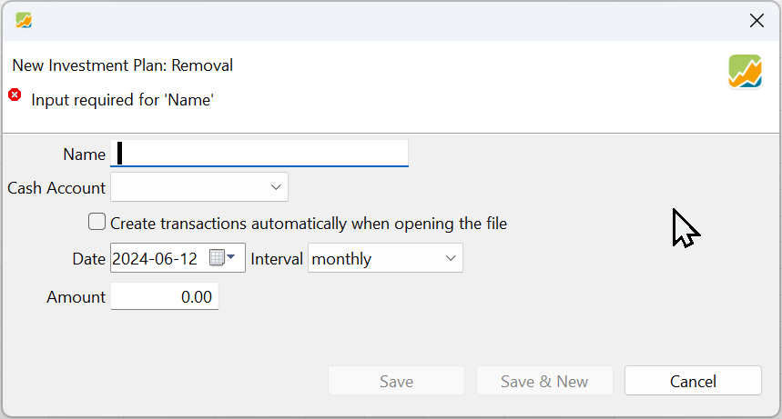
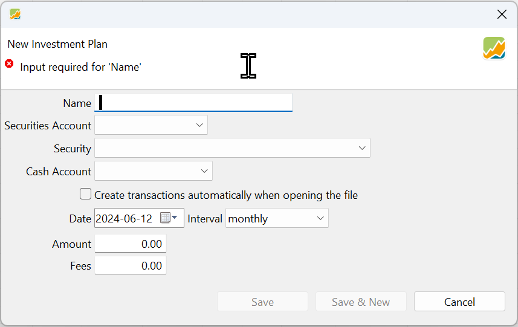
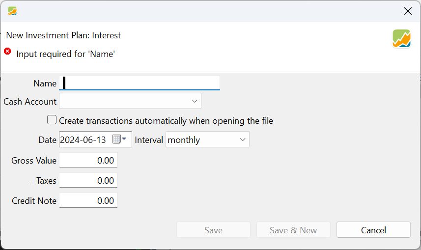
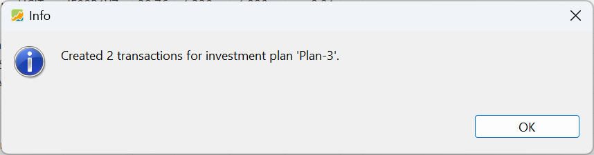

投资计划是一种自动化的方式，用于简化定期账目（如存款、取款、利息支付或买入）的处理。它让你能以极少的手工操作，按固定间隔系统性地投资或提取资金。

## 投资计划的类型 {#types-of-investment-plans}

图： 主面板中的四种投资计划，以及信息面板中 plan-3 生成的账目。{class=pp-figure}

投资计划主要有四种类型：存款、取款、利息以及证券买入/转入（如&nbsp;图 1 所示）。存款计划和利息计划会增加现金账户的余额，而取款计划会减少余额。另一方面，证券买入/转入计划会同时减少你的现金账户（为买入证券提供资金）和增加你的证券账户（因为你获得了新的证券）。要创建新计划，只需点击界面右上角的"创建投资计划" :octicons-feed-plus-16: 按钮（如图 1 所示）。

### 存款投资计划 {#deposit-investment-plan}

图： 存款投资计划。{class=pp-figure}

借助存款投资计划，你可以定期把指定金额的款项存入指定的现金账户。要设置存款计划，你需要提供一个描述性名称（例如 `plan-1`）、现金账户的名称、要存入的金额、计划的起始日期，以及存款的频率（间隔，从每月一次到每 12 个月一次不等）。起始日期也可以在过去或在未来。

点击 `保存` 按钮后，该信息会被添加到投资计划的主面板中（如图 1 所示），但计划不会立即执行。此阶段不会执行任何账目。不过，如果你勾选了`打开文件时自动创建账目`，那么下次打开文件时该计划就会自动执行。

另外，你也可以点击"保存 && 创建"按钮，把该计划加入列表并重新打开对话框。这样你就可以连续快速地创建多个存款计划。

### 取款投资计划 {#withdrawal-investment-plan}

图： 取款投资计划。{class=pp-figure}

借助取款投资计划，你可以定期从指定的现金账户中取出指定金额的款项。设置取款计划的过程与设置存款计划类似。你需要为该计划提供一个描述性名称、要使用的现金账户名称、要取出的金额、计划的起始日期，以及取款的频率。创建取款计划所需的字段与创建存款计划时相同。

### 证券买入/转入投资计划 {#security-purchasedelivery-investment-plan}

图： 证券买入/转入投资计划。{class=pp-figure}

借助证券买入/转入投资计划，你可以使用指定现金账户中的资金，定期获取某项指定证券。如图 4 所示，你需要为该计划提供一个描述性名称（例如 `plan-3`）、证券账户名称与要获取的具体证券、资金将从中支取的现金账户名称、计划的起始日期、买入的频率、每次投入的金额，以及任何相关费用。

在选择现金账户时，务必注意买入与转入之间的区别。如果你想通过转入方式获取证券，应使用 `(证券转入)` 选项。反之，如果你想通过买入方式获取证券，则应使用某个现有现金账户的名称，资金将从该账户中支取。

主面板中显示以下字段/列（见图 1）：`名称`、`证券`、`证券账户`、`现金账户`、`起始日期`、`上次执行`、`下次执行`、`周期`、`自动生成`、`金额`和`费用`。大多数字段一看便知。在初次创建计划时若选择了`打开文件时自动创建账目`选项，`自动生成`字段就会自动设置。还可以使用 `显示或隐藏` 按钮（右上角的齿轮符号）添加两个额外字段：`备注`和`属性`。关于如何调整各列的说明，请参阅手册中的[全部账目一节](../accounts/all-transactions.md/#settings)。

### 利息计划 {#interest-plan}

图： 利息计划。{class=pp-figure}

利息计划与存款计划相似，因为它同样会在指定的现金账户中生成一笔存款。此外，它还允许进行税款抵扣。此计划下的账目被归类为 `利息`，从而在计算绩效时不会被计入现金流。（见[系统概览一节](../../../concepts/system-overview/index.md#transactions)）

## 管理投资计划 {#managing-investment-plans}

图 1 的主面板列出了投资组合中所有投资计划的完整清单。通过上下文菜单（在一个计划上右击即可访问），你可以生成账目、修改所选投资计划，或将其彻底删除。

### 生成账目 {#generate-transactions}

图： 打开投资组合时的消息框。{class=align-right style="width:50%"}

-  如果在创建计划时选择了 `打开文件时自动创建账目`选项，账目就会在下次打开文件时自动生成。打开投资组合时，会显示一个类似于图 6 所示的消息框。

 

- 选择 `生成账目`命令会立即创建所有可行的账目，但须符合指定的日期限制。  
- 存款、取款或买入/转入账目从起始日期起生成。如果起始日期落在假日（见帮助 > 首选项 > 日历）或周末，该账目将顺延至下一个工作日。
- `上次执行`列将显示账目生成算法最近一次执行的日期。`下次执行`列将根据频率和上次执行日期，指示未来最早发生账目的日期。
- 你不会意外地重复运行计划。只要当前日期早于`下次执行`日期，`生成账目`命令就不会产生任何效果。

### 编辑计划 {#editing-a-plan}

- 计划初次创建之后仍可编辑/更改。所有字段均可编辑。例如，如果初始计划设定为每 2 个月执行一次，你可以把它改为每月执行，缺失的月度账目会在下次生成账目时补上。
- 但是，你无法通过编辑计划来删除已存在的账目。例如，如果你改回每 2 个月执行一次的计划，那些新增的月度账目不会被删除。

### 删除计划 {#deleting-a-plan}

- 使用上下文菜单可彻底删除一个投资计划。
- 删除计划也会删除随之生成的所有相关账目。如果你想保留其中某些账目，必须在删除计划之前将它们复制（右击 > 复制账目）。

## 生成的账目 {#generated-transactions}

投资计划视图的信息面板列出了由主面板中所选投资计划自动生成的全部账目。需要注意的是，该列表不包含在该证券上手动创建的买入账目。信息面板专门用于显示*仅*由投资计划实施所产生的账目，便于你轻松监控和分析该计划的执行情况。

你可以编辑或删除部分或全部生成的账目，而不影响计划本身。例如，一笔生成的买入账目可能并不反映实际买价，因为它基于当天的收盘报价。你可能需要在生成账目之后修改其细节，例如修改买入账目的买价。

如果最近生成的账目被删除，主面板中的 `上次执行`字段也会被清空。

投资计划视图中的图表菜单与[全部证券菜单](../../../reference/view/securities/all-securities.md/#chart-menu)中的图表菜单完全相同。历史价格也是如此。
