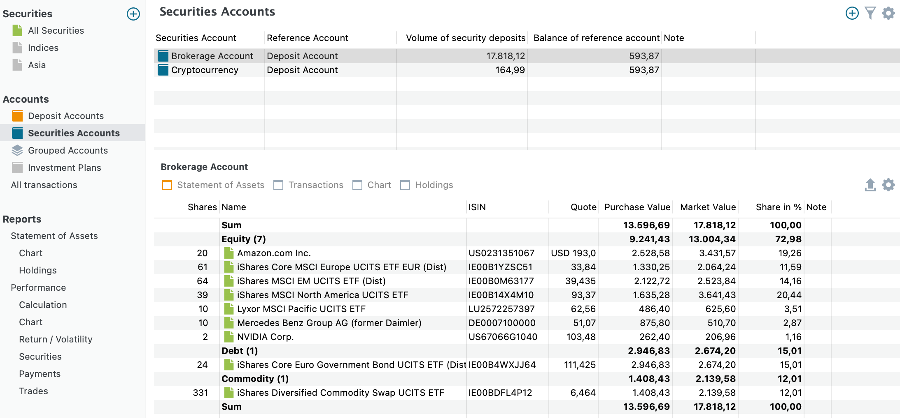
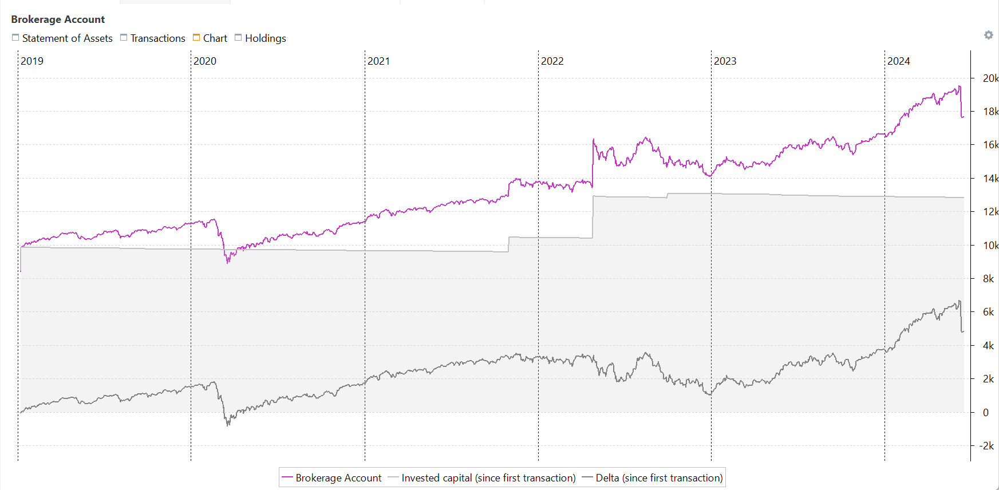
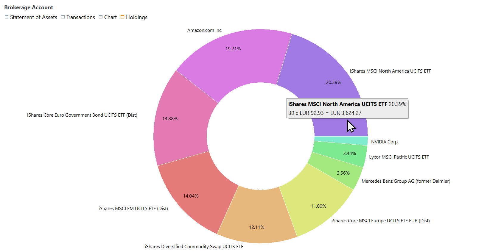

`证券账户`视图提供投资组合内所有证券账户的[双面板视图](../../../how-to/user-interface.md)（见图 1）。主面板显示所有证券账户的列表，而位于下方面板的信息面板则提供所选账户的详细信息。

图： 证券账户示例。{class=pp-figure}

## 主面板 {#main-pane}

证券账户用于存放你的证券，也是进行交易的账户。使用数据工具图标 :octicons-feed-plus-16: 可添加新账户。对每个证券账户，其资产的市值总额显示为`证券市值`，同时还显示[关联账户](../../../concepts/portfolio-performance-terminology.md#master-data)的总余额。证券账户通常以你用于买卖的券商或银行命名。当然也可以采用其他命名方式。例如，你可以把所有比特币投资归入一个单独的账户 `Cryptocurrency`，或者区分你自己的账户与你伴侣的账户。

值得注意的是，尽管投资组合中有四个现金账户（见现金账户一节的[图 1](images/sb-accounts-deposit-accounts.png)），但其中只有一个名为 `Deposit Account` 的账户被设为关联账户。当未明确指定其他账户时，该关联账户用于处理头寸。信息面板（下方面板）显示所选证券账户的`资产明细`视图。

## 信息面板 {#information-pane}

信息面板有四个标签页：`资产明细`、`账目`、`图表`和`持仓`。

### 资产明细 {#statement-of-assets}
`资产明细`标签页（如图 1 所示）是默认选中的。它包含股数、资产名称与 ISIN、最新价格或报价、成本、市值总额（按份额乘以报价计算），以及该资产在投资组合总额中的百分比等详细信息。它与菜单 [`视图 > 报告 > 资产明细`](../../view/reports/statement/index.md) 中的表格相同，只是限定于所选的证券账户。

通过 `显示或隐藏列` :gear: 图标，你可以添加其他许多字段，例如买价、股息等。这些字段在 [`视图 > 报告 > 资产明细`](../reports/statement/index.md#available-columns) 中有完整说明。导出数据为 CSV 图标 :material-upload: 允许你把所显示的表格保存为 CSV 文件。

### 账目 {#transactions}
本节给出一张表格，列出与所选证券账户有关的所有账目。该表格提供每笔账目的深入信息，例如日期、账目类型、涉及的证券、数量、价格、费用以及其他相关数据。有关可用字段以及如何使用数据工具自定义表格的更多信息，请参见 [`视图 > 账户 > 全部账目`](all-transactions.md)。

### 图表 {#chart}

`图表`标签页呈现一张特定的折线图，显示所选账户（例如图 2 中的 Brokerage Account）随时间变化的市值、该证券账户中自首笔账目以来投入的资金，以及两者之间的差额（差值）。

图： 证券账户的图表（信息面板）。{class=pp-figure}

点击图表上的任意点，都会显示这三条时间序列的实际数据。通过 :gear: 数据工具（右上角），你还可以把 `税款 (累计)` 和 `费用 (累计)` 时间序列添加到图表中。有关自定义图表的更多指导，请参阅[用户界面](../../../how-to/user-interface.md#)一节。

### 持仓 {#holdings}

证券账户的持仓图没有任何额外的数据工具。它与投资组合持仓图非常相似；参见 [`视图 > 报告 > 资产明细 > 持仓`](../../view/reports/statement/holdings.md)。点击图表的任意部分都会显示一些附加信息。

图： 证券账户的持仓图（信息面板）。{class=pp-figure}

## 一个还是多个证券账户？ {#one-or-more-security-accounts}

你是否应该只创建一个证券账户来存放你所有的账目？

- 每个证券账户都关联一个相应的现金账户，该关联在创建时即已确定。为某个买入或卖出账目选择证券账户时，关联的现金账户会被自动选定。这种情况下无需手动选择。不过，若要为该账目改选其他现金账户，就必须手动选择，需多点击一次。
- `报告 > 资产明细 > 持仓`的饼图对整个投资组合而言可能会变得相当拥挤。把它拆分成若干单独账户是让它更易管理的好办法。通过筛选器，你可以创建证券账户与现金账户的任意组合来查看。该筛选器也可用于其他视图。
- 如果你把重复的证券放在同一个账户中，建议分别建立独立账户。这是因为 Portfolio Performance 采用先进先出 (FIFO) 方法，总是最先卖出最早买入的部分。例如，如果你和伴侣在不同时期买入了同一只证券，把它们合并到一个证券账户中，在执行卖单时总会优先卖出最早的份额。

