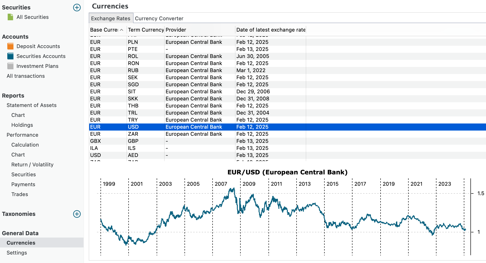
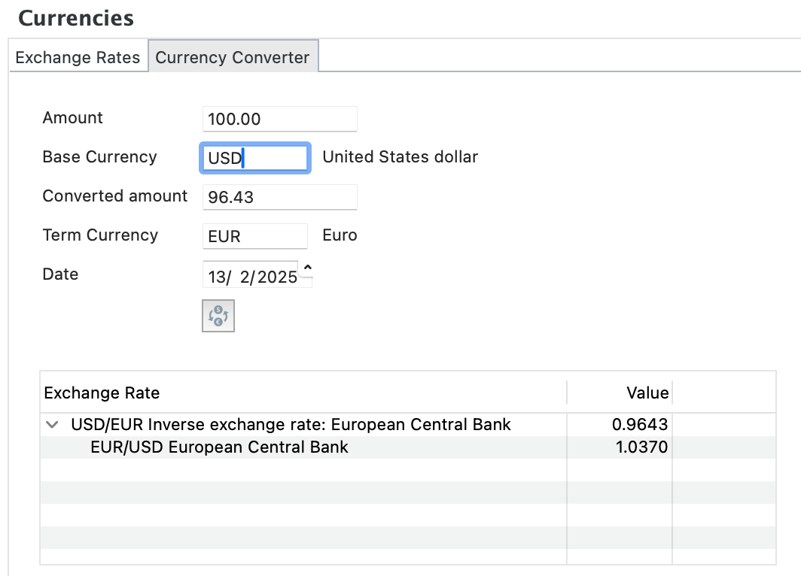

历史汇率和货币转换器位于菜单 `视图 > 常规数据 > 货币` 之下。它提供了 50 多种货币组合，例如 EUR/USD（见图 1）。这些汇率取自[欧洲中央银行](https://www.ecb.europa.eu/stats/policy_and_exchange_rates/euro_reference_exchange_rates/html/index.en.html)（ECB），可追溯至 1999 年欧元进入金融市场之时。它们实际上是参考汇率，很可能与你的券商或银行所用的实际成交汇率略有差异。这里只能显示图表，没有数值数据。图表的右键菜单另见[此处说明](../../view/securities/all-securities.md#chart-menu)。

图： 汇率与货币转换器。{class=pp-figure}

!!! Note

    你可以在[欧元外汇参考汇率](https://www.ecb.europa.eu/stats/policy_and_exchange_rates/euro_reference_exchange_rates/html/index.en.html)网页上下载包含所有历史汇率（可追溯至 1999 年）的 CSV 文件；向下滚动至时间序列即可。

图： 货币转换器。{class=align-right style="width:50%"}

图 1 中的第二个标签页显示货币转换器（见图 2）。借助此工具，你可以把任意金额从基准货币换算为某个指定日期的对应货币。在外汇（forex）市场，货币对通常写作 XXX/YYY，其中 XXX 为基准货币。基准货币 XXX 的一个单位等于对应货币的 YYY 个单位。例如，2025 年 2 月 13 日的汇率 EUR/USD = 1.0370 意味着 1 EUR 等于 1.0370 USD。

既然 EUR/USD = 1.0370，那么 USD/EUR = 0.9643。你更偏好哪种报价方式？这在一定程度上取决于你的本币（你每天使用的货币）以及你偏好乘法还是除法。

因此，报价分为两种：直接报价（或价格报价）与间接报价（或数量报价）。默认情况下，Portfolio Performance 采用后者，但你可以用菜单 `帮助 > 首选项 > 显示` 来更改报价类型。

- 间接报价表示买入或卖出一单位本币所需的外币数量。本币的价格以外币表示。对欧洲共同体的居民而言，报价 EUR/USD = 1.0370 属于间接报价。
- 在直接报价中，外币是基准货币，本币是对应货币。对欧洲共同体的居民而言，报价 USD/EUR = 0.9643 属于直接报价。

你可以点击图 2 中日期字段下方的 `切换货币` 按钮来显示这两种报价。
