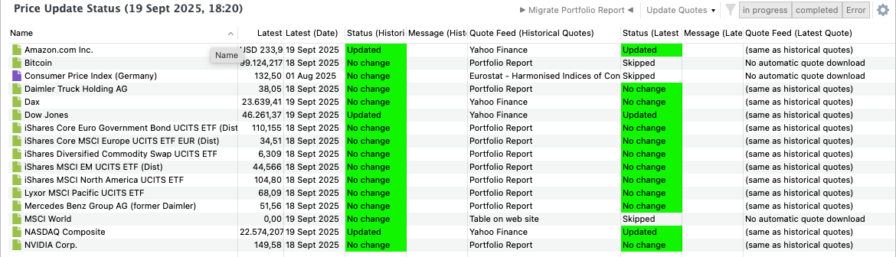

通过菜单[在线](../../online.md)，你可以更新部分或全部证券的历史价格。根据你的网络连接状况、所选数据提供方以及证券数量，这一过程可能非常快，也可能明显偏慢。

`价格更新状态` 视图（见图 1）提供了这一（自动）更新过程的详细状态报告。

图： 菜单 视图 > 价格更新状态。{class=pp-figure}

左上角的标题显示该视图的名称以及所显示更新的日期。右侧你可以找到若干（下拉）按钮，以及 `显示或隐藏列`齿轮 :gear: 图标。

默认情况下，下方表格显示以下各列。

- 证券名称  
- 最新报价价格  
- 最新报价价格的日期  

接下来的六列显示与历史价格和最新报价的更新过程有关的状态、报价提供方以及任何错误信息。状态可能为：

- `已更新`  
- `无变化`  
- `已跳过` – 当[证券主数据](../../file/new.md#security-master-data)中的报价提供方设为 `不自动下载报价`时显示。  

报价提供方同样在证券主数据中定义。

使用 :gear: 图标，你可以自定义此视图以显示不同的列。

`更新报价` 下拉按钮（顶部）的用法与[在线](../../online.md)菜单类似。  

- 选择 `进行中` 可在更新运行时临时查看更新过程。  
- 更新完成后，所有信息都会被清除。若要保留最后的状态报告（见图 1），请选择 `已完成` 按钮。  
- 如果更新过程遇到错误（例如源网站不可用），你可以使用 `错误` 按钮查看错误日志。  

对于此前依赖外部 Portfolio Report 网站作为数据源、而现在希望改用 Portfolio Performance 内置数据源的用户，还提供了一个专用的 `迁移 Portfolio Report` 按钮。
