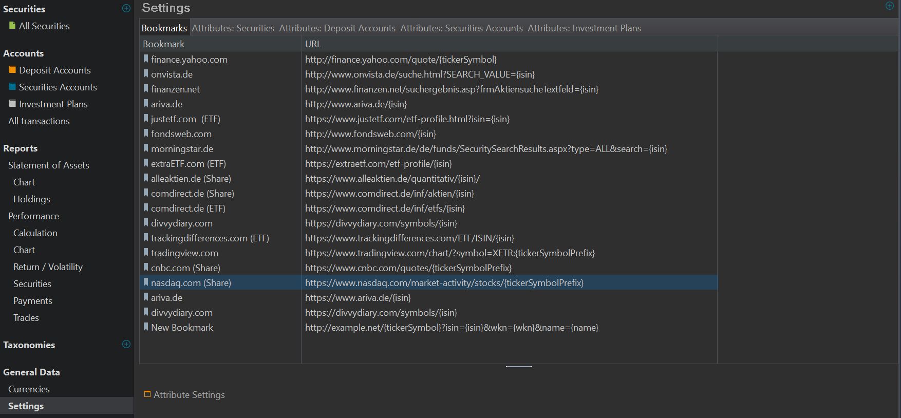
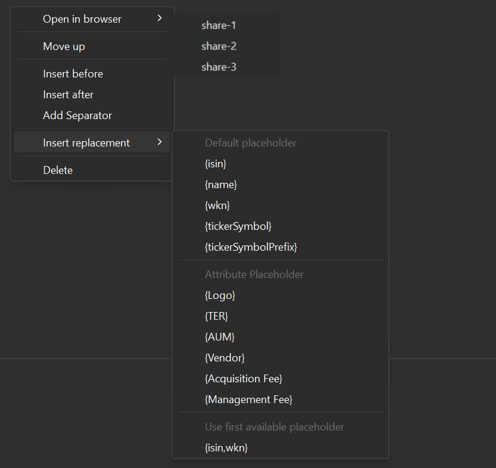
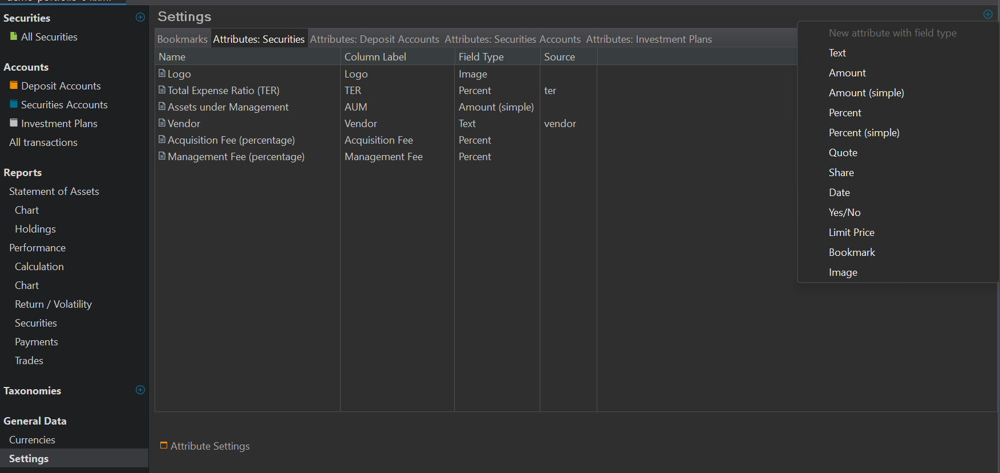

`设置` 是 `视图 > 常规数据` 下的一个子菜单。共有五个子面板或标签页可用。

- # 书签 {#bookmarks}
    大多数财经网站都提供按特定证券检索的选项。例如，在 [https://www.ariva.de/](https://www.ariva.de/) 上点击搜索框，即可按证券的 `名称`、`WKN` 或 `ISIN` 查找证券。

    图： 定义其他属性。{class=pp-figure}

    

    在设置面板中定义的书签用于简化这一过程。随后你可以右键单击某项证券或账目，用 `在浏览器中打开` 来打开它。该网站所需的属性会自动嵌入 URL 中，从而把你引导到财经网站上的相应页面。

    该列表包含若干示例。在[论坛](https://forum.portfolio-performance.info/t/verschiedene-links-fur-im-browser-offnen/629)中，人们提出了更多示例以及一些变通做法。

    使用 `新建书签` 图标（右上角），你可以按个人需要添加自定义书签。列表中会新增一行名为 "New Bookmark" 的条目，其 URL 为 `http://example.net/{tickerSymbol}?isin={isin}&wkn={wkn}&name={name}`（见图 1 最后一行）。双击名称或 URL 即可更改其值。你需要查看原网站，弄清如何构造正确的 URL。例如，finance.yahoo.com 需要形如 https://finance.yahoo.com/quote/NVDA 的 URL 才能获取 NVIDIA 的网页。使用占位符 {tickerSymbol} 后，该 URL 在运行时会被动态填充为所选证券的相应代码。

    图： 书签页面的右键菜单。{class=align-right style="width:50%"}

    

    可用的占位符列在书签页面的右键菜单中（通过右键单击打开），位于 `插入替换项` 选项之下（见图 2）：{isin}、{name}、{wkn}、{tickersymbol} 和 {tickersymbolprefix}。在代码格式 XXX.YY（例如 DTE.DE）中，XXX 对应 {tickersymbolprefix}，xxx.YY 代表 {tickersymbol}。对某些网站，你可能只需要 {tickersymbolprefix}。

    通过此右键菜单，你可以管理书签列表。

    - **在浏览器中打开**：会弹出第二个窗口显示所有可用证券；这可能是一份非常长且未排序的列表。更好的做法是在 `全部证券` 视图中从选中的证券打开网页。
    -**上移**：将书签在列表中上移一行；例如可用来把书签按特定顺序排序。
    - **插入到前面** 和 **插入到后面**：使用新建书签图标（见下文）会把它追加到列表末尾。使用这两个选项则可将新书签放在所选书签的前面或后面。
    - **添加分隔符**：在所选书签之后插入一个空行。
    - 插入替换项：显示一个附加窗口，列出可用的占位符。所选占位符将被追加到 URL 末尾。请注意，你可以用逗号分隔多个占位符，表示应使用该网站中第一个可用的占位符。
    - **删除**：从列表中移除一个书签。

- # 属性：证券 {#attributes-securities}

    可以为证券（见图 2）、现金账户、证券账户和投资计划定义新的属性或字段。
    除了证券主数据中已定义的属性（如名称、ISIN、报价提供方……）之外，图 2 还包含另外六个属性，如 logo、总体费用率……。

    图： 定义其他属性。{class=pp-figure}

    

    你可以用 `带字段类型的新建属性` 图标（右上角）创建自己的自定义属性。点击它会显示一个子面板，列出可用的数据类型（见图 2）。例如，已有的 `Àctive` 属性很可能是 `是/否` 类型，而名称属性则应为 `文本` 类型。

    这些附加属性会在任何与证券有关的表格视图中显示，也会在证券的[附加属性](../../file/new.md#additional-attributes)面板中显示。这些属性不能用于计算，但你可以用它们对列表排序。

- # 属性：现金账户 {#attributes-deposit-accounts}
- # 属性：证券账户 {#attributes-securities-accounts}
- # 属性：投资计划 {#attributes-investment-plans}
