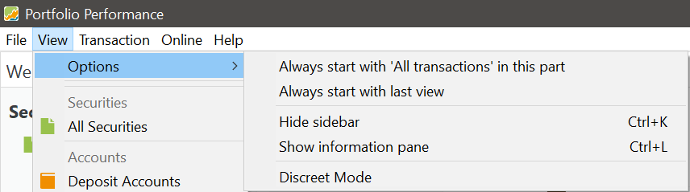

选项子菜单包含若干子菜单，用于自定义程序的启动行为以及屏幕中各元素的显示方式。

图： 视图 > 选项子菜单{class=pp-figure}

- **始终以"xxx"开头显示本部分**：其中 XXX 部分是可变的，取决于当前显示的视图。例如，如果当前视图是"全部账目"[如此处所示](../../how-to/images/components-UI.svg)，该消息将显示为 `Always start with 'All transactions' in this part`。选择该选项可确保启动时总是在顶部面板中显示这个视图。
- **始终以最后一个视图开始**：该选项让程序记住你上次使用的视图（仅顶部面板），并在打开程序时显示它。
- **隐藏边栏 ... Ctrl+K**：该选项隐藏或显示屏幕左侧的边栏。你也可以使用快捷键 Ctrl+K 来切换该选项。
- **隐藏信息面板 ... Ctrl+L**：该选项隐藏或显示屏幕底部面板，该面板显示与顶部面板相关的明细和图表。你也可以使用快捷键 Ctrl+L 来切换该选项。
- **隐蔽模式**：该选项切换投资组合中敏感货币数值的显示，提供更低调、更私密的显示效果。例如，份额数、市值、税款、费用等明细会被替换为 **\*\*\*\***，以确保隐私。不过，买价、报价以及内部收益率 (IRR) 等绩效百分比仍保持可见。
