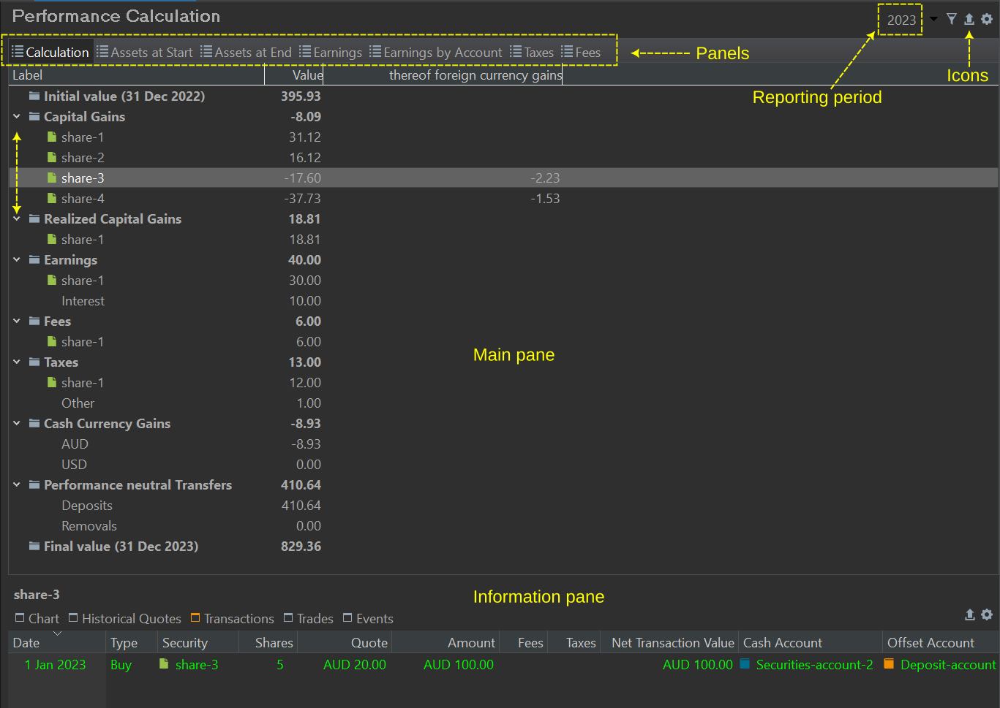
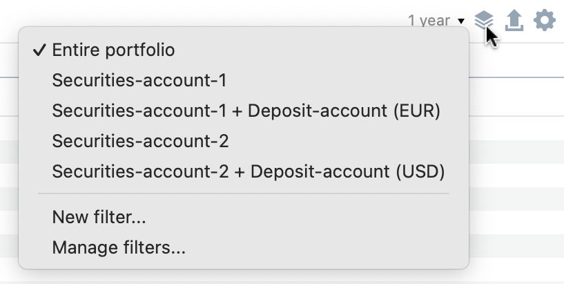
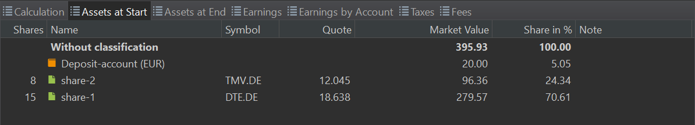
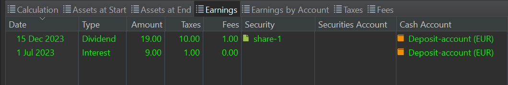
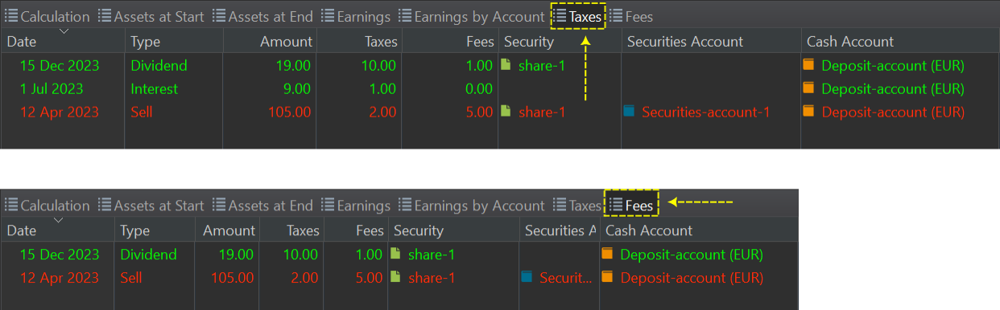
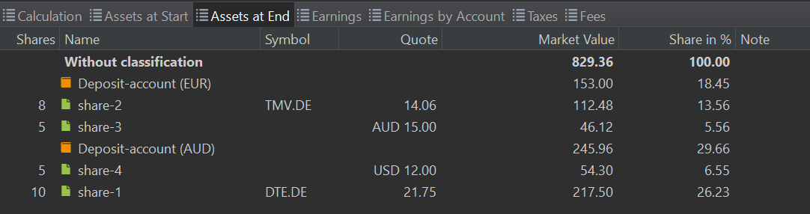

有关绩效计算的更详细信息，可在菜单 `视图 > 报告 > 收益 > 计算` 或侧边栏中找到。主面板包含标题栏图标（右上角）以及七个标签页或面板：`计算`、`期初资产`、`期末资产`、`收入`、`按账户的收入`、`税款`和`费用`。信息面板显示主面板中所选项目的详细信息。

图： 计算面板。{class=pp-figure}

 

## 主面板 {#main-pane}

图： 筛选菜单。{class=align-right style="width:20%"}

标题栏（右上角）显示所选的[报告期](../../../../concepts/reporting-period.md)（在图 1 和图 2 中命名为 `2023`），以及若干实用工具图标。`按投资组合和关联账户筛选数据`让你可以把显示的信息限定为整个投资组合或某个特定证券账户，可单独选择，也可连同其关联的现金账户一起选择。默认为 `整个投资组合`。你只能挑选一个筛选选项。你也可以通过选择要组合的账户并命名来创建自己的 `新建`筛选器。它们列在默认选项之下。`管理...`选项让你编辑或删除自定义筛选器。只需选中筛选器名称，再用右键菜单添加其他账户或删除该筛选器。点击三角形会展开显示所选账户，你可以逐个删除它们。`移除所有条目`选项会删除全部自定义筛选器。
    
使用 `导出数据为 CSV`图标，你可以把每个面板保存为 CSV 文件。这便于在电子表格程序中进行计算，例如比较 `期初资产`与 `期末资产`。CSV 文件中的列与面板的标题一致，例如 `份额`、`名称`、`证券代码`、`报价`……

`配置视图`图标提供两个选项：

- `税前`：选中后，税款部分变为零值，税款改在 绩效中性转账中考虑。选中时会加上勾选标记。

- `买价计算方式`：此选项依据你选择的成本计算方式，影响 已实现与 未实现资本利得的数值。两种计算方式（先进先出或移动平均）之间的差异参见此处：[买入成本计算方法](../../../../concepts/cost-methodology.md)

### 计算及其他明细面板 {#calculation-other-detail-panels}

计算面板（见图 1）包含所选账户或投资组合的初始值与最终值，以及由前者到后者的各类变化科目。你可以用上下文菜单（右键）折叠或展开单个科目，或一次展开/折叠全部科目。该面板完全折叠后的版本，也会作为一个组件显示在上级的[收益](./index.md)菜单中。

- 初始值：它表示投资组合（或所选账户）在报告期开始时的余额。从图 1 和图 2 可见，报告期设为 `2023`年。需要注意的是，该数值固定为当日结束时的值，也就是说*不*包含第一天的账目。你可以在期初资产面板中（图 3）核对初始值及其构成。就我们的[绩效公式](../../../../concepts/performance/index.md)而言，MVB 符号（期初市值）指的就是这个值。

    图： 期初资产面板。{class=pp-figure}

    

    初始值与最终值之间的，是从前者到后者的各类变化科目：资本利得、收入、费用与税款、现金汇兑损益，以及绩效中性转账（见图 1）。

- 资本利得：资本利得或损失，是指资本性资产（如股票、债券或房地产）的价值在买入之时与估值之时*或*卖出之时之间的增加或减少。在后一种情况下，使用"已实现资本利得"这一术语。对投资组合中仍持有的每只证券，都会计算其绝对收益或损失。必须强调的是，该收益或损失以投资组合的货币表示，而*不是*以该资产的货币表示。若该资产以外币计价，则由[汇率](../../../file/currency.md)波动带来的任何收益或损失都会被计入，并在 `其中汇兑损益`列中显示。将鼠标悬停在该数值上，会弹出一个面板，显示更详细的计算过程。例如，以 `share-3`的计算为例（见图 1 - 信息面板）：

    - 2023 年 1 月 1 日：按 1 EUR = 1.5693 AUD（约 0.6372 AUD/EUR）的汇率计算，以每股 20 AUD 买入 5 份（share-3）= 100 AUD x 1/1.5693 = 63.72 EUR。
    - 2023 年 12 月 31 日：按 1 EUR = 1.6263 AUD（约 0.6149 AUD/EUR）的汇率计算，以每股 15 AUD 对 5 份估值 = 75 AUD x 1/1.6263 = 46.12 EUR。
    - 资本损失 = 46.12 - 63.72 = -17.60 EUR。

    然而，这笔损失还因汇率变动而加剧。2023 年 1 月 1 日买入的 100 AUD 当时估值为 63.72 EUR，而到 2023 年 12 月 31 日只值 61.49 EUR。因此，即便报价价格保持不变，你的投资（以 EUR 计）已经因汇率差异减少了 -2.23 EUR。总计 -17.60 EUR 的资本损失中，部分是由 -2.23 EUR 的汇兑损失造成的。
    
- 已实现资本利得：它指的是投资以不同于原始买入价格的价格卖出时所发生的盈利或亏损。上文所述的*假设性*资本利得或损失，此时即成为已实现的利得或损失。图 1 中只有一笔已实现资本利得。2023 年 4 月 12 日，`share-1` 的 5 份以 5 x 22.40 EUR/份 = 112 EUR 卖出（不含费用与税款）。在 MVB 时点（2022 年 12 月 31 日），这些份额的估值为 5 x 18.638 EUR/份 = 93.19 EUR。因此已实现资本利得为 112 - 93.19 = 18.81 EUR。值得注意的是，`share-1`分两批买入：2021 年 1 月 15 日以每股 15 EUR 买入 10 份，2022 年 1 月 14 日以每股 16 EUR 买入 5 份。由于 Portfolio Performance 采用先进先出原则，被卖出的这 5 份来自第一批的 10 份。如果我们考虑一个更长的报告期、从而涵盖最初那次买入，那么卖出的估值将由最初买入的买价决定，而不是第二次买入的买价。

- 收入：投资产生的盈利，由股息和利息构成。如图 4 所示，`share-1` 派发了 30 EUR 的股息（含费用与税款）。该笔款项存入一个现金账户。该现金账户同样会产生利息，于 2023 年 7 月 1 日支付。

     图： 收入面板。{class=pp-figure}

    

    按账户收入面板提供按账户汇总的数据，并拆分出股息、利息、收入总额、费用和税款。

- 费用与税款：费用是银行、经纪商或投资平台为其服务收取的费用。税款是政府对投资收入征收的税项。费用与税款大多记录在账目本身（买入、卖出、股息、利息）上，但也可以作为单独的账目入账。例如，独立利息账目上的 1 欧元税款在图 1 中记为 `其他`。share-1 买入与股息上的税款合计为 12 EUR。

     图： 税款与费用面板。{class=pp-figure}

    

- 现金汇兑损益：请先阅读下文关于绩效中性转账的章节，以便更好地理解本节。由于部分存款和投资以 AUD 等外币进行，因此可能产生现金汇兑损益或损失。其中一部分损失在卖出时发生。例如，（参见上文资本利得）。此外，自 2023 年 1 月 1 日以来 AUD 现金账户上剩余的存款也有损失。由于买入只需 100 AUD，剩余的 400 AUD 仍留在现金账户中。该笔存款的损失为 400 x (1/1.6263 - 1/1.5693) = -8.93 EUR

- 绩效中性转账：转账是指流入或流出投资组合的资金；在我们的[绩效公式](../../../../concepts/performance/index.md)中也称为现金流（CFin 和 CFout）。它可以是对现金账户的存款或取款，也可以是证券转入或转出证券账户的证券转账。在图 1 的例子中，2023 年初有一笔 500 AUD 的存款。按 0.6372 AUD/EUR 的汇率计算，这构成一笔 318.61 EUR 的中性转账。

    7 月 1 日还有一笔 5 x 20 USD 份额的证券转入。按 0.9203 USD/EUR 的转账汇率计算，这相当于一笔 92.03 EUR 的中性转账。合计来看，2023 年绩效中性转账为 410.64 EUR。

    !!! Note
        `中性转账`这一术语强调的是：转账本身（无论资金还是股票）并不会影响绩效。当投资者把钱存入现金账户时，只是增加了可用的现金余额，到目前为止并未产生盈利。其他各类科目（资本利得、收入、费用与税款、现金汇兑损益）则是会影响你盈利或绩效的转账。它们对绩效*并非*中性。

- 最终值：最终值代表所选账户或投资组合在报告期结束日的估值。图 6 提供了投资组合或账户中所持每项资产期末值的明细。最终值对应我们[绩效公式](../../../../concepts/performance/index.md)中的 MVE 符号（期初市值）。

    图： 期末资产面板。{class=pp-figure}

    

## 信息面板 {#information-pane}

信息面板提供主面板中所选证券的全面细节。它与[全部证券](../../securities/all-securities.md#information-pane)视图中的信息面板基本相同，唯一的区别是没有 `数据质量`子菜单。
