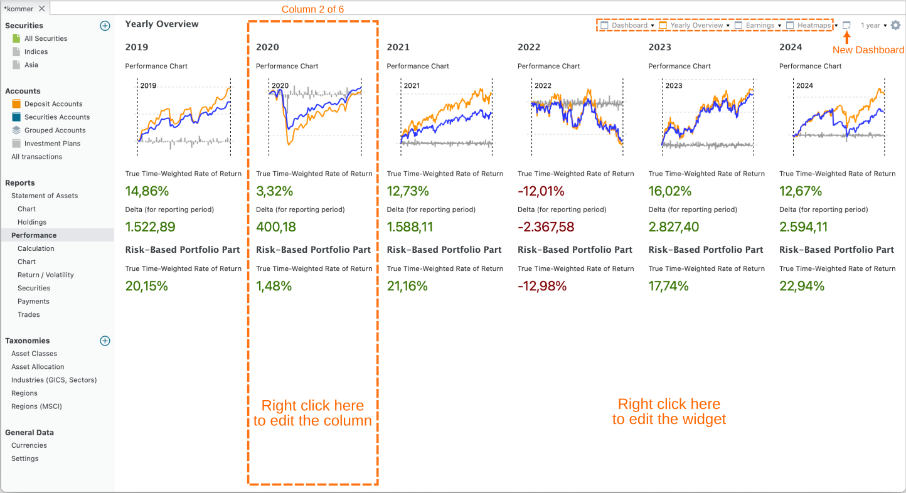
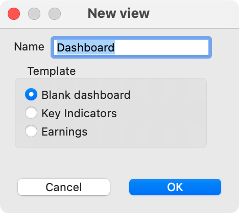
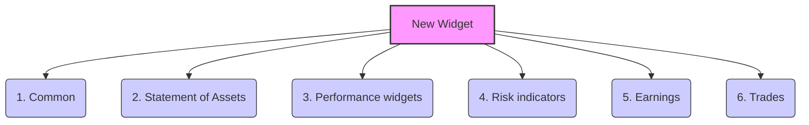
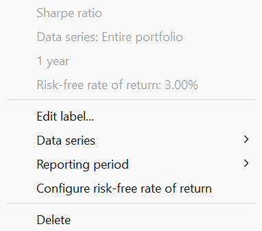

仪表板是一种可配置的视图，把绩效数据汇总为单页报告的格式。你可以通过菜单 `视图 > 报告 > 收益`或侧边栏进入默认的收益仪表板。它包含三列关键绩效与风险指标。不过，仪表板可以复杂得多；例如见图 1。

图： 年度概览仪表板。{class=pp-figure}

你可以点击报告期左侧的 `新建仪表板`图标，创建一个新的（空）仪表板（见图 1）。你可以在空白仪表板、关键指标（即默认的收益仪表板）和收入之间选择（见图 2）。要把某个仪表板从菜单中移除，点击名称旁边的箭头并选择 `删除`。你可以把仪表板移到列表最前面（置于顶层）、重命名仪表板，或为所选仪表板创建一个副本。

图： 创建新仪表板。{class=align-right style="width:30%"}

一个仪表板包含一列或多列；图 1 中的仪表板包含 6 列。你看不到列的边框。在（空白）区域内右击可删除某一列。你可以借助配置仪表板的齿轮图标（右上角）添加新列。如果已经至少有一列，你也可以在某一列区域内右击，选择 `左侧新建列`、`右侧新建列`或 `复制列`（见图 5）。通过 `列宽`你可以逐级增减所选列的宽度。当然，由于窗口总宽度保持不变，其他列的宽度也会受到影响。使用 `应用到全部`选项，你可以为仪表板中所有组件统一设置报告期和数据序列。

 每一列可以包含若干可配置的组件：由标签与数值构成的数据块，或一幅图，例如总收益变化或绩效图表。在列中的*空白处*右击可管理组件，例如添加组件。在*组件标签*上右击可管理该具体组件，例如更改数据序列或报告期。

组件是按你的喜好定制仪表板的有力工具。[Finanzkoch 的 YouTube 视频](https://youtu.be/_-9iC7UqLsw)对此有详尽的介绍（德语讲解，但可开启英语字幕）。论坛上还可以找到 fellow investors 整理的[一批非常出色的仪表板](https://forum.portfolio-performance.info/t/beispiele-fur-auswertungen-grafiken-und-berichte/5367/118)。

`新建组件`选项会展开一个子菜单，其中列出六类组件（参见图 3）。下面逐一说明各类组件。在组件标签上右击会弹出上下文菜单。多数组件都有 `编辑标签`、`删除`和 `高度`等选项。你可以在列内以及列之间拖放组件。按下 CTRL 键（Windows）即为复制而非移动。

图： 新建组件菜单，含所有可用组件一览。{class=pp-figure}

### 1. 通用 {#1-common}
 - *标题*：单行文本字段。
 - *描述*：字号较小的多行文本字段。
 - *当前日期*：文本"当前日期"，后接计算机的系统日期，其语言和格式按 帮助 > 首选项 > 显示 > 语言 中的设置。
 - *可折叠区域*：创建之后，你可以把其他组件拖放到此区域中。点击 ▼（向下箭头）图标展开内容组件，点击 ▶（向右箭头）图标隐藏内容。
  
 - *汇率*：以 XXX/YYY 数字格式表示的汇率。右击可选择具体的汇率，例如 EUR/USD。
 
 - :material-chart-box-outline:*交易活动*：一幅图表，x 轴为时间（按年和按月），y 轴表示账目笔数。通过上下文菜单，你可以添加或移除 y 轴、更改报告期（默认取仪表板的期间），或更改账目类型（默认为买入、卖出、证券转入和证券转出）以及筛选条件（默认为整个投资组合）。
 
 - *证券：超过限价*：你可以在证券主数据中为每只证券设置限价（[参见操作指南](../../../view/securities/all-securities.md#main-pane-list-all-securities)）。如果该证券的当前价格（截至今天；与报告期无关）超过限价，就会显示该证券的名称、当前价格和限价，并显示日期为 `仅过去`或 `仅未来`的份额。

 - *证券：到达日期*：与限价类似（见上文），你可以把某个"特殊"日期作为附加属性关联到证券上。该组件会显示文本 `证券：到达日期 (xxx)`，其中 xxx 表示达到所设日期的证券数量。此外还会提供一份份额名称与日期的列表。该列表可在上下文菜单中排序。

 - *证券：事件*：事件是一种可以附在特定证券某个日期上的备注，例如分股、股息支付和备注。该组件会显示事件日期、类型、证券名称以及事件描述。
 
 - *证券：最新价格*。这是一个单行组件，显示某只证券的当前价格；该证券可在上下文菜单中选择。标签中会提及所选证券的名称。

- 证券：距 ATH：当前价格与该证券历史最高 (ATH) 价格之间的差值，以 % 表示。应在上下文菜单中指定证券。

 - *网站*：一个文本框，显示某个网站的内容；在上下文菜单中以 URL 指定。允许使用锚点，例如 `https://help.portfolio-performance.info/en/concepts/performance/#the-money-weighted-rate-of-return`。组件高度可在上下文菜单中调大。

- 垂直间隔：此组件生成一个不可见的矩形，用于占位。它用于在视觉上（垂直方向）分隔各组件。将鼠标悬停在组件上会显示其标签。右击可更改其高度。

### 2. 资产明细 {#2-statement-of-assets}

除最后三个之外，所有组件都是单行文本组件。

- *合计*：该资产在报告期末的市值。可用上下文菜单指定资产和报告期。

- *总收益变化*、*差额（针对报告期）*、*差额（自首笔账目以来）*：这些术语的定义[见上文](./index.md#absolute-change)。

- *绩效中性转账*：显示所选持有期间内绩效中性转账的合计；这些转账在[视图 > 报告 > 收益 > 计算](./calculation.md#main-pane)中有说明。

- *每月绩效中性转账*：显示一张列出全部绩效中性转账的表格，数值按年和月拆分。

- *投入资本（针对报告期）*和*投入资本（自首笔账目以来）*：股票投资组合中的投入资本，指已投入该投资组合的资金总额。
- *FIRE 计算*：你的 FIRE 数字是为实现财务自由/提前退休而希望达到的储蓄与投资目标金额。一条常用的经验法则是按 4% 的可持续提取率，将其估算为预期年度退休支出的 25 倍。在此组件中，你手动设置 FIRE 数字。随后会根据你当前的净资产、估算的月度储蓄和估算的年收益率（按月复利）来推算实现 FIRE 所需的时间。

- *比例*：该组件计算两项资产之间的比例，例如 份额 1 / 整个投资组合。

- *资产明细 - 图表*：此组件生成[视图 > 报告 > 资产明细 > 图表](../../reports/statement/statement-chart.md)的迷你版本。若定义了多个图表视图，可在上下文菜单中选用。

- *资产明细 - 持仓*：饼图，是[视图 > 报告 > 资产明细 > 持仓](../../reports/statement/holdings.md)的迷你版本。

- *类别*：饼图，展示各类别占比分布。

- *类别：目标值*：显示两张饼图，分别为所选类别下每个类别的实际配置与目标配置。

- *实际与目标配置*：显示一张柱状图，展示每个类别的实际配置与目标配置。在图表上左击会显示一个提示框，显示出偏差（差额）。
- *历史最高*：显示整个投资组合（或某个替代数据序列）的最高值。

### 3. 绩效类组件 {#3-performance-widgets}

前三个组件是单行文本，代表常见的绩效指标。

- *时间加权收益率（累计）*、*时间加权收益率（年化）*和*内部收益率 (IRR)* 是[已知](../../../../concepts/performance/index.md)的单行绩效指标。数据序列和报告期可在上下文菜单中选择。

- *收益计算*：一张完全折叠的表格，类似[视图 > 报告 > 收益 > 计算](calculation.md)的第一个面板。各科目无法展开。

- *最大贡献者（价值）*：报告期内绝对价值变化（正负均计）最大的 3 只证券。

- *最佳表现者 (TTWROR)*：报告期内 [TTWROR](./index.md) 绩效最高（正负均计）的 3 只证券。
  
- *绩效图表*：此组件生成[视图 > 报告 > 收益 > 图表](../../reports/performance/performance-chart.md)的迷你版本。通过 `汇总级别`上下文菜单，可以设置明细程度（日、周、月、季度或年）。

- *热力图形式的月度收益率*：热力图是一种数据的图形表示，用颜色编码来可视化投资组合中不同股票的绩效。热力图通常由一个表格或矩阵构成，每个单元格代表某项选定资产的月度绩效。各单元格的颜色对应该股票的绩效。

- *热力图形式的年度收益率*：热力图中的每个单元格代表一年。

- *投资组合税率*：税款 /（已实现与未实现资本利得 + 收入 - 费用）的比值。

- *投资组合费用率*：费用 /（已实现与未实现资本利得 + 收入）的比值。

### 4. 风险指标 {#4-risk-indicators}

以下六个组件是单行文本组件，代表常见的风险指标。关于 `最大回撤`、`当前回撤`、`最长回撤期`、`波动率`和`下行波动率`的说明，见[本页顶部](index.md#maximum-drawdown)。

:material-chart-line: `回撤图表`选项会创建该图表的组件版本，如[图 1](./images/performance-mdd.svg)所示。

图： 从上下文菜单设置无风险收益率。{class=align-right style="width:30%"}

`夏普比率`是一项金融指标，在考虑投资组合风险的前提下，衡量该投资组合相对于无风险资产的表现。其计算方法是用投资组合的收益率（如内部收益率 (IRR)）减去无风险收益率，再除以投资组合收益率的标准差（后者是衡量其波动率的指标）。

无风险收益率默认为 0%，但可通过上下文菜单调整，以反映你当前的无风险利率（见图 4）。由于该比率以波动率为基础，因此需要完整的历史价格。若价格不完整，计算出的波动率可能被低估。

### 5. 收入 {#5-earnings}

- *账目概览*：显示每月收入的表格，其中包括股息、利息，或两者各自的明细。可用组件顶部的微调按钮调整年份。

- *每月收入*：显示每月收入的表格。年份应通过上下文菜单设置。
- *即将派发的股息*：显示即将派发股息的表格，按日期排序。对未来一个月内有股息的每只证券，都会显示除权日与支付日期。如果你投资组合中的证券有 ISIN，且你已在[设置](../../../help/preferences.md)中保存了 DivvyDiary API 密钥，则数据会从 [DivvyDiary](https://divvydiary.com/en/settings) 加载。你也可以在某只证券信息面板的[事件](../../../view/securities/all-securities.md#information-pane)标签页中查看这些信息。
- *每月收入*、*每季度收入*和*每年收入*：按月、季度或年度收入的图形表示（柱状图）。
- *按类别划分的收入*：按类别划分的收入的图形表示（环形图）。

### 6. 头寸 {#6-trades}

- *有盈 / 亏的头寸数量*：单行组件，以灰色显示头寸总数，并配一个向上的绿色箭头加计数器表示盈利头寸数量，一个向下的红色箭头表示亏损头寸数量。

- *头寸盈 / 亏*：报告期内头寸的净总值合计。盈利用绿色，亏损用红色。可用上下文菜单设置资产和报告期。

- *平均持有期*：平均持有期的计算方式如下：所有在所选报告期内某一时刻处于投资组合中的头寸都计入在内。每只证券的持有期是买入与卖出时间之差。对当前持有的头寸，按即期卖出处理。头寸权重按该头寸的买价相对于全部买价总额的比例计算。平均持有期为所有头寸上"持有期 x 头寸权重百分比"乘积之和。该指标可用天或年显示。

- *投资组合换手率*：投资组合换手率衡量在整个持有期内，投资组合中有多少资金（以金额计）被"置换"，其结果以平均投资组合价值的比例表示。换手率 100% 意味着此后投入投资组合的全部资金都已被置换。

- *每月投资*、*每月费用*和*每月税款*：展示投资、费用或税款总额的表格。行对应年份，列对应月份，每个单元格即为一年中的月度记录。
