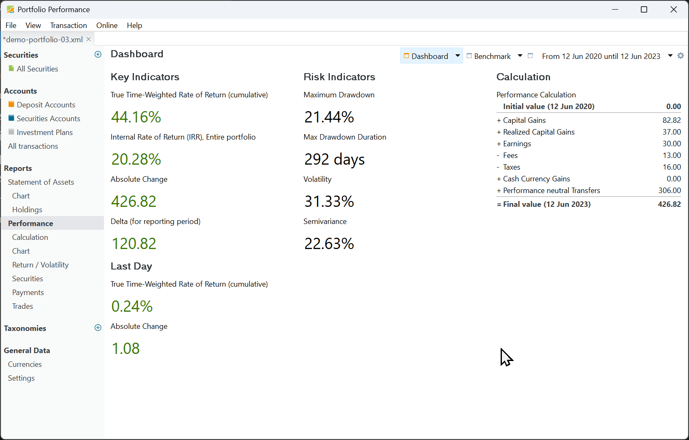
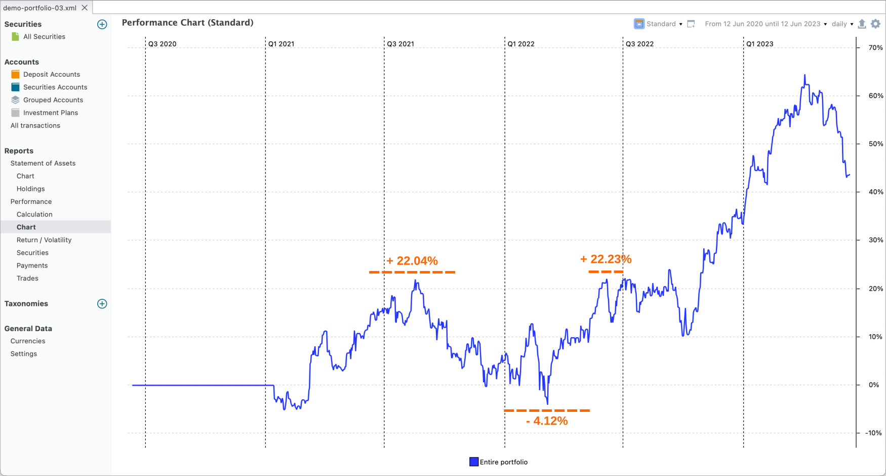

关键绩效与风险指标连同一个计算组件一起汇总在仪表板中。可以通过菜单 `视图 > 报告 > 收益` 或侧边栏进入该仪表板（见图 1）。你可以用几十个组件[自定义仪表板](./dashboard.md)。

图： 含关键绩效与风险指标以及计算组件的仪表板。{class=pp-figure}

请注意，绩效与风险指标始终针对整个投资组合和某个特定[报告期](../../../../concepts/reporting-period.md)计算。默认为从今天起一年。你可以在右上方的下拉菜单中选择其他期间，或创建一个新期间来更改。图 1 中的报告期为 `from Jun 12, 2020 till Jun 12, 2023`。对于绩效关键指标，绿色表示盈利，红色表示亏损。

## 关键绩效指标 {#key-performance-indicators}

### 时间加权收益率（累计） {#true-time-weighted-rate-of-return-cumulative}

累计时间加权收益率 (TTWROR) 是报告期内各日收益率的几何平均值。对报告期内每一天，日收益率用公式 1 计算。累计收益率用公式 2 计算。

$$\mathrm {r_{daily} = {\frac{MVE + CF_{out}}{MVB + CF_{in}} - 1 {\qquad \text{(Eq 1)}}}}$$

以及

$$\mathrm {r_{cum} = [(1 + r_1) \times (1 + r_2) \times ... \times (1 + r_n)] - 1 {\qquad \text{(Eq 2)}}}$$

其中 MVE = 该资产在当日的期末市值，MVB = 当日期初（或前一日结束）的市值。CFin 与 CFout 表示当日的净现金流入或流出。当一只股票派发股息时，从该股票的角度看，这是现金流出。而存款（用于买入该股票）是现金流入，支付相关费用同样如此。

关于 TTWROR 计算的深入说明，见[基本概念 > 绩效 > 时间加权收益率](../../../../concepts/performance/time-weighted.md)。一个极简示例的分步计算可见于[视图 > 报告 > 收益 > 图表](../performance/performance-chart.md)。

### 内部收益率 (IRR) {#internal-rate-of-return-irr}

某一报告期的资金加权收益率或 IRR，是把期初的投资市值（MVB）及其后所有现金流都带到报告期末市值（MVE）所必需的年化利率。要在给定时间内产生这些指定的现金流，你的投资组合必须每年按等于 IRR 的百分比增长。IRR 计算的基础公式为：

$$\mathrm{MVE = MVB \times (1 + IRR)^{\frac{RD_1}{365}} + \sum_{t=1} ^{n}CF_t \times (1+IRR)^{\frac{RD_t}{365}} \qquad \text{(Eq 3)}}$$

其中 *n* = 报告期内现金流的数量，$CF_t$ = 期间内时点 *t* 的现金流，$RD_t$ = 期间内的剩余天数。对 MVB 而言，$RD_t$ 等于整个期间，表示以年为单位的期间长度。你可以把 MVB 视为初始现金流，从而简化公式。现金流是指投入某项投资或从中提取的任何金额。深入说明见 [基本概念 > 绩效 > 资金加权收益率](../../../../concepts/performance/money-weighted.md)。

### 总收益变化 {#absolute-change}

总收益变化是投资组合在报告期末（MVE）的市值与期初（MVB）市值之间的差值。

$$\mathrm{MVE - MVB\qquad \text{(Eq 4)}}$$

例如，在图 1（计算组件）中，总收益变化等于最终值（426.82 EUR）减去初始值（0 EUR）。

### 差额 {#delta}

差额值（针对报告期）等于总收益变化（见上文）减去该期间发生的外部现金流。

$$\mathrm{(MVE - MVB) + \sum_{t=1} ^{n}CF_t {\qquad \text{(Eq 5)}}}$$

例如，图 1 中的差额为 120.82 EUR。该值代表投资组合中证券的实际收益。投资组合的总收益变化部分是由外部现金流入（306 EUR，用于买入这些证券）造成的。这笔钱来自外部来源，因此应从总收益变化中扣除。在计算面板中，它们被汇总为绩效中性转账。

## 最后一日 {#last-day}

### 最后一日：时间加权收益率 {#last-day-true-time-weighted-rate-of-return}

人们往往会认为最后一日与报告期的结束日相同。遗憾的是，并非如此。它是"今天"之前的上一个交易日，将鼠标悬停在标签上即可看到。图 1 创建于 2023 年 12 月 8 日。当时投资组合的市值为 459.31 EUR。该日期之前的最后一个交易日是 2023-12-07，市值为 455.84 EUR。最后一日没有现金流。

当日的 TTWROR 由公式 1 给出，即 `(459.31 - 155.84)/455.84 = 0.76%`。

### 最后一日：总收益变化 {#last-day-absolute-change}
公式 3 可用于计算最后一日的总收益变化。数值显然等于 `3.47 EUR = 459.31 EUR - 155.84 EUR`。

## 风险指标 {#risk-indicators}

风险是指损失部分或全部投入资本、或未能从投资中获得预期收益的可能性。手册提供了若干指标用于衡量风险。

### 最大回撤 {#maximum-drawdown}
最大回撤 (MDD) 是指投资组合或投资在特定期间内绩效从峰值到谷值的最大跌幅，通常以百分比表示。它衡量的是在创出新高之前，从最高点到最低点所产生的损失幅度。

通过 `视图 > 报告 > 收益 > 图表`，你可以绘制投资组合、账户或特定证券的累计绩效曲线。图 1 显示的是 2020 - 2023 报告期的投资组合绩效。

图： 标注了最大回撤的投资组合累计绩效。{class=pp-figure}

最大回撤出现在 2021 年 8 月 18 日至 2022 年 3 月 8 日之间。累计绩效从 22.04% 跌至 - 4.12%（见图 2）。2020 年 6 月 12 日至 2023 年 6 月 12 日这一报告期的 MDD 为 21.44%（见图 1）。将鼠标悬停在数值上（标签会显示报告期）即可查看相应日期。

### 最长回撤期 {#maximum-drawdown-duration}

MDD 时长是指一项投资处于两个波峰之间的最长（或最差）时间长度。
本例中为 292 天，即 2021 年 8 月 18 日至 2022 年 6 月 6 日之间。最长的恢复期（从低点到一个波峰的时长）为 90 天，即 2022 年 3 月 8 日至 2022 年 6 月 6 日之间。

### 波动率 {#volatility}
投资组合绩效中的波动率，是指投资组合收益率随时间变化的变动程度。它是衡量与该投资组合未来绩效相关风险或不确定性的指标。波动率高的投资组合，其收益率会随时间大幅波动；而波动率低的投资组合，其收益率则更为稳定一致。

图 2 中显示的波动率为 31.33%（参见图 1）。它代表报告期内日收益率的标准差。准确地说，其计算方法是对 (1 + 日收益率) 取自然对数，再乘以报告期内总天数的平方根。需要注意的是，周末和节假日不计入这一计算。获取全部日收益率的一种高效方法是把收益率/波动率图表导出为 CSV 文件。

### 下行波动率 {#semideviation}
下行波动率（semideviation，或下行风险）只考虑投资的负向波动。它是那些低于平均收益率的收益率的标准差。下行波动率值为 22.63%（参见图 1），计算时不计周末与法定节假日。将鼠标悬停在该数值上可获得更多信息。

在负向与正向波动相互抵消的情形下，公式 波动率 (v) = 下行波动率 (s) x sqrt(2) 成立。对于图 2 所示的均匀分布数据集，下行波动率的计算方式为：`s = v / sqrt(2) = 31.33% / sqrt(2) = 22.15%`。

由于实际的下行波动率略低于估算值（22.15% < 22.63%），这表明收益率并非对称分布，且负收益率的数量略多于正收益率。
