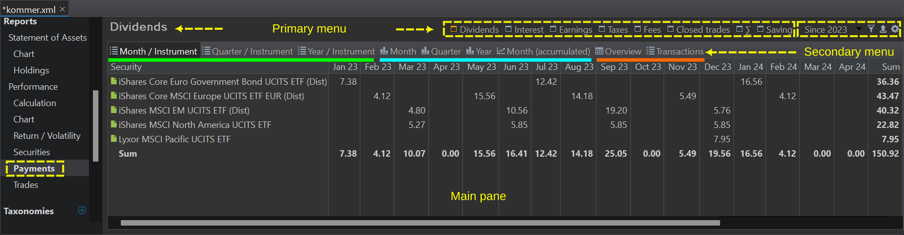
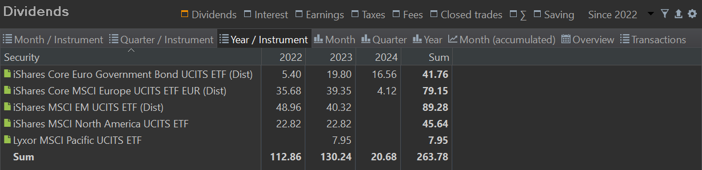
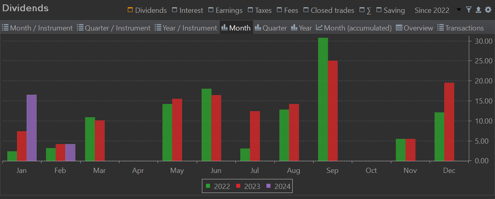
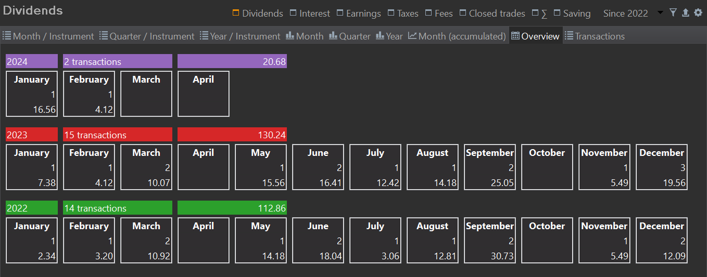

菜单 `视图 > 报告 > 收益 > 收入`按期间呈现收入概览。收入是指流入账户的资金划转，涵盖股息、利息、费用和税款。该视图是一张表格，期间排列为列，工具（账户和证券）排列为行，每个单元格中分配一个汇总的合计收入。通过顶部的主菜单和次菜单，你可以指定收入类型和期间选择（参见图 1）。

所有收入均以投资组合的默认货币表示，例如图 1 中的 EUR。以外币发生的收入会按支付日适用的汇率自动换算。

图： 收入概览（<a href="https://raw.githubusercontent.com/portfolio-performance/portfolio-help/0f038406ff9400afb5b828240724e2cffa76bcb8/docs/en/assets/kommer.xml" download="kommer.xml">下载示例 XML 文件</a>）。{class=pp-figure}

## 主菜单 {#primary-menu}

- *报告期*：在主菜单（最右侧），你可以选择总报告期。使用下拉菜单 `自 xxxx` 指定时间期间；例如 `自 2023`。与子期间选择（例如 月）结合时，主面板中可能出现大量列。事实上，四年将产生 48 列。

- *筛选*功能与[收益 > 计算](./calculation.md#main-pane)视图中的完全相同，可让你把显示的信息限定为整个投资组合或某个特定证券账户，可单独选择，也可连同其关联的现金账户一起选择。

- *导出*数据为 CSV 功能可导出月度、季度和年度表格视图，以及账目视图。图表则无法导出。

- *配置*图标让你可以反转列的顺序（从 `1 月 > 2 月 > 3 月 > ...` 变为 `3 月 > 2 月 > 1 月`）、只显示 `自 xxxx`年份列表中的第一年，以及合并非活跃证券。合并会在新增的 &sum; `已停用证券`行中汇总（合并）所有[非活跃证券](../../../file/new.md#security-master-data)的结果。默认情况下，活跃与非活跃证券都会列出。

- *收入类型*

    - *股息*：所有[账目 > 股息 ...](../../../transaction/dividend.md)类型的收入。图 1 中选中的是股息收入类型
    - *利息*：所有[账目 > 利息](../../../transaction/interest.md)以及 `利息支出`类型的收入。若两类都发生在同一期间，则显示（利息 - 利息支出）的净值。
    - *收入*：所有股息与（净）利息收入之和。
    - *税款与费用*：所有与[税款与费用](../../../transaction/fees-taxes.md)相关的收入。这些收入可能是其他账目（例如买入或利息）的一部分；也可以作为单独的账目以 `税款`、`退税款`、`费用`或 `费用退款`的类型入账。若支付与退款发生在同一期间，则显示净值。
    - *已结头寸*：卖出账目的结果即是一笔已结头寸。此处显示的数值是该次卖出的毛利/亏；因此未扣除已付的税款和费用。
    - *&sum;（合计）*：各期间全部收入之和（&sum;）；例如 `股息 + 净利息 + 净费用 + 净税款`。
    - *储蓄*：所有[存款与取款](../../../transaction/deposit-withdrawal.md)以及[证券转入与转出](../../../transaction/delivery.md)，含税款和费用。不含买入和卖出账目，因为它们本身已包含一次存款或取款。

## 次菜单 {#secondary-menu}

次菜单（主菜单之下）让你调整主面板的布局。前三个选项可让你选择按月、季度或年度的表格视图；在图 1 中以绿线标出。接下来四个选项呈现相同的数据，但以图表形式（蓝线）。最后两个选项（橙线）提供详细信息。点击列标题可按升序或降序排列各行。

- *月/工具*：报告期（`自 xxxx`）按月划分，每月一列。第一列和最后一列显示工具名称，这些工具可能是证券和/或现金账户。筛选选项（见上文）可让你把此视图限定为特定账户。每一列（月份）和每一行（工具）都提供合计。如前所述，此视图可导出为 CSV 文件。
- *季度/工具*：报告期（`自 xxxx`）按季度划分，每季一列。工具列只显示一次。
- *年/工具*：与上述描述类似，但按年而非按月组织。所显示的年份数量取决于所选报告期（`自 xxxx`）。
    图： 自 2022 年以来的年度股息支付。{class=pp-figure}

    

    通过比较图 1 和图 2 可以看出，第一只证券在 2023 年的数值是各月收入之和（19.80 = 7.38 + 12.42）。

- :bar_chart: *月*：对 `月/工具`视图绘制的柱状图，x 轴为月份（1 月 - 12 月），y 轴为收入，年份则用不同颜色的柱子表示，并配有相应的图例。图 3 展示的是一幅柱状图，用以呈现自 2022 年以来的月度股息支付情况，数据取自图 1 所示的表格视图。
    图： 自 2022 年以来月度股息支付的柱状图。{class=pp-figure}

    

- :bar_chart: *季度与年度*：与月度柱状图类似，但按季度或年度组织。
- :chart_with_upwards_trend: *月（累计）*：一幅折线图，显示每月收入之和。x 轴为月份（1 月 - 12 月），y 轴为累计收入。年份各用一条不同颜色的折线表示（图例）。
- *概览*：一种特殊的"方框"视图，每一年和月份各有一个方框，其中包含该期间的账目笔数和收入总额（见图 4）。

      图： 自 2022 年以来月度股息支付的方框视图。{class=pp-figure}

    

- *账目*：列出与主菜单中所选收入类型相关的所有账目。例如，在主菜单和次菜单中分别选择 `股息`和 `年/工具`选项后，主面板会显示每年的股息支付总额。若你想找出促成这些股息支付的账目，可以在次菜单中切换到"账目"选项。
