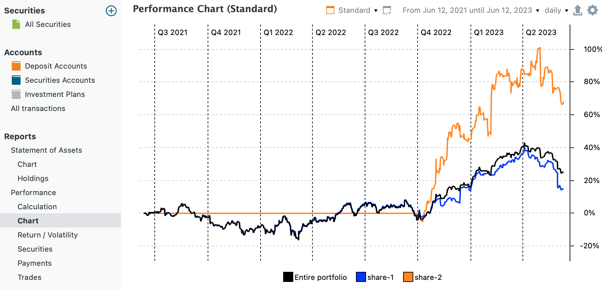
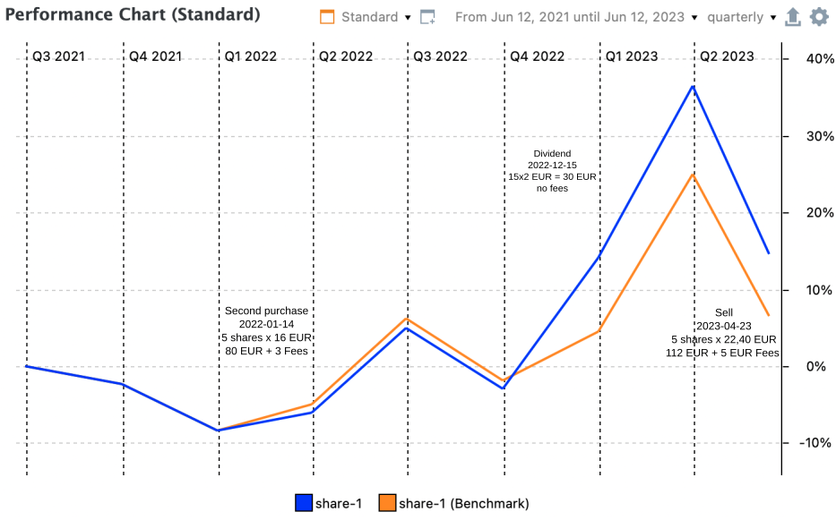
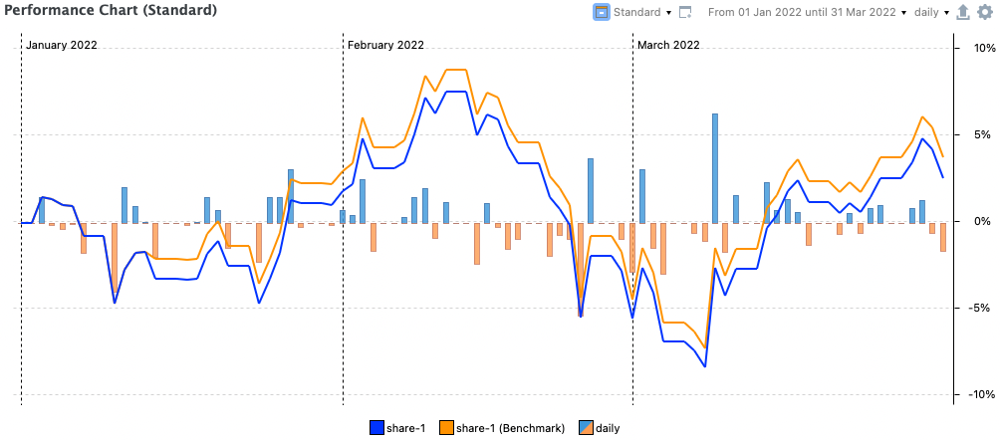

# 收益 &rsaquo; 图表

通过 `视图 > 报告 > 收益 > 图表`菜单或侧边栏菜单，你可以生成资产相对绩效随时间变化的图形表示（见图 1）。x 轴表示时间。你可以用右上角的下拉菜单选择所需的报告期。默认可选 1 年、2 年和 3 年的报告期。此外，你还可以用 `新建`功能创建自定义时间期间。参见[报告期](../../../../concepts/reporting-period.md)中的说明。

y 轴以百分比表示累计绩效，从报告期起算的 0% 开始。它反映资产价值相对上一期间的总体增减，上一期间可以是日、周、月、季度或年。更长期间的绩效通过把日收益率复利合成来计算。

图： 自定义 2 年报告期内单只份额与整个投资组合的每日绩效图表。{class=pp-figure}

关于累计绩效如何计算的详细说明，请参阅[时间加权绩效](../../../../concepts/performance/time-weighted.md)一节。由于 `share-2`直到 2022 年 9 月 30 日才买入，其绩效在此日期之前一直为零，这意味着在此之前 `share-1`的绩效与投资组合绩效相同。

绩效图表的用户界面与[视图 > 报告 > 资产明细 > 图表](../statement/statement-chart.md)的图表界面相似。例如，上下文菜单完全相同。本节只讨论差异之处；通用功能请参见上面的链接。

借助 `配置图表`图标（:gear: 右上角），你可以向图表添加数据序列：

- 常规数据序列，例如 `share-1`，以及更 `通用`的序列，例如 `整个投资组合`、`整个投资组合（税前）`，或 `每日`、`每周`、`每月`……投资组合绩效。后者代表整个投资组合的日柱状图、月柱状图……（见图 3），以期间柱状图的形式显示。你可以通过图例的上下文菜单为正、负绩效指定不同颜色；例如图 3 中的 `每日`。
- 基准，例如 share-1（基准）（见图 2）。基准是仅使用其历史价格来计算日绩效、月绩效……以及累计绩效的证券。通常，没有买入记录的证券其绩效为零。因此，基准可以看作是一只仅持有一份份额、假设在报告期开始时买入的证券。显然，该证券不会影响投资组合的整体绩效。
 
图 2 中的曲线具有误导性，似乎暗示 2022 年第一和第二季度的绩效在逐步上升。由于折线图连接的是相邻的（季度）数据点，它在视觉上暗示绩效是连续变化的，尽管实际上只计算了两个数据点。你可以在某个季度内左击图表画布，再左右移动光标改变日期来验证这一点。每个季度内绩效保持不变。

图： share-1 及其基准的季度绩效图表。{class=pp-figure}

从图 3 可以看出，第一季度的上升完全不是线性的，而是有涨有跌。请注意，绩效从 0% 开始，因为此处选择了一个新的报告期（1 月 1 日至 3 月 31 日）。

图： 2022 年第一季度的每日绩效图表。{class=pp-figure}

图 2 和图 3 中的曲线还显示，自 2022 年第一季度起，`share-1`与其基准的绩效开始分化。这是由 `share-1`在 2022-01-14 的首次买入所致。请记住，Portfolio Performance 始终按日计算绩效：`1 + r = (MVE + CFOut)/(MVB + CFIn)`（[公式 1](../../../../concepts/performance/money-weighted.md)）。季度绩效只是日绩效的复利合成。

- 2022-01-13（买入前一天）：`share-1`的历史价格从 16.016 EUR/份上涨到 16.026 EUR/份。因此 `share-1 (benchmark)`的日绩效为 (16.026 / 16.016) -1 = 0.0624%。这与已持有的 10 份 `share-1`投资的绩效相同：((160.26 + 0) / (160.16 + 0)) - 1 = 0.0624%。在没有现金流的日子里，`share-1`与其基准的日绩效相同。
- 2022-01-14：历史价格从 16.026 跌至 15.962 EUR/份。`share-1 (benchmark)`的日绩效下降为 (16.026 / 15.962) -1 = 0.040%。然而，由于当天额外以 83 EUR（5 x 16 EUR/份 + 3 EUR 费用）买入了 5 份，该证券的 MVE 变为 15 份 x 15.962 EUR/份 = 239,43 EUR，日绩效 = (( 239,43 + 0) / (160.26 + 83)) - 1 = -1.574%。由于费用的存在，基准的绩效优于实际 15 份投资的绩效。
-  请注意，从图 3 读出的绩效是累计绩效，因此与上面计算的日绩效不同。计算累计绩效时，需要把日绩效复利合成。对基准而言：r14 = (1+r1)x(1+r2)x ... (1+r12)x(1+0.0624%)x(1-1,574%) = -2.07%。
- 2002-12-15 支付的 30 EUR 股息（含税）造成了第二次分化。历史价格从 19.166 EUR/份跌至 18.898 EUR/份。因此，基准在 12 月 15 日的绩效为 (18.898/19.166) - 1 = -1.40%。`share-1`的绩效为 ((15 * 18.898) + 30) / (15 * 19.166) = 9.04%。
- 卖出租金发生在 2023-04-12：以每股 22.4 EUR 卖出 5 份，减去 5 EUR 费用，即 107 EUR。基准在 2023-04-12 卖出租金发生时的绩效为 (22.40/22,60) - 1 = -0,88%。`share-1`的绩效为 ((10 * 22.40) + 107) / (15 * 22,60) = 2,36%。

有关缩放、添加数据序列、画布与图例的上下文菜单等其他功能的说明，请参阅[视图 > 报告 > 资产明细 > 图表](../statement/statement-chart.md)。
