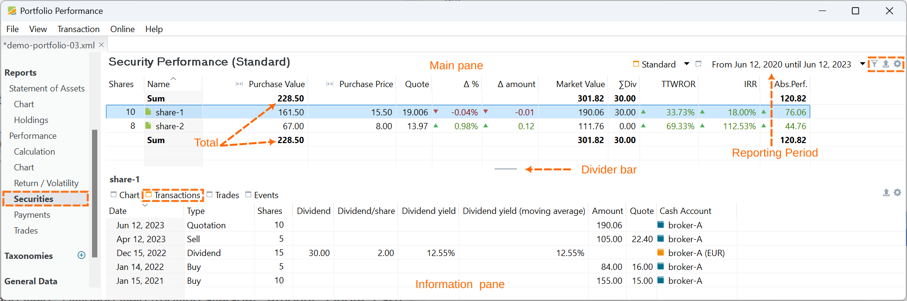
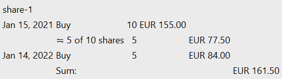
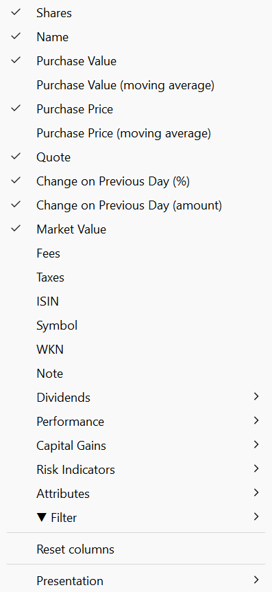
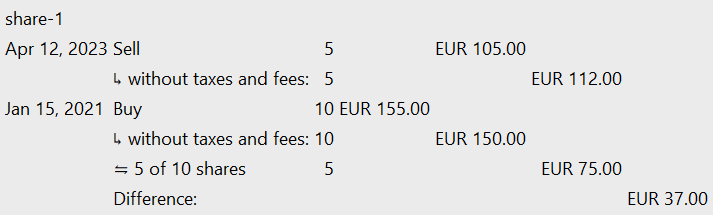

`报告 > 收益`菜单提供的是投资组合层面最重要的关键绩效指标，例如 IRR 和 TTWROR；而 `报告 > 收益 > 证券`菜单则在证券层面提供了丰富得多的细节。不过，理解两者的差异很重要，尤其是在现金流方面（参见绩效一节）。

图： 报告 > 收益 > 证券概览（<a href="https://raw.githubusercontent.com/portfolio-performance/portfolio-help/c66b7b82c0db5e57279a2bfde6ff2d3f5ddb1bf6/docs/en/assets/demo.xml" download="demo.xml">下载示例 XML 文件</a>）。{class=pp-figure}

## 主面板 {#main-pane}
`报告 > 收益 > 证券`菜单包含主面板（上方）和信息面板（下方），后者显示主面板中所选证券的信息。绩效计算始终取决于所选的报告期，可用右上角的下拉菜单设置。

第一个筛选器组（右上角）可把证券列表限定为 `份额`&ne; `0` 或 `份额`= `0`。后一个筛选器只显示已完全卖出的份额，即买入份额数已降至零的份额。若不使用这两个筛选器，则显示所有份额，无论数量多少。第二个筛选器组在[收益 > 计算菜单](calculation.md#main-pane)中也有详细介绍，可让你选择整个投资组合或特定的具体账户。

顶部和/或底部的合计行显示各列的总额，例如成本、市值、已付股息等（含费用，见下文添加该列的方法），但只针对筛选后的证券。使用 **设置** :gear: 图标，你可以选择在顶部、底部、两处显示合计，或完全不显示。

`导出为 CSV 文件`选项会把当前表格（仅包含可见列）保存为 CSV 文件。

`显示或隐藏列`图标提供全部可用字段的（很长的）列表，你可以从中选择要显示的字段。

### 可见列 {#visible-columns}
- 份额：估值时点证券账户中的份额数；该时点即报告期的结束日期；例如图 1 中的 2023 年 6 月 12 日。
- 名称：证券的名称。
- 成本：列名之前的小图标表示这一概念与更常见的`买价`有所不同。将鼠标悬停在列标题上，会弹出一个小型窗口，解释该概念的含义。可用份额的成本（在估值时点）采用先进先出 (FIFO) 方法计算，并包含交易费用和税款。
    对图 1 中的 `share-2`而言，这一计算相对直接。2022 年 9 月 30 日，以每股 16 EUR 的报价买入 8 份，合计 67 EUR，其中包括 3 EUR 的交易费用和税款。

    将鼠标悬停在 `share-1`的成本上，会显示一份账目历史（参见图 2），情况较为复杂。2021 年 1 月 15 日，以 155 EUR（含费用与税款）买入 10 份。这 10 份中，在 2023 年 4 月 12 日卖出 5 份后仍剩 5 份，价值为 77.50 EUR（原始 155 EUR 的一半）。2022 年 1 月 14 日又以 84 EUR 买入 5 份，使估值时点的成本合计达到 161.50 EUR。

    图： 成本。{class=pp-figure}

    

- 买价：与成本一样，这是计算得出的买入价格，已考虑多次买入与卖出。例如，`share-1`第一次买入后剩余的 5 份价格定为每股 15 EUR，不含费用与税款。第二次买入的 5 份价格定为每股 16 EUR（不含费用与税款）。*加权*平均买价为 [(5 x 15) + (5 x 16)]/10 = 15.50 EUR。
- 报告期结束时的报价（估值时点）。
- &delta; %：表示报价相对前一日的变化，从今天的数据计算。将鼠标悬停在数值上会显示这两天的确切报价。
- &delta; 金额：与上类似，但以绝对值表示；例如以欧元计。
- 市值：等于份额数 x 估值时点的报价价格；例如 `share-1`为 190.06 EUR = 10 x 19.006 EUR。
- &sum; 股息：已付股息总额，含费用和税款。
- TTWROR 和 IRR：参见下文绩效计算一节。
- 总收益：总收益 = 市值 + 证券转出/卖出 + 股息 - 税款 - 费用 - 初始估值 - 证券转入/买入。总收益始终以报告期为限，例如成本即为报告期开始时的估值。总收益与资本利得（当前持仓）的差别在于，它还包含股息、税款以及已卖出证券的资本利得。

### 可用列 {#available-columns}

除上文所述的默认可见列之外，还可以添加若干其他字段（见图 3）。

图： 证券的可用字段。{class=align-right style="width:30%"}

- 成本（移动平均）：默认情况下，Portfolio Performance 采用 FIFO 方法对股票存量估值。在该方法下，卖出时最先买入的股票也最先卖出，较近的买入则留作剩余股票。在上涨行情中，这意味着最贵的份额被留存下来，绩效看上去也更为有利，尤其是与 LIFO 方法相比时。

    在移动平均方法中，对卖出时使用哪些证券不作任何假设。它可能是最先买入的、最后买入的，或是随机选取的若干份额。股票的加权平均价格由此计算得出。当买入新股票时，这一加权平均值会向新买入股票的价格靠拢。

    对于单次买入的情形（例如 `share-2`），两种方法没有区别。`成本`（默认列）与 `成本（移动平均）`的值相同：均为 67 EUR。然而，对于多次买入的股票（例如 `share-1`），在卖出时两者的差异就显现出来。默认的 FIFO 方法算得 177.50 EUR（计算细节参见上文）。（简单）移动平均方法的计算方式如下：最初 10 份，每股 15.5 EUR（含费用与税款），后来 5 份，每股 20 EUR，因此为 [(10 x 15.5) + (5 x 20)] / (10 + 5) = 17 EUR/份。卖出后剩余的 10 份价值为 170 EUR。

- 买价（移动平均）：该价格*不*包含费用和税款。计算方式为：[(10 x 15) + (5 x 19.20)] / (10 + 5) = 16.40 EUR/份。
- 费用与税款：已付费用和税款的总额。
- ISIN、证券代码、WKN、备注：参见[参考手册 > 文件 > 新建主数据](../../../file/new.md#security-master-data)。

- 股息：默认显示股息之和。
    - 股息 %：也称股息收益率 = 股息支付之和 / 按 FIFO 计算的成本。对 `share-1`而言：30 / 177.50 = 16.90%。
    - 股息 %（移动平均）：同上，但基于移动平均方法（见上文）。对 `share-1`而言：30 /170 = 17.65%。
    - 股息 %/年：也称年度股息收益率 = 股息支付 / 股息支付时的股价（年平均值）。share-1 在股息支付日（2022-12-15）的报价价格为 18.898 EUR/份。股息 %/年 = 30/
    - 股息支付次数：报告期内股息支付的总数。
    - 最后一次股息支付日期：报告期内最后一次股息支付的日期。
    - 周期性：周期性是根据报告期内的支付情况估算的。`share-2`没有股息支付，因此该值为 `无`。而由于 `share-1`只有 1 次股息支付，其值暂时为 `未知`。若有多次支付，周期性可能是 `年度`、`半年`、`季度`或`每月`。
- 绩效：默认显示 TTWROR（累计）、IRR 和总收益率 %。
    - TTWROR（年化）：参见绩效计算一节。
    - 资本利得（FIFO，当前持仓）：对报告期末仍在投资组合中的证券（当前持仓）= 市值 - 成本（FIFO）。对 `share-1`而言：190.06 - 177.50 = 12.56 EUR。
    - 资本利得 %（FIFO，当前持仓）：同上，但以百分比表示：(市值 - 成本（FIFO))/ 成本（FIFO）。
    - 资本利得（移动平均，当前持仓）：同上，但采用移动平均成本。对 `share-1`而言：190.06 - 170 = 20.06
    - 资本利得 %（移动平均，当前持仓）：同上，但以百分比表示：(市值 - 成本（移动平均))/ 成本（移动平均）。
    - 总收益率 %：总收益（见上文），但以百分比表示。

- 资本利得：关于 `资本利得`的更详细说明，参见[报告 > 收益 > 计算](calculation.md#)一节。

    - 已实现收益：将鼠标悬停在数值上会弹出一个包含更多信息的窗口。例如，`share-1`的已实现收益为 37 EUR。这 5 份以 112 EUR 的总额卖出；而成本（不含费用与税款）为 75 EUR。因此已实现收益为 37 EUR。

        图： share-1 的已实现收益。{class=pp-figure}

        

    - 汇兑损益 / 已实现收益：如果卖出以外币计价的证券，可能会产生汇兑损益。例如，2022-04-01 投入的 100 USD 按 USD/EUR = 0.9048 的汇率折合 90.48 EUR。若在 2024-04-26 卖出这笔投资，可实现 93.34 EUR；原因仅仅在于汇率已升至 USD/EUR = 0.9334。即便报价价格毫无变化，这笔投资也应产生 2.86 EUR 的汇兑收益。
    - 未实现收益：未实现收益来自尚未卖出的证券。`share-2`自首次买入以来没有变动。因此其实现在收益为 0 EUR。该份额于 2022 年 9 月以 64 EUR（不含税款和费用）买入。在报告期末（2023 年 6 月 12 日），市值为 11.76 EUR。未实现收益为 47.76 EUR。
    - 汇兑损益 / 未实现收益：同上，只不过针对未实现收益。

- 风险指标（有关这些概念的更多信息，参见[视图 > 报告 > 收益](../performance/index.md)）：

    - 最大回撤 (MDD)：衡量一项投资在报告期内所经历的最大损失；即该证券的峰值 - 最低值。对 share-1 而言为 28.98%：2023-04-11 的 339 EUR 减去 2021-01-30 的 147——参见 [Investopedia](https://www.investopedia.com/terms/m/maximum-drawdown-mdd.asp)上的文章
    如果一项投资从未亏损一分钱，最大回撤将为零。可能的最大回撤为 -100%，意味着该投资已完全贬值。
    - 最长回撤期：一项投资处于波峰（持仓价格高点）之间的最长（最大）时间
    - 波动率：投资组合绩效中的波动率，是指投资组合收益率随时间变化的变动程度。
    - 下行波动率：下行波动率（或下行风险）只考虑投资的负向波动。

从投资组合的角度看，唯一重要的现金流是现金账户上的存款/取款账目，或证券账户中证券转入/转出的货币价值。只有这些账目的资金才会流入或流出投资组合。

从证券（账户）的角度看，某只证券的绩效受买入或卖出账目的价值（价格），或等值的证券转入/转出所影响。股息支付被视为流入该证券的现金流（提升绩效），费用退款也是如此。而证券账目上支付的费用会降低绩效，并因买入/卖出或证券转入/转出而减少现金流。

税款则是个例外。在 Portfolio Performance 中，从证券的角度看，它们被视为绩效中性。

"报价"通常指某只证券或商品在特定时点上的价格，由交易所或做市商报出。相比之下，"估值"则是指确定一组证券或资产整体价值的过程，其中要考虑市场状况、财务表现和未来增长前景等多种因素。
