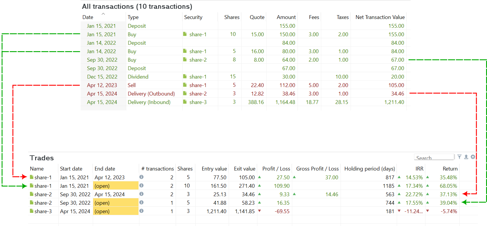
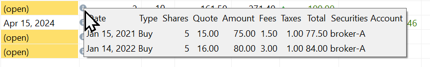

每当你通过 `买入`或 `卖出`账目，或通过 `证券转入`或 `证券转出`买卖某项金融证券时，就会产生一笔头寸。所有头寸都列在 `报告 > 收益 > 头寸`视图中。头寸分为两种：

- **未结头寸**：未结头寸始于某只证券的第一笔 `买入`或 `证券转入`账目。`开始日期`设为该首笔账目的日期；如果截至今天投资组合中仍有剩余份额，`结束日期`则保持为空。此后对同一证券的买入会累加到*这笔*未结头寸上，更新份额数以及入场价格和盈 / 亏等绩效指标。卖出则会减少份额数。因此，一笔未结头寸可以包含多次买入。若使用[头寸分组](#trade-grouping)选项 `每次买入单独列为一笔头寸`（见下文），则改为每次买入各自形成一笔头寸。

- **已结头寸**：某只证券的*每一笔* `卖出`或 `证券转出`账目都会生成一笔已结头寸。若你在三个不同日期卖出同一只证券，就会生成三笔独立的已结头寸，各自以其相应的买入和卖出日期来标识。卖出一只证券可能会影响相应未结头寸的 `开始日期`，因为系统采用先进先出 (FIFO) 方法。若某次买入的全部份额都已卖出，未结头寸的 `开始日期`就会顺延至下一次买入的日期。

图： 报告 > 收益 > 头寸视图 <a href="https://raw.githubusercontent.com/portfolio-performance/portfolio-help/5fc9b00128961e41863ecdeb4653080d583a57ba/docs/en/assets/demo-portfolio-07.xml" title="Right-click and choose 'Save Link As' to download" style="font-style: normal;">[Portfolio Performance 文件]</a>。{class=pp-figure}

查看图 1 的 `全部账目`（上面板），你可以区分出 5 笔头寸（见下面板）。
1. 已结头寸（`share-1`），于 2023 年 4 月 12 日通过卖出 15 份中的 5 份而结束。该头寸始于 2021 年 1 月 15 日的（其中一半）首次买入；第二次买入（2022 年 1 月 14 日）不属于这笔头寸——它完全属于下方的未结头寸。
2. 未结头寸（`share-1`），始于 2021 年 1 月 15 日（首次买入 10 份）。其中 5 份于 2023 年 4 月 12 日卖出。然而剩余的 5 份仍然计入该头寸的期末价值，2022 年 1 月 14 日第二次买入的 5 份同样如此。该头寸之所以未结，是因为截至今天投资组合中仍有 10 份 `share-1`。
3. 已结头寸（`share-2`），始于 2022 年 9 月 30 日买入 8 份，并于 2024 年 4 月 15 日通过证券转出 3 份而结束。
4. 未结头寸（`share-2`）：由于今天投资组合中仍有 5 份 `share-2`，因此存在一笔未结头寸，始于 2022 年 9 月 30 日买入 8 份。
5. 未结头寸（`share-3`）：始于 3 份的证券转入，这些份额今天仍在投资组合中。

借助 `筛选`菜单，你可以把头寸列表限定为 `仅未结头寸`或 `仅已结头寸`。若该组中两者都未选中，则显示所有头寸。在第二组中，你可以在 `仅盈利头寸`与 `仅亏损头寸`之间选择；本质上就是绿色行与红色行之别。

`导出为 CSV`图标中只有一个导出项，名为 `头寸`，对应图 1 中的表格。用 `设置`图标添加或删除的字段，在 CSV 文件中也会相应地添加或删除。可用字段中的大多数都已在图 1 中显示。

## 头寸分组 {#trade-grouping}

某只证券的账目如何归并为头寸，由 :gear: `设置`菜单中的 `头寸分组`选项控制：

- `把多次买入合并为一笔头寸`（默认）：同时处于未结状态——或由同一次卖出结清的——所有买入构成一笔头寸。这就是上文所述、并在本页通篇采用的行为；`share-1`的两次买入归入图 1 第 2 行的那一笔未结头寸。

- `每次买入单独列为一笔头寸`：每次买入各自形成一笔头寸，因此一笔头寸至多包含一次买入和一次卖出。`share-1`的两次买入现在产生*两笔*未结头寸——一笔始于 2021 年 1 月 15 日、含 5 份，另一笔始于 2022 年 1 月 14 日、含 5 份——各自拥有自己的入场价格、持有期和 IRR。

    若某次卖出消耗了多笔买入的份额，它会依照先进先出原则在这些买入之间进行拆分。由此产生的每一笔已结头寸分得属于其自身买入的那部分卖出：份额、卖出净收入、费用和税款按比例分配，使各部分之和恰好等于原始卖出。

    由于同样的账目只是切分方式不同，所有头寸的合计数不会改变；改变的只是行数以及每行的数值。

分组设置按安装（installation）存储，而非保存在投资组合文件中，因此它适用于你打开的每一个文件。当该视图是以预先选定的一组头寸打开时——例如从某个仪表板组件点击进入——该选项会显示为灰色，因为这些头寸是按其原先的计算结果呈现的，此处不会重新计算。

其他视图（例如 `全部证券`下方）信息面板中 `头寸`标签页的 :gear: 菜单也提供同一选项，其设置与本视图的设置分开存储。

## 可用列 {#available-columns}

- *名称*：头寸以所交易证券的名称命名（例如 `share-1`）。你可以双击该名称重命名头寸。
- *开始日期*：首笔买入/证券转入账目的日期。若某次买入的全部份额都已卖出（依照先进先出法），开始日期将更新为下一次买入的日期。
- *结束日期*：要么是该证券被卖出的日期，要么标记为（未结），表示该头寸仍然有效。一旦全部份额售出，这笔未结头寸就会从列表中移除。
- *&#35; 账目*：一笔头寸中的账目数通常是一笔（只有一笔买入账目）或两笔（买入 + 卖出）。将鼠标悬停在 :material-information-outline: 图标附近的单元格上会弹出附加信息。从图 2 可以推断，2023 年 4 月 12 日卖出了 5 份 `share-1`。将鼠标悬停在未结头寸上（第 2 行）会显示，2021 年 1 月 15 日买入了 5 份，2022 年 1 月 14 日又买入了 5 份。在这里你可以看到先进先出原则的实际运作：卖出的那 5 份是从最初买入的 10 份中扣减的。

    图： share-1 已结头寸的信息浮层。{class=pp-figure}

    

- *份额*：该头寸中的份额数。
- *入场价格*：它表示该头寸的净额 (NTV)，其中包含费用和税款。你可以在图 1 上面板的最后一列中找到该数值。对于没有卖出账目的未结头寸，这就是买入的 NTV。例如，`share-3`的买入由单次买入完成，NTV 为 1211.40 EUR；其中含有（外币）税款和费用。对于像 `share-2`这样的买入 + 卖出头寸，原始买入的净额（8 份为 67 EUR）会分配到剩余 5 份的未结头寸（41.88 EUR = 5/8 * 67 EUR）和 3 份的已结头寸（25.13 EUR = 3/8 * 67 EUR）上。

    `share-1`这笔 2 买 + 1 卖的头寸情况更复杂。2021 年 1 月 15 日买入 10 份的原始净额为 155 EUR。第二次买入 5 份的净额为 84 EUR。依照卖出账目中的先进先出原则，未结头寸中剩余 5 份的入场价格（161.50 EUR）由第一次买入的 5 份和第二次买入的 5 份共同构成。卖出的那 5 份来自第一次买入。于是未结头寸的 NTV 变为：(5/10 * 155 EUR) + (5/5 * 84 EUR) 或 161.50 EUR。

- *入场价格（每股）*：使用 设置 :gear:（齿轮）图标可启用该列。其数值只需用入场价格除以份额数即可算出。
- *离场价格*：对未结头寸而言，这是市值，等于份额数乘以当前报价价格。例如，`share-2`当前的报价价格（2024 年 10 月 11 日）为每股 11.645 EUR。离场价格为 5 x 11.645 = 58.23 EUR。对已结头寸而言，离场价格是该次卖出的净额。例如，`share-2`于 2024 年 4 月 15 日卖出：3 份 x 每股 12.48 EUR 减去费用与税款（4 EUR）。因此离场价格为 34.46 EUR。
- *离场价格（每股）*：与入场价格（每股）类似；如上文所述。
- *盈 / 亏*：盈 / 亏是离场价格与入场价格之间的差值。绿色数字表示盈利，红色数字表示亏损。
- *毛利 / 亏*：它等于上一列的数值加上税款和费用。
- *持有期（天）*：对于单次买入的已结头寸，它等于结束日期与开始日期之间的天数。对于未结头寸，它则是**今天**与开始日期之间的差值。该计算*不*考虑周末、节假日或任何其他日历因素。

    !!! Note
        对于多次买入的头寸，持有期是按份额数加权的平均值。例如，假设今天是 2024-10-13，则图 2 中 `share-1`第一次买入的持有期为：(2024-10-13 - 2021-01-15) = 1367 天，第二次买入为 (2024-10-13 - 2022-01-14) = 1003 天。加权平均为 [(5 x 1367) + (5 x 1003)]/10 = 1185 天。

- *最新头寸*：使用 设置 :gear:（齿轮）图标可启用该列。它通常包含已结头寸的结束日期，或未结头寸的开始日期。例外情况是包含多笔买入账目的未结头寸，此时使用最后一笔账目的日期。
- *IRR*：即内部收益率；详细计算参见下一节。
- *收益率*：使用 设置 :gear:（齿轮）图标可启用该列。收益率的计算方式为：`(离场价格/入场价格) - 1`。它用于指示该头寸的绩效（详见下文）。
- *备注*：与该证券关联的备注。你无法为每笔头寸单独设置备注。

此外，还可以使用设置（齿轮）图标显示以下各列：`证券账户`、`ISIN`、`证券代码`和 `WKN`。这些字段的说明见证券[主数据](../../../file/new.md#security-master-data)一节。

## 绩效计算 {#performance-calculation}

IRR（内部收益率）列和收益率列表示未结或已结头寸的绩效。请注意，你无法显式设置报告期。头寸的报告期始终介于今天与该头寸的开始日期之间。持有期（天）列可给出这两个日期之间天数的提示。

在[参考手册 > 基本概念 > 绩效 > 资金加权收益率](../../../../concepts/performance/money-weighted.md#irr-at-trade-level)一节中，给出了未结与已结头寸 IRR 的大量计算示例（使用与上文相同的 `share-1`例子）。

概括而言，给定 [IRR 公式](../../../../concepts/performance/money-weighted.md)：$\mathrm{MVE = MVB \times (1 + IRR)^{\frac{RD_1}{365}} + \sum_{t=1} ^{n}CF_t \times (1+IRR)^{\frac{RD_t}{365}} \qquad \text{(Eq 1)}}$

其中，`MVE` 与 `MVB` 是报告期的[期末市值与期初市值](../../../../concepts/performance/index.md)（对一笔头寸而言，`MVB`始终为零，见下文）；`CF_t`为[*t* 笔现金流](../../../../concepts/performance/money-weighted.md#defining-the-cashflows)的金额（此处为买入），`RD_t`则是该笔现金流与今天之间的天数。

对一笔头寸而言，`MVB`始终为零。与投资组合不同——后者在所选报告期开始之前可能已持有投资——头寸自身的时间线恰好始于其首次买入；在那一刻之前其中并无任何投资。因此 MVB = 0，而其后的买入计入 MVE。当在不同时有多次买入时，每一笔都按各自的持有期折现，因为投入时间越长的资金，按比例可复利的时间也越多。

- 已结头寸（`share-1`）：这 5 份于 2023 年 4 月 12 日以每股 22.40 EUR（5 x 22.40 EUR = 112.00 EUR 总额）卖出，减去 5 EUR 费用和 2 EUR 税款，得到下文所用的 105 EUR MVE；持有 `817`天（`2023-04-12 - 2021-01-15`）：`105 EUR = 0 + 77.50 EUR * (1 + IRR)^(817/365)`。IRR 为 14.53% 时可精确求解该方程。要使 MVE 达到 105 EUR，需要初始入场价格 77.50 EUR 在 817 天内以 14.53% 的年复利率（IRR）增长。

- 未结头寸（`share-1`）：与入场价格（直接把两次买入相加得到 161.50 EUR）不同，IRR 的计算需要分别保留每次买入的金额和日期，如上文所述。该未结头寸有两笔现金流（买入）。将鼠标悬停在账目单元格上会显示相关数据（见图 2）。假设今天是 2024-10-13，`share-1`的历史价格为 27.14 EUR。剩余 10 份的 MVE = 271.40 EUR。

    - 来自第一次买入：剩余 5 份，买入金额 77.50 EUR（=5/10 * 155 EUR），持有 1367 天（`2024-10-13 - 2021-01-15`）。
    - 第二次买入：5 份，买入金额 84 EUR，持有 1003 天（`2024-10-13 - 2022-01-14`）。
    
    IRR 方程变为：`271.40 EUR = 0 + 77.50 * (1 + IRR)^(1367/365) + 84 * (1 + IRR)^(1003/365)`，即 17.34%。请注意，若在更晚的日期尝试此示例，持有期和离场价格都会随之变化。

收益率列是一个[简单的绩效度量](../../../../concepts/performance/index.md)：`(离场价格/入场价格) - 1`。与 IRR 不同，它不进行年化处理，也不按每笔买入各自的持有期加权——它只是把（合并后的）入场价格与离场价格作比较，无论该头寸已持续多久。这样计算起来很方便，但这也意味着收益率数值只适用于持有期相近的头寸之间直接比较；而且对于多次买入的头寸，它并不反映每笔买入*发生的时间*，只反映合计数。

对于单次买入的头寸，例如 share-3 的未结头寸，内部收益率 (IRR)、年化时间加权收益率 (TTWROR p.a.) 和简单收益率三者是相同的。例如，`share-3`的*期间*简单收益率为 -5.74%。*年化* IRR 为 -11.24%。你可以用[公式](../../../../concepts/performance/time-weighted.md#ttwror-pa)把期间收益率 r 年化：`((1 + r)^(365/HP)) - 1`；其中 HP 为持有期。例如，持有期 181 天的期间收益率 -5.74%，其年化值为 `((1 - 0.0574)^(365/181)) - 1`，即 -11.24%，这恰好就是 IRR。

- 已结头寸（`share-1`）：r = (105 EUR/77.50 EUR) - 1 = 35.48%
- 未结头寸（`share-1`）：r = (271.40 EUR/161.50 EUR) - 1 = 68.05%

请注意，未结头寸的收益率（68.05%）与其 IRR（17.34%）看起来差异很大：收益率是整个持有期上的*期间*收益率，而 IRR 是与之等价的*年化*收益率——这与上文的区别是同一个。把同一个年化公式应用于（加权平均的）1185 天持有期，`((1 + 0.6805)^(365/1185)) - 1`，得到 17.34%，在显示精度上与 IRR 相符。不过这一次它只是近似值（不像 share-3 那样精确吻合）：在多次买入的情况下，这一简化做法把持有期视为单一平均值，而不像 IRR 那样对每笔买入分别加权。
