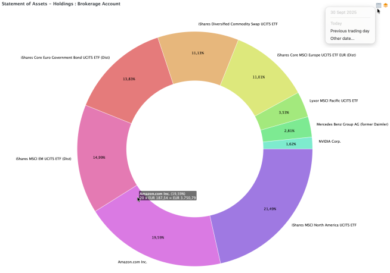

# 资产明细 &rsaquo; 持仓

持仓视图（菜单 `视图` > `资产明细` > `持仓`，或通过侧边栏）以环形图展示每项工具的价值——既可以是整个投资组合的，也可以是某个特定账户（例如 Brokerage）的。该图显示不同工具在总额中所占的比例，整个圆环代表 100%。

图： kommer.xml 中 Brokerage 账户的环形图。{class=pp-figure}

将鼠标指针悬停在环形图的某个扇区上，会显示该工具的以下详细信息：名称、百分比、份额数、当前每股价格，以及以投资组合货币计的总市值。若为现金账户，份额数固定为 1（见图 1）。

取值为负的头寸（例如余额为负的现金账户）不会显示。由于这些头寸被略去，所显示的百分比之和可能不等于实际总额。这种情况下会显示一条错误信息。

使用筛选图标 :material-layers-triple:（右上角），你可以显示整个投资组合或选定的账户组合（例如含或不含其关联现金账户的 Brokerage）。你可以创建新的筛选器、重命名或删除已有的筛选器。

投资组合时光机 :material-calendar-month: 图标让你回到任意选定日期，查看当时的持仓情况（见图 1，右上角）。

对于持有大量证券的投资组合，图表可能变得难以辨认，建议设置筛选器。
