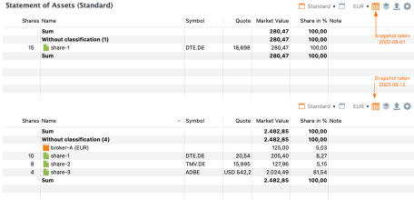
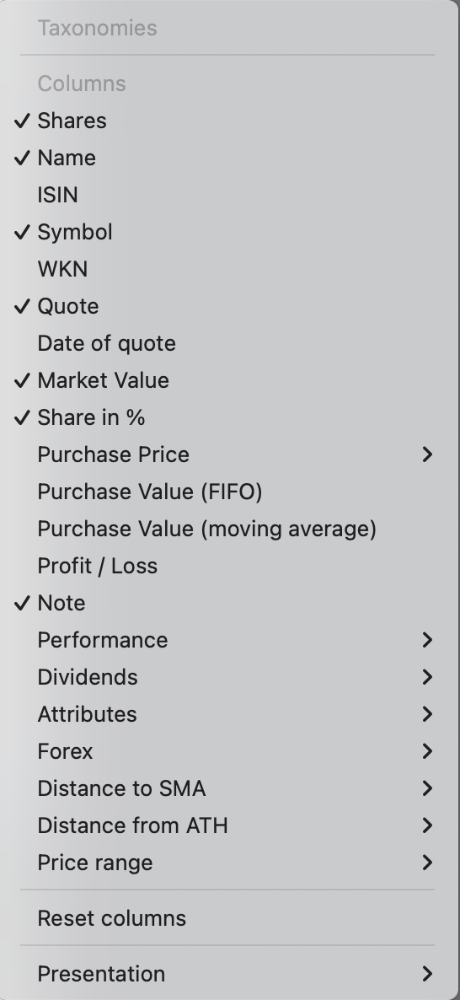
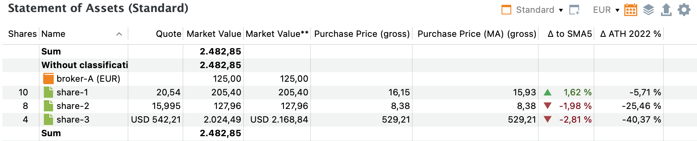
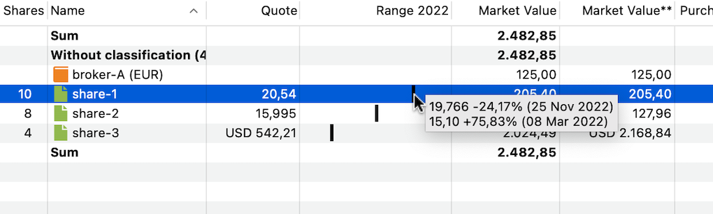

# 资产明细
**资产明细**报告提供你投资组合的各项资产（证券与账户）在*特定*时点上的快照。默认显示当天。不过，你可以通过右上角的日历图标进入 :material-calendar-month: 时光机，选择其他日期（见图 1）。

图： demo-portfolio-04.xml 的资产明细报告（两张快照）{class=pp-figure}

如图 1 所示，[`demo-portfolio-04.xml`](../../../../assets/portfolios/demo-portfolio-04.xml)的两张快照差异显著。在第一个快照日期，*仅*买入了 `share-1`，这意味着该证券占投资组合价值的 100%。到第二个快照时，该投资组合的所有账目都已完成，包括 `share-2`、`share-3`（以 USD 计价）的买入以及一笔股息付款。请注意，现金账户 `broker-A (USD)` 并未列出，尽管它确实存在。这是因为其余额为 0 USD。

## 工具栏 {#toolbar}

工具栏包含以下图标：:material-window-maximize:{.active}`标准视图`、:pp-view-plus: `新建视图`、EUR :octicons-triangle-down-16: `货币`、:material-calendar-month:{.active}`投资组合时光机`、:material-layers-triple:`筛选数据`、:octicons-upload-16:`导出数据`以及:gear:`列`。有关[详细说明](../../../../how-to/user-interface.md)，请参见用户界面一节。

- :material-window-maximize:{.active}`标准视图`：图 1 显示的是资产明细报告的`标准视图`，其中列出了 `份额`、`名称`、`证券代码`、`报价`、`市值`、`占比 %` 和 `备注` 等列。顶部和底部都会加上合计行。你可以通过添加或删除列、合计行来自定义这个`标准视图`。使用图 2 中的 :gear: `重置列`选项，可以恢复列的默认排布。要重命名、复制或删除当前视图，请点击视图右侧的三角形。如果你经常需要某种自定义布局，可以复制标准视图，为它取一个新名字，再按你的偏好进行定制。此外，还可以使用 `新建视图`按钮，基于默认设置创建新视图。

- EUR :octicons-triangle-down-16: `货币`：货币按钮上标注的是投资组合的基准货币（此处为 EUR），但你可以选择其他货币，即使投资组合中并没有以该货币计价的资产。所有计算字段（例如 `市值`）都会换算为所选货币。不过，报价价格仍保持其交易所在货币。

- :material-calendar-month:{.active}`投资组合时光机`：投资组合时光机图标让你设定计算中所用的日期。默认情况下，资产的 `市值`按当天 `今天`计算。你也可以选择 `前一交易日`，或从日历中选取的 `其他日期`。所选日期*不会*随视图一起保存。图 1 下半部分的报告显示 2023 年 9 月 12 日的全部可用资产，其中包括承载 `share-1` 卖出结果的现金账户。证券按前一日（即 2023 年 9 月 11 日）的收盘报价所对应的市场价格估值。`Share-2` 以 USD 计价，换算为 EUR 采用欧洲中央银行（ECB）提供的汇率（前一日收盘）。

- :material-layers-triple:`筛选数据`：此选项让你筛选计算中所用的资产。你可以选择整个投资组合、单个证券账户，或某个证券账户连同其关联的现金账户。此外，你还可以创建自定义筛选器，以选择其他账户。

- :octicons-upload-16:`导出数据`：表格（按所选列与行显示的样式）可导出为逗号分隔值 (CSV) 文件。

- :gear:`列`：此选项显示所有可用列（见下文）。当前可见的列在左侧以勾选标记标出。使用列表底部的显示选项（见图 2 底部），可以添加或删除合计行。默认设置为在*上方和下方*都显示合计。由于演示投资组合未添加任何类别，所有资产都列为 `未分类`。

## 可用列 {#available-columns}

图： 可用列。{class=align-right}

你可以用右上角的 :gear: 图标自定义默认列（见图 1）。默认显示的列是 `份额`、`名称`、`证券代码`、`报价`、`市值`、`占比 %` 和 `备注`。此外还有大量其他列/字段可用（见图 2）。虽然列标题大多不言自明，但其中少数几个可能需要进一步说明。

**买价与成本（FIFO 与移动平均）**

如[成本](../../../../concepts/purchase-value.md)一节所述，Portfolio Performance 使用先进先出 (FIFO) 方法计算价格与数值。不过"移动平均"也是另一种常用方法。例如在图 1 中，两种方法算出的买价略有差异（含税款与费用）：2023-09-12 为 16.15 EUR（移动平均）对 15.93 EUR（FIFO）；而在 2022-09-01 则没有差异（15.93 EUR）。为什么？让我们看看这些账目：

- 2021 年 1 月 15 日以每股 15.00 EUR 买入 10 份，总额 155 EUR（含费用与税款）。
- 2022 年 1 月 14 日以每股 16.00 EUR 买入 5 份，总额 84 EUR。
- 2023 年 4 月 12 日以每股 22.40 EUR 卖出 5 份，总额 105 EUR。

投资组合中剩余 10 份的买价是多少？

- *移动平均法*：最初 15 份的平均价格计算为 (155 + 84) / 15 = 15.93 EUR。剩余 10 份按此价格估值。
- *FIFO 法*：剩余 10 份由第一次买入的 5 份与第二次买入的 5 份组成。其总价值计算为 (155 / 2) + 84 = 161.5 EUR。因此 FIFO 平均价格为 161.5 / 10 = 16.15 EUR。

**盈 / 亏**

`盈 / 亏`字段表示（当前）`市值`与（先进先出）`成本`之间的差值。例如在图 1 中，`share-1` 的 `市值`为 205.40 EUR。剩余 10 份的 `成本`（FIFO）计算为 10 × 16.15 EUR/份，即 161.50 EUR。因此盈利为 43.90 EUR。

**收益与股息**

`收益`与`股息`下可用的字段在[单独一章](../performance/index.md)中讨论。

**属性**

借助 `属性`选项，你可以向表格添加自定义字段。这些字段在`左侧边栏 > 设置 > 属性：证券`或菜单 `视图 > 设置`及其后续面板中定义。你可以在某只证券的 `附加属性`面板中为该证券填写具体的属性值（例如参见[入门 > 添加证券](../../../../getting-started/adding-securities.md)中的图 3）

**外汇**

`外汇`（Foreign Exchange）选项让你查看每项资产报价所用的货币，以及它相对投资组合基准货币的汇率。标注为 `市值**`、`买价**` 和 `盈 / 亏**`（带双星号）的字段与上文中以基准货币表示的对应字段含义相同，只是以外币呈现。

例如，来看以 USD 交易的 `share-3`。在默认视图中，`市值`以 EUR 表示（图 1 下半部分为 127.96）。若想改用 USD 查看该数值，只需选择 `市值**`字段即可（见图 3）。

**距 SMA**

图： demo-portfolio-04.xml 的资产明细报告（市值 **、SMA 与 ATH）{class=pp-figure}

`距 SMA`是一项度量指标，用于衡量某只证券的当前价格与其在过去指定天数内的平均价格之间的差异。缩写"SMA"应指"简单移动平均"。

选择加入该列时，你还需要指定一个周期，例如 5 天、20 天、50 天或 200 天。假设你想知道 `share-1` 的 &Delta; to SMA5（5 天周期的距 SMA）。2023-09-12 之前可得的最后 5 个价格分别为：20.43、20.14、20.015、19.942 和 19.868 EUR/份。计算过程如下：

1. 计算最近 5 天的平均价格 = (20.43 + ... + 19.868)/5 = 20.10 EUR。
2. 计算今日价格与平均价格之差 = 20.43 - 20.08 = 0.33 EUR。
3. 将该差值除以平均价格并换算为百分比 = -0.33/20,43 = 1.62%。最后的价格比最近 5 天的平均价格高 1.62%。

**距 ATH**

`距 ATH`（历史最高）是一项类似的指标，显示报告期内最后一个价格与该期间最高价格相距多远。你必须在子菜单中选择该周期。例如，`share-1` 在 2022 年的最高价为 2022 年 11 月 25 日的 19,766 EUR。将鼠标悬停在该字段上，可以查看历史最高（ATH）的确切价格与日期。该期间最后一个价格为 2022 年 12 月 30 日的 18.638 EUR/份。因此 2022 年的 &Delta; ATH（即 2022 年的距 ATH）等于 (18.638 - 19.766)/19.766，即 -5,71%。

**价格区间**

图： demo-portfolio-04.xml 的资产明细报告（价格区间）{class=pp-figure}

对于该字段，你需要指定一个报告期，例如 1 年、2 年或 3 年，并可选择用时光机指定一个评估日期。

`价格区间`列显示当前价格相对于所选周期内某只证券的最高价与最低价的位置。不过，当前价格取决于所选的时间周期。

图 4 展示了 2022 年的价格区间，评估日期设为 2023 年 9 月 12 日（另见图 1）。此时，当前价格等于 2022 年最后一个可得价格/报价，例如 2022 年 12 月 30 日的价格。这并*不是*第三列中显示的报价价格，后者是时光机所设评估日期（如 2023-09-12）对应的价格。若选择更自然的周期（如 1 年），当前价格才会反映最近可得的报价。

将鼠标悬停在 `share-1` 的第一根（黑色小）横条上，会显示一个提示，说明价格区间的计算方式：
- 周期内最高价（历史最高）为 2022 年 11 月 25 日的 19.766 EUR。
- 周期内最低价为 2022 年 3 月 8 日的 15.10 EUR。
- "当前价格"为 18.638 EUR，即 2022 年 12 月 30 日的报价价格。

假设最高价与最低价之差代表 100%，当前价格相对于最低价的位置计算如下：

`(当前价格 - 最低价) / (最高价 - 最低价)`

本例中：

`(18.638 - 15.10) / (19.766 - 15.10) = 75.83%`

当前价格位于最高价与最低价之间区间的 75.83% 处。列中的黑色小横条确实位于列宽约 3/4 的位置。或者，你也可以计算当前价格距最高价有多远：

`(当前价格 - 最高价) / (最高价 - 最低价)`

本例中：

`(18.638 - 19.766) / (19.766 - 15.10) = -24.17%`

两个指数绝对值之和等于 100%。

## 多重图表 {#multiple-charts}

信息面板通常显示上面板中所选证券的图表。不过，你也可以显示多只证券（见图 5）。用 `Shift` 键选择相邻证券，或用 `Ctrl`（Mac 上为 `Cmd`）选择不相邻的证券。通过 :gear: `配置图表`图标添加的标记——例如股息、投资（买入、卖出）等——将不再显示，以保持图表清晰。

 图： 资产明细视图信息面板中的多重图表。{class=pp-figure}

 
