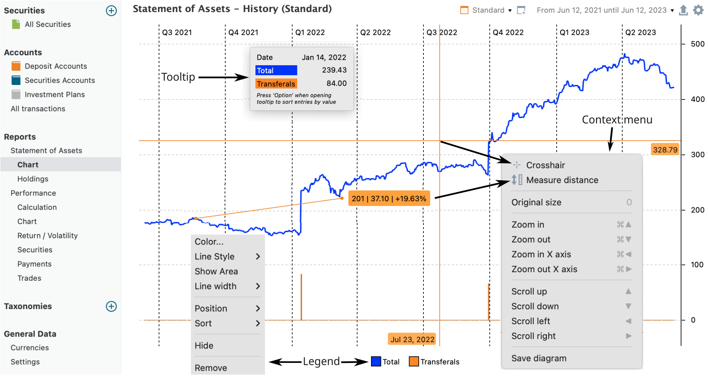
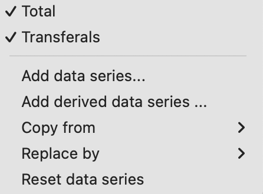
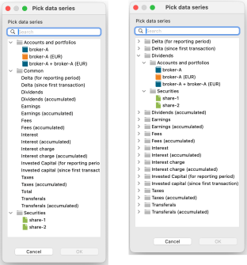

# 资产明细 &rsaquo; 图表

通过菜单 `视图 > 报告 > 资产明细 > 图表` 或侧边栏，你可以生成资产*价值*随时间变化的图形表示。它与另一个图表（`视图 > 报告 > 收益 > 图表`）相似，但后者显示的不是资产价值，而是随时间变化的*绩效*。

你可以用右上角的下拉菜单选择所需的报告期。默认可选 1 年、2 年或 3 年。此外，你还可以用 `新建`功能创建自定义时间期间，或用 `管理`功能管理已有期间；参见[报告期](../../../../concepts/reporting-period.md)中的说明。

默认的 `标准`视图的时间期间为 1 年，以黑色和灰色显示两个数据序列（合计与净存款；见下文），并让 y 轴从接近图表底部的零开始。上述所有特性都可以自定义。通常的做法是先用 `新建视图`按钮（右上角）创建一个新视图。这个新视图最初复制自默认的标准视图，你可以在其基础上按需定制。使用视图名右侧的下拉菜单，你可以复制、重命名或删除视图。若标准视图被删除，系统会以默认设置自动重新创建。

通过 `导出数据为 CSV`按钮，你可以把可见图表的数据导出为逗号分隔值 (CSV) 文件，或把图表导出为图片。:gear: 齿轮图标将在下文讨论。

## 坐标轴 {#axes}
x 轴表示时间。与[视图 > 报告 > 收益 > 图表](../performance/performance-chart.md)下的绩效图表不同，这里的时间序列始终按日显示。

y 轴显示你资产的总价值，以投资组合的默认货币计价。较大的数字会通过加上 'k' 或 'm' 来缩写，其中 1k 等于 1000 个投资组合货币单位，1m 为一百万。你可以用键盘方向键，或用上下文菜单在图中滚动（见图 1）。

- 按下键盘上的 :octicons-triangle-up-24: 向上方向键向上滚动，使视图偏移到更高的数值（例如图 1 中从 0–500 变为 100–600）；按下 :octicons-triangle-down-24: 向下方向键则移向更低的数值。
- 使用 :octicons-triangle-left-24: 向左方向键查看更早的时间段，使用 :octicons-triangle-right-24: 向右方向键查看更晚的期间。

使用方向键时按住 Ctrl（或在 macOS 上按住 :material-apple-keyboard-command: Cmd）可放大或缩小。

- Ctrl+向左方向键（:material-apple-keyboard-command: :octicons-triangle-left-24:）在 x 轴上放大（显示更细的时间段：年 > 季度 > 月 > ...）。Ctrl+向右方向键（:material-apple-keyboard-command: :octicons-triangle-right-24:）显示更粗的期间。

- Ctrl+向上方向键（:material-apple-keyboard-command: :octicons-triangle-up-24:）在 y 轴上放大。边界值（例如 0 - 500）会收缩为更小的数值（例如 100 - 400）。Ctrl+向下方向键（:material-apple-keyboard-command: :octicons-triangle-down-24:）在 y 轴上缩小，边界值随之扩展。

 你还可以用鼠标中键滚动来调整 y 轴的刻度。把鼠标光标停在图中希望放大或缩小刻度的垂直位置上。这对于放大图中的某个特定数据点很有用。

 按 0（数字零）键可将图表恢复到其原始刻度。

图： 演示投资组合总价值的图表。{class=pp-figure}

## 画布 {#canvas}

画布是一个或多个数据序列的图形表示。一个数据序列通常包含一组以表格形式呈现的成对数据点，例如日期及其对应的数值。默认显示两个数据序列：`净存款`（主要是存款）与`合计`（所有可能的数据序列说明见下文）。当你在画布上左击并在某一天（例如 2022 年 1 月 14 日）按住鼠标时，会弹出一个提示窗口，显示所选各数据序列在该日的详细数值。

在图表画布上右击会显示上下文菜单，提供更多选项（见图 1）。

- 十字准星：选择此选项后，左击画布会在图表上出现一个大的十字准星（见图 1）。原点设在点击时的鼠标位置。只要该选项处于激活状态，你就可以重新定位原点。十字准星便于更轻松地读取数据序列中某个点的确切数值。
- 测量距离：如果你想确定图表上两点之间在时间和数值上的确切差值，请选择此选项。在两点之间点击并拖出一条线。提示（例如 `201 | 37.10 +19.63%`）表示两点之间相差 201 天，数值增加 37.10 EUR 或 +19.63%。
- 原始尺寸：按 O（数字零）键会将图表恢复到最大可见状态，撤销此前所做的任何放大或缩小调整。
- 各种导航选项及其对应快捷键，例如放大、向上滚动等（见上文）。
- 保存图表：此功能可把*可见的*图表以 PNG 或 JPG 图片格式保存到你的计算机。

## 图例 {#legend}

在图例图标上右击（例如图 1 中的蓝色或橙色方块）会打开更多格式设置选项（见图 1）。对于所有类型的数据序列及其图例条目，你都可以修改 `颜色`、`位置`（向后移、移到最底层或向前移，以及置于最顶层）和 `排序`（A-Z 或 Z-A）。后两个选项会相应地按从左到右重新排列图例条目。对于像合计值这样的线型数据序列，你还可以调整 `线条样式`（实线、虚线、点线……）以及 `显示面积`选项（填充数据序列下方的区域）。此外，你还可以选择隐藏它（图例条目仍然可见但被划掉，数据序列不在图表上显示），或将其彻底移除（图例与数据序列都从图表中完全删除）。你也可以通过双击相应的图例图标来隐藏或显示某个数据序列。

## 配置图表 {#configure-chart}

图： 配置菜单。{class=align-right}

通过右上角的 :gear: 齿轮图标（见图 1），你可以看到图表中显示的数据序列，例如合计与净存款。某个数据序列一旦添加到图表中，它就会出现在该菜单中（见图 2），但会从可用数据序列列表中消失（见图 3）。

Portfolio Performance 还提供两个附加图表：绩效图表（位于 `视图 > 报告 > 收益 > 图表`）以及历史收益率与波动率图表（位于 `视图 > 报告 > 收益 > 收益率/波动率`）。`复制自`选项会把这些图表视图中的数据序列添加到当前图表。`替换为`选项作用类似，但会先移除已有的数据序列，再添加新的数据序列。

图表的实际数据通过 :gear: 菜单选项 `添加数据序列 ...` 和 `添加派生数据序列 ...` 来配置。数据序列是一组成对数据点，例如日期与投资组合总值。派生数据序列则由原始数据序列计算或推导而来，例如 `投入资本`、`税款与费用`、`股息`等。这些派生数据序列列在图 3 的右侧面板中，以及标题 `通用`之下（左侧面板）。

借助 `账户与投资组合`选项，你可以选择显示特定的账户组合，例如*证券账户* `broker-A`、*现金账户* `broker-A (EUR)`，或二者的组合。在图 2 底部还提供了单只证券的列表。选中合适的选项并按住 Ctrl（Cmd）可添加更多选择。一旦你添加了某个数据序列，它就不再出现在图 3 的可用数据序列列表中，但会在齿轮菜单中被勾选。你可以在齿轮菜单中取消勾选，或通过删除图例条目（见上文说明）的方式，把数据序列从图表中移除。

图： 数据序列（左）与派生数据序列（右）。{class=pp-figure}

借助 `账户与投资组合`选项，你可以选择显示特定的账户组合，例如证券账户 `broker-A`、现金账户 `broker-A (EUR)`，或二者的组合。在图 2 底部，你还可以选择单只证券。按住 Ctrl（Cmd）可添加更多选择。一旦你添加了某个数据序列，它就不再出现在图 3 的可用数据序列列表中，但会在齿轮菜单中被勾选。你可以在齿轮菜单中取消勾选，或通过删除图例条目（见上文说明）的方式，把数据序列从图表中移除。

请注意，派生数据序列在图 3 的左右两个面板中都可获得。不过，左侧面板中的数据始终代表整个投资组合，而右侧面板则允许细分为各个组成部分。例如，左侧面板中的费用反映投资组合内支付的所有费用，而在右侧面板中，还可以按来源账户或证券拆分。

- Delta（针对报告期，或自首笔账目以来）表示某项资产的价值从报告期开始到结束、或从首笔账目到期末的变化量。该 Delta 会围绕零上下波动，例如在首个账目日 delta 为零。关于[报告期](../../../../concepts/reporting-period.md)一章说明了，投资组合的估值可能因所选`报告期`而异。

- 股息、收入（= 股息 + 利息）、费用、利息、利息支出和税款都有累计版本和"单次实例"版本。例如，"单次实例"的股息会显示为一个尖峰，而累计版本则显示一条随着股息累积而稳步上升的曲线。这些字段在[账目](../../../transaction/index.md)中有说明，并作为每笔账目的一部分被记录。

- 投入资本（针对报告期，或自首笔账目以来）："投入资本"一词指投资者为购买各类证券（如股票、债券或其他金融工具）所使用的资金总额。它包括证券的初始买入价、随时间发生的追加投资，以及费用、税款等其他因素……

- 合计：随时间估值的投资组合总价值。

- 净存款（单次实例与累计）：每一笔存款或取款，无论是存款/取款还是证券转入/转出，都会在账目发生当日显示为一个小尖峰（正或负）（单次实例）。累计版本则以块状图呈现，显示所有存款与取款随时间变化的累计净值。
