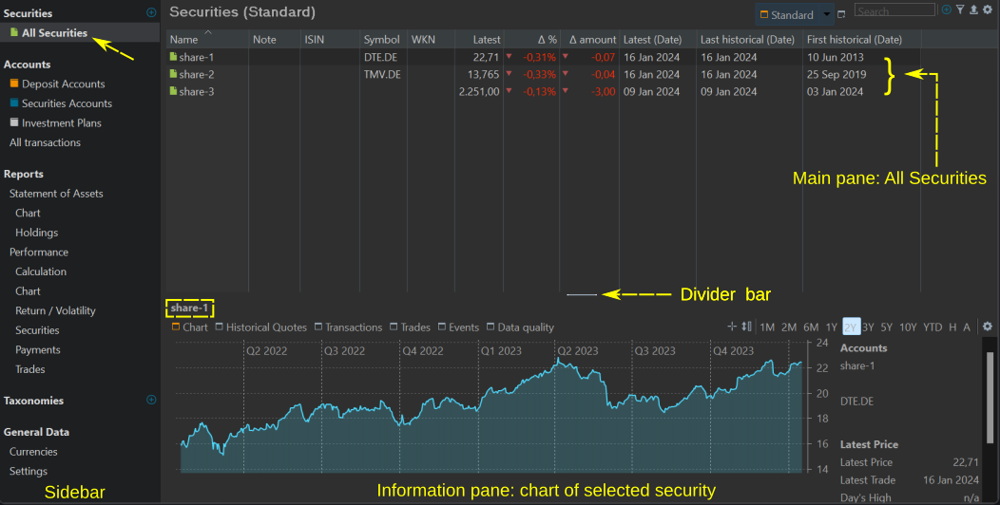
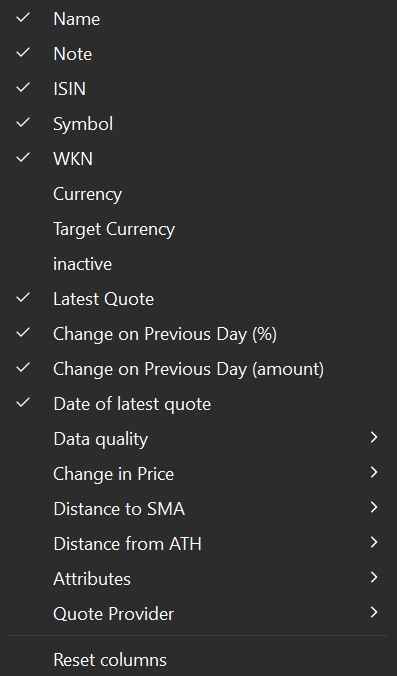
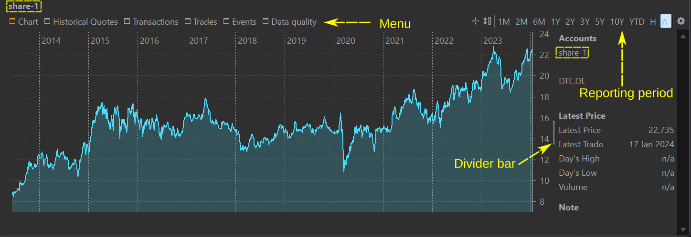
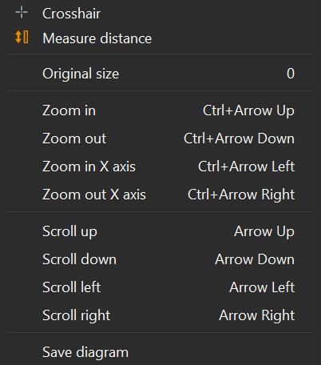
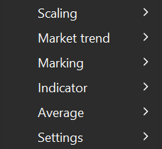
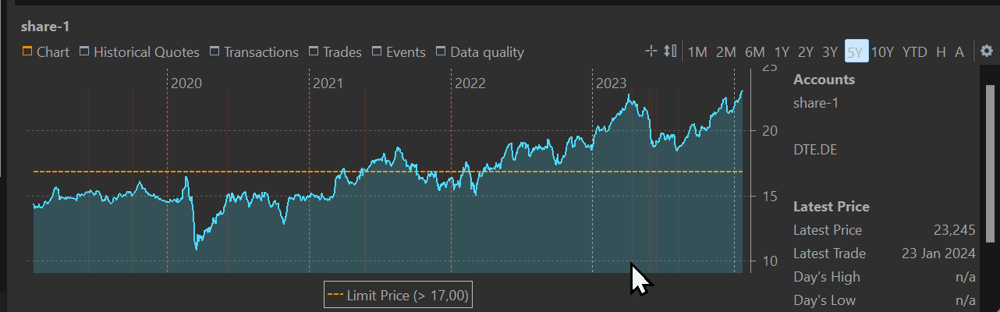
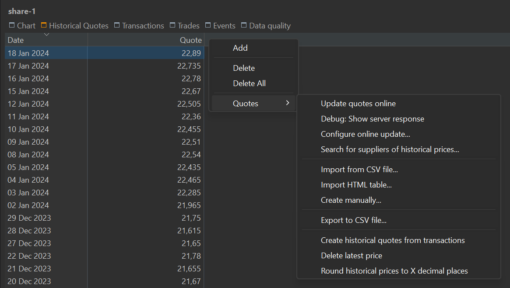

顾名思义，该列表包含你正在监控（&ne; 已买入）的所有证券。要查看当前在投资组合账户中的证券，请前往 `报告 > 资产明细`。

图： 查看全部证券。{class=pp-figure}

此视图包含两个面板。主面板是所有可用证券的列表。你可以选择多个证券，但其中只有一个可以处于激活状态。信息面板显示激活证券的图表。

## 主面板：全部证券列表 {#main-pane-list-all-securities}

图： 所有可用列。{class=align-right style="width:30%"}

主面板本质上是一张列出所有可用证券的表格。点击列标题可按该列对表格排序。你可以拖动列标题来重新排列任意一列。拖动两列之间的分隔线可调整左列的宽度。你可以用上下文菜单（在列标题上右击）重命名或隐藏某一列。添加、删除或把列重置为原始布局，可用 `显示或隐藏列`图标（右上角的齿轮符号）完成。默认的列显示在图 1 中；它们在图 2 中也有勾选标记。图 2 给出了所有可用列的清单。

各列的定义与简要说明请参见[术语表](../../../concepts/portfolio-performance-terminology.md)。请注意，列标题有时与字段名称不同，例如 &Delta; 额；此外有若干字段被归入同一个类别，例如数据质量。

图 1 所示为 `标准`视图。视图会记录可见的列、列宽、列标题以及表格的排序顺序。点击按钮旁的三角形图标，可以访问复制、重命名或删除当前视图的选项。

如果你经常需要某种自定义布局，可以复制标准视图，为它取一个新名字，再按你的偏好进行自定义。新建的视图会放在标准视图的右侧。你也可以使用 `新建视图`按钮（搜索框左侧）基于默认设置创建新视图。

通过搜索框你可以筛选可见证券的列表。例如，在搜索框中输入 "DE" 只会显示 share-1 和 share-2，因为它们的股票代码中包含字符串 "DE"。

筛选图标用作更细分类的筛选器。可用选项有：仅已启用投资品、仅已停用证券、仅证券、仅汇率、持仓 ≠ 0、持仓 = 0，以及证券：超过限价。对于最后一项，你需要在投资组合的[设置](../general-data/settings.md)（菜单 `视图 > 设置`）中新建一个类型为"限价"的属性。然后你就可以把这一列添加到表格中并填入数值。

当前视图下显示的表格可以导出为 CSV 文件，保留行列数量及其（自定义的）列标题。

通过拖动分隔条，你可以调整主面板的大小，使其变大或变小。你甚至可以把它扩展到占满整个画布，或把它完全隐藏。鼠标悬停时分隔条会显现出来。

## 信息面板 {#information-pane}

信息面板默认显示激活证券（即主面板中最后选中的那个证券）的图表（参见图 3）。每当选中不同证券时，该图表都会更新。

图： 主面板中激活证券的图表。{class=pp-figure}

### 图表菜单 {#chart-menu}

`图表菜单`被选中时会变为橙色，并显示激活证券的折线图。在图表右侧会显示该证券的详细信息，例如股票代码、最新价格等。通过竖直分隔条，你可以缩小或扩大该区域，以显示更多或更少的图表内容。把分隔条一路拖到最右侧即可完全隐藏此区域。鼠标悬停时分隔条会显现出来。

通过报告期菜单，你可以设定图表的时间跨度，从 1 个月 (1M) 到 10 年 (10Y)。该跨度始终是从今天往回推相应时长。图表的 x 轴可细分为月份 (1M、2M 和 6M)、季度 (1Y 和 2Y)、2 个季度 (3Y) 或年份 (5Y 和 10Y)。你还可以选择 YTD（年初至今）选项，即从今年 1 月 1 日直到今天。选项 H 代表该证券的完整持有期（即从买入日期直到现在），而 A 表示"全部数据"，即从第一条到最后一条历史报价。

如果在图表上点击并按住，可以查看该时刻证券的日期和价格。若还有附加标记，例如份额数或简单移动平均 (SMA) 之类的时间序列，它们也会一并显示。要按数值对这些条目排序，可以按住 Alt 键点击。

点击报告期菜单的第一个图标（十字准星）会在图表上方显示一个大的十字准星。原点 (0,0) 位于鼠标点击的位置。纵轴会揭示 x 轴上的位置或确切日期。横轴会显示该证券当天的历史价格。

 
通过第二个图标（测量距离），你可以确定图表上两点之间的确切天数。它还会显示两点之间历史价格的差值及相应的百分比。

图： 图表的上下文菜单。{class=align-right style="width:20%"}

这两个选项也可以通过上下文菜单访问（在图表上右击）。

- 原始尺寸：将图表恢复为所选时间跨度的默认状态。数字 0 在此处用作快捷键。 
- 放大/缩小：在 y 轴上显示更多细节（放大）或更少细节（缩小）。缩放可以通过快捷键或鼠标中键滚轮完成。
- 放大/缩小 X 轴：显示更精细（放大）或更粗略（缩小）的时间刻度
- 上移、下移、左移、右移：在 y 轴上向上（上）或向下（下）移动，或在 x 轴上移向更早的时间（左）或更晚的时间段（右）
- 保存图表：允许你把图表保存为 PNG 或 JPG 格式的图片。

图： 配置图表（齿轮图标）。{class=align-right style="width:15%"}

通过配置图表图标（右上角的齿轮），你可以在图表上设置众多附加数据。图 5 显示的是折叠后的视图。

- 尺度（适用于 y 轴）
    - 线性：线性刻度间距均匀，刻度上每一个单位代表相同的数值差。
    - 对数：对数刻度的数值间距并不恒定。每一级代表 10 的一个幂次增长，例如 1、10、100、1000。该刻度把大跨度压缩成更易观察的视觉呈现，并突出相对变化。

- 市场趋势：会显示一条额外的水平轴。
    - 市场趋势线：图中会加上一条额外的水平参考线，它在 Y 轴上的交点为所选报告期的第一条报价。此线作为参考点，使你能够把图中各个价格与这一初始报价作比较。历史价格落在市场趋势线之下的区域会被浅色填充，以强调相对于报告期首条报价而言表现较差的部分。
    - 市场趋势 vs. 成本：这条额外的水平轴与该证券的买价水平相交。 
- 标记：可以在图表上加入附加符号，以传达特定信息或突出关键数据点。
    - 买卖：买入（证券转入）与卖出（证券转出）账目分别以绿色向上三角形和红色/橙色向下三角形标记。
    - 份额：图中叠加一条附加的阶梯线，描绘任一时点所持的份额数。 
    - 股息：股息在图上以一个小的蓝色矩形表示。鉴于股息通常只占市场价的一小部分，该标记的位置非常靠近 y 轴的原点。
    - 事件：事件说明列于图表底部，与相应日期对齐。此外，图中在每个事件对应的日期处还会显示一条小的竖直虚线。
    - 高/低：在该证券达到最高或最低报价的位置，图表中会分别加入一个绿色向上箭头（高）和一个红色向下箭头（低）。
    - 成本 (FIFO)：图中叠加一条粉色阶梯线，表示该时刻的[成本](../../../concepts/purchase-value.md)。成本按先进先出法计算。
    - 成本 (移动平均)：与 FIFO 方法类似，图中会加入一条粉色阶梯线，展示各时刻的成本。不过此时计算方法遵循[移动平均](../../../concepts/purchase-value.md)原则。 
    - 显示限价：在启用此选项之前，须先新建一个限价类型的[证券属性](../general-data/settings.md#attributes-securities)。你还应把该属性作为[附加属性](../../file/new.md#security-master-data)添加到你的证券中。例如输入限价 `> 17`（见图 6）。17 这个数值处会出现一条橙色水平条。

        图： 带限价指示的图表。 {pp-figure}

        

- 指标
    - 布林通道：由三条带/线组成——上轨线、中轨线和下轨线——绘制在价格图表上。中轨线（虚线）是该证券价格在指定周期内的简单移动平均 (SMA)。上轨线和下轨线分别是价格相对中轨线的 +1/-1 标准差。
    - MACD：即[指数平滑异同移动平均](https://www.investopedia.com/terms/m/macd.asp)。它是一种常用的动量指标，用于分析证券价格趋势的强度和方向。
- 平均
    - 简单移动平均 (SMA)（5、20、30、38、50、90、100、200 天）：对每一个时点计算 SMA，并绘制在图表之上。
    - 指数移动平均线 (EMA)（天数同上）：SMA 在计算中对所有数据点赋予同等权重，而 EMA 对较新的价格赋予更高权重、对较旧的价格赋予更低权重。这使 EMA 对近期的价格变化更为敏感。
- 设置
    - 显示标记线：当标记功能启用时（如上文所述），图表上会以相应的颜色显示一条竖直标记线，标记值显示在该竖线旁边。
    - 显示数据标签：或者，当数据标签激活时，标记值直接显示在标记符号旁边，而不是放在竖线旁边。 
    - 显示缺失交易日：启用此选项会在历史报价缺失的正常营业日位置画上小的竖条（例如参见图 6）。
    - 百分比刻度 (次要)：在图表左边界处添加一条新的 Y 轴。该刻度以百分比表示，初始买价设为 0%。
    - 辅助线 (报价)：如果次要百分比刻度可见，虚线水平线可以对齐主报价轴（此选项），也可以对齐次要百分比轴（下一个选项）。
    - 辅助线 (百分比)：此选项与上一个选项应启用其一。启用此选项时，虚线水平线按百分比水平对齐。

### 历史报价 {#historical-quotes}

信息面板中的历史报价菜单显示一张两列表格，展示主面板中所选证券的日期和报价（见图 6）。点击列标题可按该列以升序或降序排列表格。你可以通过拖动列标题来重新排列各列。

双击日期或报价即可修改其数值。更改日期时请小心，因为新的报价会覆盖该日期已登记的任何报价。

使用"导出数据为 CSV"功能（右侧图标）可把整张表格保存为 CSV 文件。上下文菜单（右击）提供各种管理选项。

图： 信息面板中历史报价的上下文菜单。{class=pp-figure}

- 添加：此选项让你输入该证券的日期及相应报价。你可以为任何有效日期添加报价，甚至可以是未来的日期。

- 删除：要删除一行或多行，请先做选择。若要连续选择，点击第一行，按住 Shift，再点击最后一行。若要非连续选择，请使用 Ctrl 键。利用上下文菜单删除所选的行。

- 删除全部：此命令移除表格中所有历史报价。请注意此操作无法撤销。

- 报价：此标题下隐藏着若干附加选项（见图 6）。其中许多选项也可以从其他上下文（例如菜单）中执行。

    - 在线更新报价：[菜单 `在线 > 更新报价（所选证券）`](../../online.md#update-quotes-no-instrument-selectedxxx-instruments-selected)的快捷方式。
    
    - 调试：显示服务器响应：如果该证券已关联到某个在线数据提供方，你可以查看来自该服务器的 HTTP 响应。
    
    - 配置在线更新...：此选项会显示"证券"属性表单，并选中"历史报价"标签页；见 [`文件 > 新建`](../../file/new.md#historical-quotes)。
    
    - 搜索报价提供方...：显示 [`文件 > 新建`](../../file/new.md)向导的第一步。
    
    - 从 CSV 文件中导入...：此命令等同于 [`文件 > 导入`](../../file/import/csv-import.md)菜单。CSV 文件必须至少包含两列。
    
    

    - 导入 HTML 表格...：此选项让你导入一份在网页上找到的历史报价表格。文中给出了一些示例（见图 7）。 {#import-html-table}
        
        图： 从历史报价上下文菜单导入 HTML 表格。 {class=pp-figure}

        

        例如，前往 [https://www.finanzen.net/historische-kurse/nvidia](https://www.finanzen.net/historische-kurse/nvidia)。你也可以在该网站首页搜索该证券。输入起始日期、结束日期和一个交易市场。NVIDIA 在 XETRA 上市。点击 Suchen（搜索）。在表格上右击，并从上下文菜单中选择 View Page Source（查看网页源代码）。将全部内容复制并粘贴到 PP 中。   
    - 手动创建...：此命令与上文的 `添加` 选项相同。

    - 导出至 CSV 文件...：此命令与`导出`按钮（右上角）相同。

    - 从账目中生成历史报价：如果某证券存在账目（买入或卖出），与这些账目相关的报价价格可以并入历史价格。账目价格优先，并会覆盖该日期上任何已存在的历史报价。

    - 删除最新报价：

    - 将历史报价约至小数点后 X 位：把 99.994 这样的数值约到两位小数时，结果为 99.99，而 99.995 则会进位为 100.00。请记住，不可能把一个数约到比原先更高的精度。例如，试图把前一个数约到四位小数，并不会改变该数。

