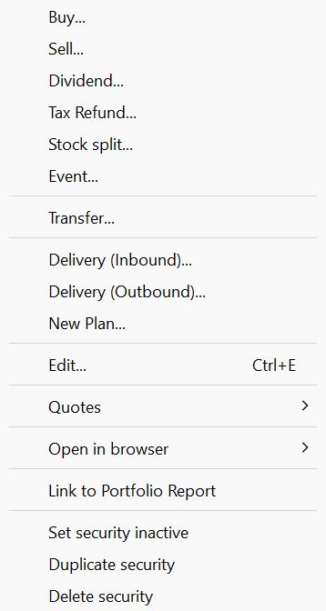
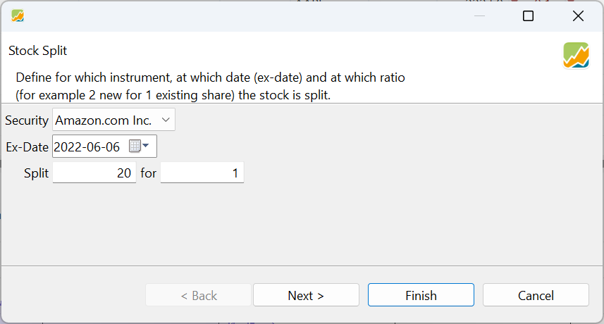
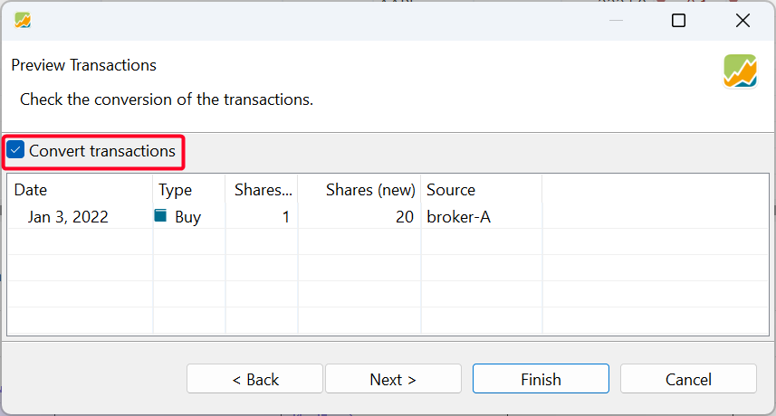
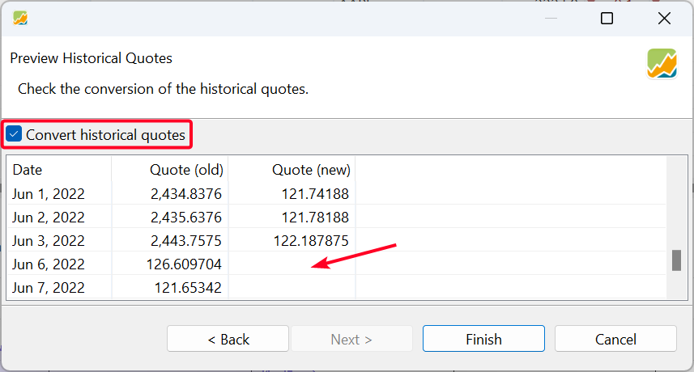
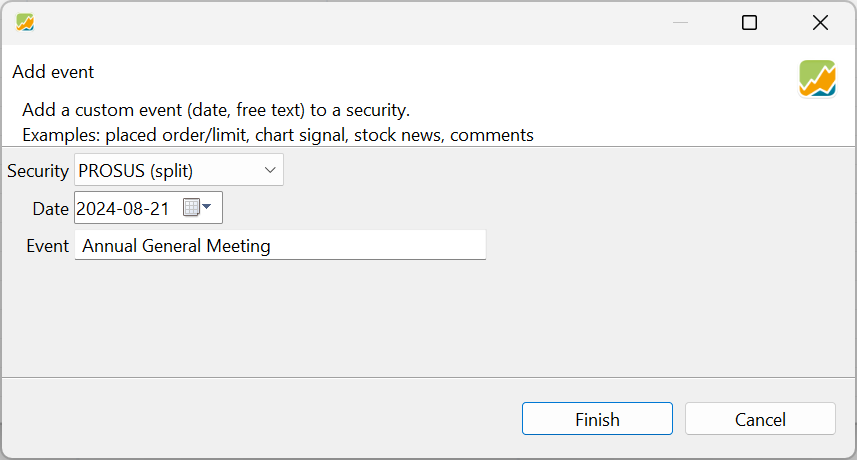
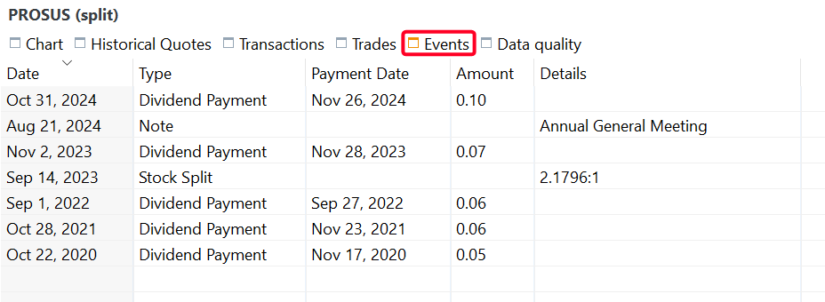

图： 所选证券的上下文菜单。{class=align-right style="width:30%"}

证券的上下文菜单包含若干在 `视图菜单`中不可用的附加选项。通过选中某个证券或某个证券视图（例如证券账户）并右击，即可访问该上下文菜单。此时会弹出一个如图 1 所示的菜单。菜单项买入、卖出、股息、退税款、证券转入与证券转出在[账目菜单](../../transaction/index.md)中已有。事件等其他菜单项则可在其他视图中访问。

## 其他章节已有说明 {#documented-elsewhere}

有若干菜单项同样出现在其他菜单或视图中，并且已在文档的其他章节中说明。
- 买入、卖出、股息、退税款、证券转入、证券转出在[账目菜单](../../transaction/index.md)中出现并已有说明。
- 转账项以略有不同的标签 `转移证券...` 出现，同样位于[账目菜单](../../transaction/index.md)中。
- 投资计划...在侧边栏菜单 账户 > 投资计划 中有涵盖，并在[参考 > 视图 > 账户 > 投资计划](../../view/accounts/investment-plans.md)中有说明。

## 分股... {#stock-split}

分股是一种公司行为，公司借此增加或减少其流通在外的股份数量，同时保持公司的总市值不变。在**正向**分股中（例如 5 拆 1），股份数量增加，每股价格按比例下降。在**反向**分股中（例如 1 拆 5），股份数量减少，每股价格按比例上升。无论属于哪种类型，投资者持仓的总价值保持不变。

例如，到 2022 年初，Amazon 的股价已升至每股约 3,000 USD，这一价格对大多数投资者而言过高（见图 2）。为此，Amazon 批准了一次 20 拆 1 的分股，于 2022 年 6 月 6 日生效。在这次分股中，公司原有的每一股被拆为 20 股新股，每股新股价值为原股价的二十分之一。

图： Amazon 的历史价格。{class=pp-figure}

由此得到的历史价格图表（见图 2）既不好看也难以解读；例如，2023-2024 年股价上涨了多少并不清楚。Portfolio Performance 目前处理分股的方式与大多数金融服务机构相同，但这种做法存在一些缺点（见[论坛讨论](https://forum.portfolio-performance.info/t/aktiensplit-buchen/11758)）。其实质是追溯性地假定股份*一直*都是拆分后的状态。以前述 20 拆 1 分股为例，2022 年 6 月 6 日之前的历史股价被调整为原值的二十分之一，同时账目中的股份数量乘以 20；这就在此切断了与纸质凭证上*真实*数字的关联。更多详细信息和背景，请参阅[操作指南 > 记录分股](../../../how-to/recording-stock-split.md)。

选择分股选项会启动一个向导，引导你通过三个步骤完成分股。在**步骤 1**中，你选择证券，并定义分股日期和分股比例。

如果证券尚未填入，可以使用下拉菜单选择。除权日（生效日）是交易所首次以调整后价格交易拆分后股份的日期。例如在 Amazon 分股的情形中，除权日为 2022 年 6 月 6 日。此外，你还需要指定分股比例，例如 20 拆 1。反向分股则是 1 拆 20。值得注意的是，这些比例也可以是小数。

图： 分股向导 - 步骤 1。 {class=pp-figure}

**步骤 2**会显示此次分股对每一笔账目（买入、卖出、转入）的影响。结果是，你所持的股份数量会按分股比例发生变化。你可以跳过此步骤，取消勾选 `转换账目` 选项以保持账目不变。如果不存在任何账目，此步骤不会产生任何影响。

如图 2 和图 4 所示，在 2022 年 1 月 3 日（分股日期之前）只有一笔买入 1 股的账目。因此，在默认勾选 `转换账目` 的情况下，从 2022 年 1 月 3 日起你的账户中会有 20 股。

历史价格可以在下一步中调整。

图： 分股向导 - 步骤 2。 {class=pp-figure}

**步骤 3**会显示转换后的历史价格。如果你不希望更改历史价格，请取消勾选 `转换历史报价`。需要特别注意的是，只有分股日期之前的价格会被改变；例如报价（新）。分股之后的价格自然会由交易市场自动正确调整。

这种转换只是简单的算术。例如，6 月 3 日的旧价格为 2443 USD。新价格将是 1/20，即 122 USD。

图： 分股向导 - 步骤 3。 {class=pp-figure}

在历史价格的图表视图中，底部带分股比例的一根小竖线会标示分股。通过 :gear: 菜单 `配置图表 > 标记 > 事件` 可以切换这根竖线的显示。你也可以在下方面板的"事件"标签页中删除该事件；见[事件](./all-securities.md#chart-menu)。这会移除图表中的标记，但**不会**从账目和历史价格中移除该分股。

图： 分股向导的结果 (Amazon)。 {class=pp-figure}

请注意此图表与图 2 的差别。2023 年和 2024 年的上涨清晰可见，而 2022 年 6 月 6 日之前的价格与调整后的价格相衔接。例如，2022 年 1 月 3 日以约 3,400 USD 买入 1 股的那笔买入账目，如今显示为买入 20 股、每股约 170 USD。

## 事件 {#event}

事件是一种备注，可以在特定日期附加到某个具体的证券上。它们可以显示在该证券的历史价格图表上。分股或股息公告发生时，系统会自动插入事件以作标记，但事件也可用于重要的股票新闻。

在执行分股操作或发布股息公告时，事件会自动生成。此外，你可以通过证券的上下文菜单（见图 1）或信息面板"事件"标签页中的上下文菜单，创建自己的自定义事件备注。

图： 添加事件。 {class=pp-figure}

创建自定义事件时，你需要提供证券名称（从下拉列表中选择）、日期和自由文本。这段文本可以相当长，但由于它会显示在图表上，建议保持简洁——几个字即可。

除了出现在历史价格图表上，你还可以为所选证券在信息面板的"事件"标签页中查看与该证券有关的所有事件（见图 8）。

图： 事件类型。 {class=pp-figure}

事件表格包含五列：`日期`、`事件类型`、`付款日`、`金额`和`详情`。事件类型包括：
- `分股`：在分股操作后自动生成（见[上文](context-menu.md)）
- 股息公告：自动获取自（详见操作指南 > 股息公告）的网络服务。
- `备注`：手动创建的自定义备注（见上文）。

使用事件表格中的上下文菜单（右击），你可以删除一个或多个选中的事件。要编辑事件，必须双击 `日期`或`详情`字段。其他字段不可编辑。

