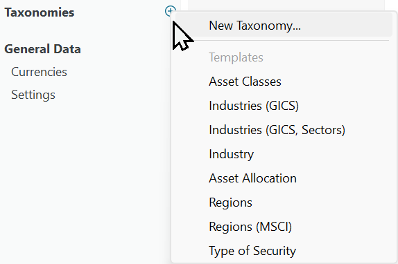

图： 添加类别模板。{class=align-right style="width:50%"}

类别是一种对投资组合中的投资进行归类与评估的工具。这一分类体系构建了一个框架，帮助你更好地理解投资的构成，并据此做出明智的决定。

类别通常按共同特征对证券分组，例如行业、板块、地理区域、市值或资产类别。以这种方式组织投资，你可以更容易地发现风险与机会，例如在某个板块中占比过高或过低。

Portfolio Performance 提供若干预定义且广为人知的类别或模板。你也可以创建自己的自定义类别。

- **资产类别**：区分以下类别：现金、权益、债券、房地产和商品。

- **行业（GICS）**：全球行业分类标准（GICS）由 MSCI 与 S&P Dow Jones Indices 合作制定。它包含 11 个板块（例如信息技术）、24 个行业组（例如软件）、69 个行业（例如 IT 服务）以及 158 个子行业（例如 IT 咨询）；见[网站](https://www.msci.com/our-solutions/indexes/gics)。

- **行业（GICS，板块）**：此模板仅涵盖 GICS 的顶层板块分类（见上文）；不含行业组等。

- **行业**：另一种行业分类，包含建筑业、生物技术、化学、能源等诸多板块。

- **资产配置**：划分为无风险资产（例如现金账户）与风险资产。后一类进一步细分为区域，例如美国、西欧等。

- **区域**：纯粹的地理分类，分为欧洲、美洲、亚洲、非洲和大洋洲，并列出各个国家。

- **区域（MSCI）**：MSCI 区域类别区分发达市场（澳大利亚、奥地利、比利时……）、新兴市场（巴西、智利、中国……）以及前沿与独立市场（阿根廷、巴林、孟加拉国……）

- **证券类型**：区分股票、股票型基金、交易所交易基金 (ETF)、债券、股票期权、指数和货币。

上述每个类别都可以按你的投资需求进行自定义。要做出修改，请使用右键菜单添加或删除条目。此外，你还可以双击某个类别的名称来重命名它。 
