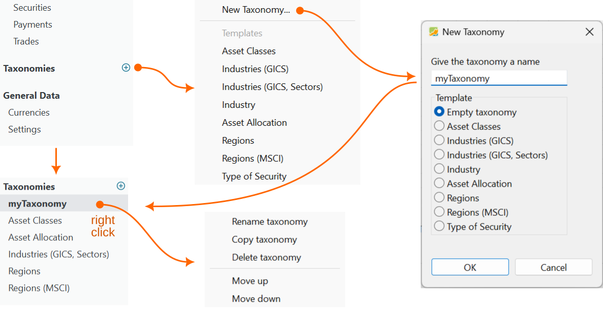
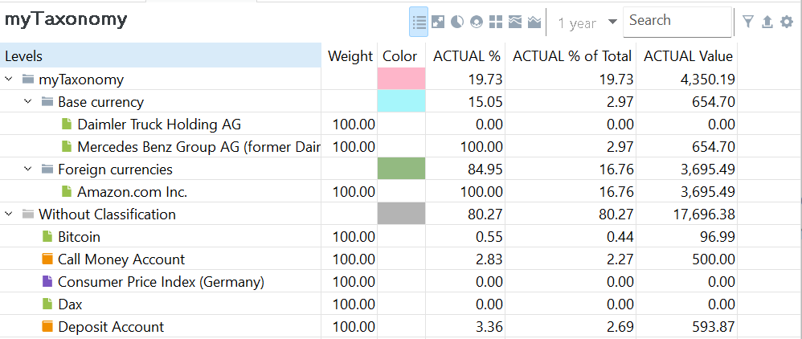
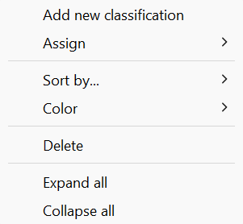

新建投资组合时，侧边栏中初始不显示任何类别（见图 1 左上角）。理论上，可添加的类别数量不受限制。不过在多数情况下，两三个类别就足够了。这些类别不仅会列在侧边栏中，也会列在 `视图` 菜单中。

图： 添加类别。{class=pp-figure}

## 添加新类别 {#adding-a-new-taxonomy}

点击绿色加号按钮 :octicons-plus-circle-16:，或使用 `文件 > 新建 > 类别` 菜单，即可为你的投资组合添加一个新类别。随后你可以使用某个[预定义模板](index.md)，或者创建一个新类别（见图 1），该新类别可以基于现有模板之一。如果想从零开始、自行定义所有类别与子类，请选择 `空白类别`。为新类别取一个有说明性的名称。两个类别可以同名，这当然不是理想做法。点击 `确定` 即可把该类别加入侧边栏。

类别列表的右键菜单允许你重命名、复制或删除已有类别。你还可以使用 `上移` 或 `下移` 选项重新排列列表中条目的顺序。

## 编辑类别 {#editing-a-taxonomy}

从侧边栏列表中选定某个类别后，其结构会显示在主面板中（见图 2）。主面板包含两个可展开的列表：一个是已分配资产的列表，它通常（但不总是）与该类别同名（例如 "myTaxonomy"）；另一个是未分配资产的列表，标记为 `未分类`。第一个列表包含各类别与子类及其已分配资产，初始时可能为空。第二个列表包含尚未分配到任何类别下的证券和现金账户，按字母顺序排列。

图： 类别的主面板。{class=pp-figure}

在图 2 中，两个列表都处于展开状态。`myTaxonomy` 列表包含两个类别 `基准货币` 与 `外部货币`，并已分配相应的证券。`未分类` 列表包含所有未分配的证券。请注意，你**可以**把同一项证券分配到多个类别。但各项权重之和应达到 100%。

图： 右键菜单。{class=align-right style="width:20%"}

如果你选择的是空白类别，必须先添加类别和子类，然后才能把证券分配给它们。使用 `添加新分类` 右键菜单创建新的分类（见图 3）。如果选中了某个子类，新的分类将创建在该子类内部。只需把类别拖放到新位置，即可重新排序。要删除选中的类别或列表，请使用右键菜单。

选中的列表可按以下方式排序：`类型与名称`、`类型与实际价值`、`名称` 或 `实际价值`。如图 2 所示，每个类别都分配了一种颜色，可以通过右键菜单更改。

要展开某个类别列表，请点击它左侧的 :fontawesome-solid-angle-right: 图标，该图标会变为 :fontawesome-solid-angle-down: 图标。点击向下的箭头即可折叠列表。要一次性展开或折叠所有类别，请使用右键菜单并选择 `全部展开` 或 `全部折叠`。 

## 添加证券 {#adding-securities}

类别用于把资产划分到不同类别中，从而让你作为投资组合管理者，清晰地理解投资组合的结构。为此，必须把证券添加到相应的类别与子类中，或将其分配过去，这类似于给文档添加标签以便分组。

证券可以通过三种方式分配到某个类别：

- **拖放**：从上方的类别中“未分类”列表里选中证券，将其拖到正确的类别或子类。如果某个类别处于折叠状态因而不可见，把证券拖到父类别上方时，该类别会以浅蓝色背景和下方一条黑线高亮显示。稍后片刻，该类别会自动展开。随后你就可以把证券放入所需类别中，或重复此过程以进行更深层的归类。如果你的类别中包含许多类别和／或资产，事先展开整个类别可能更高效。

- **右键菜单**：在你的类别中右键单击某个类别，从右键菜单中选择 `分配`。随后会显示可用资产的列表，你可以从中选择要分配给该类别的证券。

图： 证券数据窗口中的类别面板。{class=align-right style="width:50%"}

- **编辑证券**：此方法仅适用于证券，不能用于指数和现金账户。在证券出现的任意视图中右键单击该证券，既可以是 `未分类` 列表，甚至也可以是 `全部证券` 视图。从右键菜单中选择 `编辑`。在 `类别` 标签页中，你可以把该证券添加到一个或多个类别中。如图 4 所示，Daimler Truck 证券被添加到若干预定义类别中，同时也被添加到我们新建的 MyTaxonomy 的 `基准货币` 类别下。更多信息见[参考手册 > 文件 > 新建](../../file/new.md#taxonomies)。
