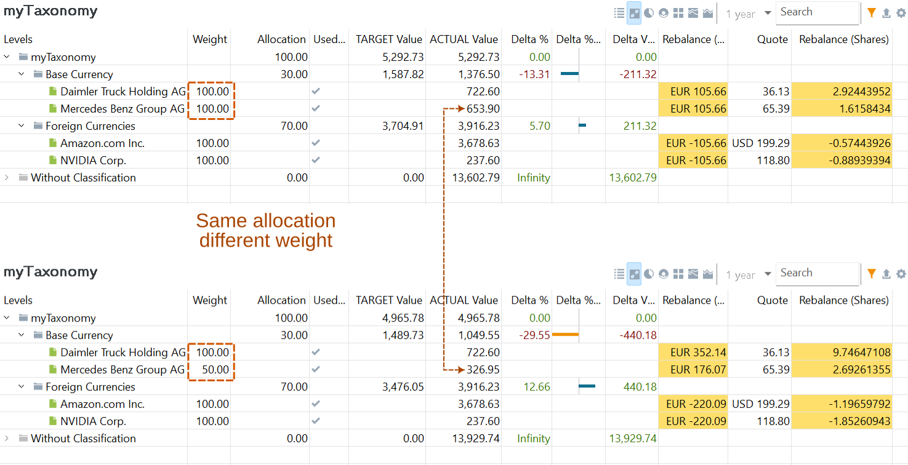
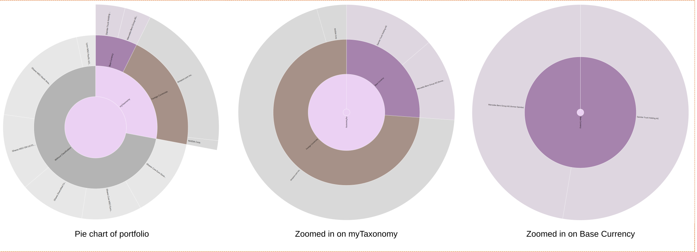
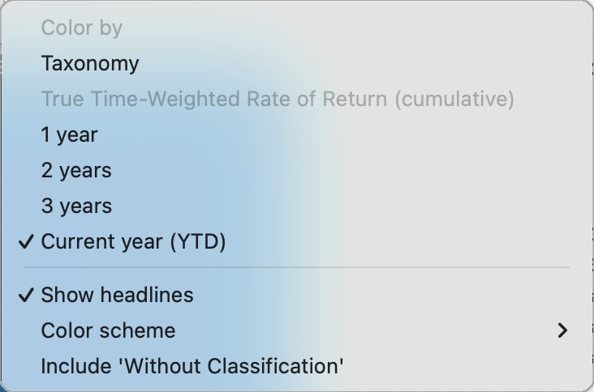

从侧边栏或视图菜单中选定某个类别后，分类情况就会显示在主面板中。表头包含标准数据图标、搜索框、报告期选择器以及七个显示选项。

图： 类别的主面板。{class=pp-figure}

## 定义视图 {#definition-view}

默认情况下，定义视图显示一张含五个字段的表：

- **权重**：权重表示某项证券可对其总价值贡献的比例或百分比。权重为 100% 表示所有证券都计入总价值的计算。此字段用于 `调整` 视图。

- **颜色**：每个类别会自动分配一种颜色。你可以使用右键菜单更改该颜色。

- **实际价值**：某项证券在当天的市值。对于一个类别而言，这是分配到该类别的所有证券市值之和。例如，截至 2024-07-08，Daimler Trucks 的市值为 20 股 x 36.36 EUR = 727.20 EUR，Mercedes 为 10 股 x 65.47 EUR = 654.70 EUR。因此该类别的总价值为 727.20 EUR + 654.70 EUR = 1381.90 EUR。请注意，`myTaxonomy` 中有相当数量的未分配证券。外部证券（例如 Amazon）按基准货币计算。

- **实际占比**：某项证券或类别相对于其上一级父类别的百分比。例如，Daimler 的 727.20 EUR 占其上一级父类别 `基准货币` 中价值的 52.62%。`基准货币` 类别的 1381.90 EUR 占最高层级类别 `myTaxonomy` 的 27.98%。

- **占总价值比例**：某项证券或类别相对于投资组合总价值（含已分配与未分配证券）的百分比。例如，`基准货币` 类别的 1381.90 EUR 仅占投资组合总价值的 6.25%。

使用数据图标 :gear:，还可以添加其他字段：类别键、代码、ISIN、备注、外汇（汇率、实际价值**）、预期收益率以及属性。`实际价值 **` 是该证券以原始货币表示的价值，不作任何折算。

:material-upload: 图标 `导出数据为 CSV` 会把屏幕上显示的表保存为 CSV 文件。

默认情况下，表中包含整个投资组合。使用 :material-filter: 图标，你可以把结果限定为仅显示价值不为零的证券与类别，或仅显示处于活跃状态的账户／证券。结果也可以限定为可用的证券账户，可选择是否包含各自对应的关联现金账户。

如果表格很长，可以使用搜索框。例如，区域（MSCI）类别相当详细。若要查找来自墨西哥的股票，通常需要逐级展开（双击）新兴市场 > 美洲 > 墨西哥。搜索框提供了更快捷的替代方式。

定义视图给出的是当前类别状态的一个快照。因此，报告期（默认为 1 年）呈灰色不可用。只有堆叠柱状图和堆叠面积图会利用报告期中的时间信息。

## 再平衡视图 {#rebalancing-view}

再平衡是一种策略，把已经偏离目标资产配置的投资组合重新拉回正轨[[维基百科](https://en.wikipedia.org/wiki/Rebalancing_investments)]。任何类别（例如行业或区域）都可以作为目标资产配置的基础。不过通常你会使用自己的分类方式。
图： 再平衡视图。{class=pp-figure}

再平衡过程的第一步是为每个类别输入目标 `配置` 比例，以及每项证券的 `权重`。

- 配置：某类别中每个子类在父类别内所占的目标百分比。一个类别内各项配置之和必须始终等于 100%。
- 权重：某项证券可对其总价值贡献的比例或百分比。权重为 100% 表示该证券的全部价值都用于计算其实际贡献。把权重设为 50% 意味着该证券只有一半的价值计入其实际价值。把权重设为 0% 则把该证券从类别中移除，移入 `未分类` 列表。

再平衡过程会根据配置比例和投资组合总价值，计算出每个类别的目标价值。如果实际价值与目标价值存在偏离，系统会算出差额（差值），然后根据权重确定类别内每项证券应增加或减少多少。

例如，`myTaxonomy` 的总价值为 5292.73 EUR，其中基准货币占 1376.50 EUR，外部货币占 3916.23 EUR（！）。然而基准货币类别应占总价值的 30%，即 1587.82 EUR。因此目标价值与实际价值之间相差 -211.32 EUR（-13.31%）（见图 2）。

要对这个子类进行再平衡，你需要卖出证券。Daimler 与 Mercedes 的权重均为 100%，因此你需要在每项证券上各卖出 105.66 EUR。这大约相当于 2.9 股 Daimler 和 1.6 股 Mercedes。

比如说，如果把 Mercedes 的权重设为 50%，其实际价值将降至 336.95 EUR（而不是 653.90 EUR），基准货币子类的实际价值将降至 1049.55 EUR（而不是 1376.90 EUR）。在这种情况下，差值将为 440.18 EUR。考虑到只有 50% 的 Mercedes 可供卖出，这可以通过卖出 9.7 股 Daimler 和 2.6 股 Mercedes 来实现。

## 饼图 {#pie-chart}

图： 投资组合饼图及放大视图。{class=pp-figure}

图 3 中表示整个投资组合的饼图显得简单而不完整，因为并非所有证券都在 `myTaxonomy` 中被分配到了类别。从图 1 可以推断，约有 28% 的证券已被分配，以紫色扇区表示。

点击饼图的某个扇区，可以放大显示该部分。图 3 中间的第二个饼图显示 `myTaxonomy` 内的各类别，例如基准货币与外部货币。第三个饼图则专门聚焦于 `基准货币` 类别。

## 圆环图 {#donut-chart}

图： 投资组合圆环图。{class=pp-figure}

圆环图表示类别的筛选结果，因此它是图 1 中 `占总价值比例` 字段的图形化呈现。使用 :gear: 图标，你可以选择是否包含 `未分类` 类别。 

## 树状图 {#tree-map}

树状图是一种用矩形来可视化数据的图表。每个矩形代表一项证券，矩形的大小与该证券的市值相对应。与圆环图类似，树状图反映的是证券的价值。不过在树状图中，百分比是由矩形的面积而非扇区来表示的。每个类别也以不同颜色加以区分。与圆环图一样，你可以选择是否包含 `未分类` 类别。

图： 投资组合树状图。{class=pp-figure}

图： 树状图的齿轮菜单。{class=align-right}

使用 `:gear:` 图标，你可以选择图表的基础配色方案（见图 6）。可选方案有：`绿-黄-红`、`绿-白-红`、`绿-灰-红`、`蓝-灰-橙` 以及 `黄-白-黑`。矩形的实际颜色可由证券的 `类别` 决定，也可由证券的收益表现决定。

选择 `按类别着色`，即为类别的每个类别分配不同颜色。或者选择 `按时间加权收益率 (累计) 着色`，依据证券的 TTWROR 表现来着色。对于该选项，你还需设置 `报告期`（例如图 5 中的本年度至今 (YTD)）。收益表现为负的证券，其色调更接近配色方案中的第三种颜色；收益表现为正的证券则更接近第一种颜色。图 5 中使用的是 `蓝-灰-橙` 配色方案。

分组后证券的（子）类别名称，例如 `商品`，可以使用 `显示标题` 选项添加。

将鼠标悬停在某项证券上时，会在树状图下方显示 `类别路径`。例如在图 5 中，鼠标位于 Mercedes 股票上方，显示出的路径从 `资产配置类别 > 风险组合部分 > 西欧 > Mercedes Benz Group AG` 开始。

你可以左键单击图表中相应的矩形来放大某个特定类别。例如，在 `kommer.xml` 示例中选择菜单 `视图 > 类别 > 资产配置`，只会显示两个类别：`风险型` 与 `无风险组合部分`。在图 5 中，被点击的是 `风险型` 类别，展开后可见 `美国／北美`（含 iShares 与 Amazon）、`新兴市场资产` 和 `西欧` 等子类。

## 堆叠柱状图 {#stacked-chart}

图： 投资组合堆叠柱状图。{class=pp-figure}

堆叠柱状图是一种以一系列彩色线条显示数据的图表，每条线代表一个类别。线条在 y 轴上的位置对应于该类别的累计价值。这些线条相互堆叠，以显示所有类别合计的总价值，即 100%。默认情况下，类别按由大到小堆叠，最大的类别位于图表底部。可以使用 :gear: 图标调整堆叠顺序，让线条按数值大小堆叠，或按其在类别列表中的位置堆叠。

堆叠柱状图和堆叠面积图都在 x 轴上绘制时间，由所选的报告期（默认 = 1 年）确定。

## 堆叠面积图 {#stacked-area-chart}

图： 投资组合堆叠面积图。{class=pp-figure}

堆叠面积图的 y 轴表示不同类别随时间变化的实际货币价值。与堆叠柱状图类似，它显示的是各堆叠类别的累计价值。但与堆叠柱状图中数值加总为 100% 不同，堆叠面积图显示的是各类别随时间变化的实际货币金额。
