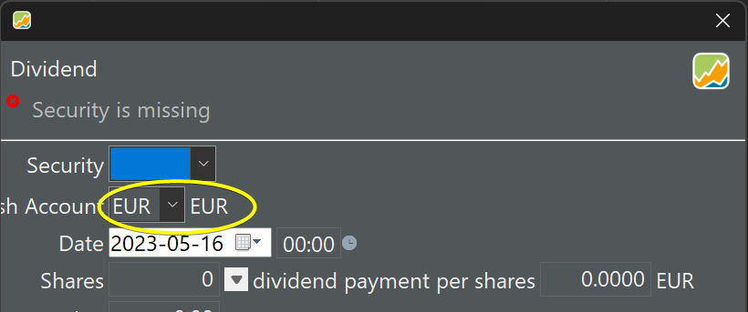

## List of known issues, todo's, questions and suggestions

### 2023-09-10 (issue)
Some screenshots contain text fields that are not aligned (see figure below). These misalignments can occur in title boxes, buttons, labels (Windows 11).



This issue seems to be related with the changing of the default font (`Help > Settings > Presentation > Formatting > Font size`). Setting it to 9px (Default) removes the issue.

### 2023-09-10 (question)[solved]
Images are stored in a subdirectory of the one where the md file resides.
``` 
concepts
   account.md
   images
      pic1.png
```
What is the correct way to reference this image?

```
1.
2.
```

(1) seems to work, both in the texteditor (VSCode) and the website. However, the path at the website is `` (1) is used at this moment.

(2) does not show the image in the texteditor preview but appears normally on the website. (2) is also needed is referencing the img in HTML.

### 2023-09-13 (suggestion implemented)

The mkdocs material frontmatter can contain several key-value pairs. It seems that only the title is taken into account for the material theme.

The frontmatter could contain other valuable info (already implemented)

- lastUpdate: YYYY-MM-DD
- todo: info about things todo on this page.

### 2023-09-16 (question)
Upon creating a security, you can specify a Calendar in the Security Master Data.

(1) What is this calendar used for?. According to the tooltip: These dates will affect some calculations, the display of price gaps and the execution of saving plans.  Which calculations? Does it matter for performance calculations?

(2) The content of these calendars is visible in `Help > Preferences > Calendar`. Can this be changed? Custom calendar?

(3) What's the difference between the `Apply` and `Apply and close` in the panel `Help > Preferences > Calendar`. Necessary?

### 2023-09-16 (question)[solved]
At the moment there is a top-level menu item called "Tips & tricks". Isn't this too informal? Replacing with "Advanced topics"?

Also the top-level item "Common procedures" may seem too generic. Other suggestions?

### 2023-09-17 (info)
Images are added with mkdocs plugin [MkDocs Caption](https://pypi.org/project/mkdocs-caption/). This plugin will put the image within a Figure HTML-element and will add a caption based on the Alt-field (between brackets). This caption will be auto-numbered as Figure 1, Figure 2, ...

Some customizations are possible. Still need to figure out how to style a right-aligned image. The author has fixed the problem to give a custom class to the figure-element. Styling is now easy.

Before I used the markdown extension [markdown-captions](https://github.com/evidlo/markdown_captions)

### 2023-09-18 (info)
There was a question about a kind of styleguide for the PP manual. Maybe we can use the APA styleguide as reference. For example, the caption of a figure should be placed on top of the figure with label Figure 1. Normally the caption itself should be at the next line in bold or italic.
Partially implemented it with the mkdocs-caption plugin.

### 2023-09-19
There should be a small but representative example portfolio on which the manual is based. This example could start from (real/anonymised) bank notes for representative securities:

- shares (EUR, GBX and USD to illustrate exchange rate and GBX). Which companies should we choose? Bayer, Nvidia, Rio Tinto?
- bonds: ?
- funds: something that should be available on morningstar, Robecco?
- trackers/ETF: tracker for gold?
- other?

Historical prices from different sources should be available. The purchase could start in 2020, january. Between then and now there should be events: such as (partial) sell, buy more, dividend payment, choice dividend (DRIP?), split, merger, other?

The example portfolio must be small and comprehensible for a beginner.

Other requirements?

### 2023-09-23
How to manage images for the EN-site? At the moment, the images were saved close to the chapter/folder they belong, e.g. concepts/images, getting-started/images, ... The naming convention was: page-name + image-description, where page-name is the page where the image is used: `irr-example-performance-reporting-period-1y.png`

Another approach is to collect all images of the EN-site into one folder en/images. Because there will be a lot of images, a workable naming convention should be followed.

path-to-image-from-UI + image-description

The name for the above example should be:
`sb-reports-performance-1yr_irr-example.png` (sb stands for sidebar)

### 2023-09-27
Upgraded to the newest versions:
mkdocs == 1.5.3
mkdocs-material == 9.4.2
mkdocs-caption == 0.0.9

### 2023-09-28 [solved]
Refering to a header in another page doesn't seem to work. For example: 
[convert](deposit.md#transferbetweentwocurrencies) will jump to the correct page but not the header. The TOC extension is activated.

### 2023-09-30
Issue source code?
The Note field of the dialog box Delivery (Inbound) and Buy differ in size, although they should be the same. The currency selector for the delivery panel is also too long (see images\mnu-transaction-delivery-vs-buy.svg).

### 2023-10-03
The text about bonds.md still has a few open questions. Asked for feedback on the >English forum.

### 2023-10-06
The "Statement of Assets" contains three acronyms: MA, SMA and ATH. Difficult to find any info about them.

The acronym MA (moving average) might be better translated as WA (weighted average). With a one-time calculation, there is no "moving" average. This probably is OK for the graph. SMA stands for Simple Moving Average, where "simple" refers to the fact that it is not weighted? Same problem with moving as above.  ATH stands for All-Time High. This seems correct.

### 2023-10-23
The option "Adjust range: 0" in reports > chart.md is not understood nor described.
Earnings: dividends + Interests? or something more? 

In the Pick Dataseries dialog (Reports > Chart > Gear) the option Taxes (accumulated) is present, but Taxes alone is missing (is present for Fees, Dividends, Interests).

### 2023-11-06
Suggestions from Flywire.
Adding the Last Update date in the front matter is indeed duplicating Git functionality. Replaced it with mkdocs-git-revision-date-localized-plugin. This plugin will add "Last update: localized date" at the bottom of each page.

In-depth text and video about writing good documentation: [https://documentation.divio.com/](https://documentation.divio.com/)
PP handbook should be structured around 2 axes (practical vs theoretical and useful for learning vs useful for working).
This gives 4 chapters: Tutorials (practical-learning), How-to (practical-working), explanation (theoretical-learning), and reference (theoretical-working).
The current structure goes in the right direction: getting-started = tutorial, common procedure and tips & tricks = how-to, basic concepts = explanation.
The section reference seems to be missing.

### 2023-12-16
Spending a few weeks trying to describe the performance indicators IRR and TTWROR.
Also restructured the manual according to the principles of divio.com (see above).
Historical prices: many of the presets don't seem to function?

### 2024-01-19
- context menu Historical Quotes (bottom panel All securities) - import HTML table: examples refer to the German website of onvista and Fianzen.net dialog. The first link (onvista) needs a selected security in the top panel that exists on onvista; otherwise null exception. Similar with finanz.net. Pasting the source code also doesn't seem to work.
- A lot of the functionality under the Quotes submenu (see above) is the same as other options; for example create manually is the same as the Add option just above.

### 2024-01-22
- menu View > Currencies > Currency converter:
    - convert USD-->SEK will be calculates as  USD --> EUR --> SEK?
    - table has two columns Exchage rate and Value. The value column has an awkwardly looking border
    - if you click and hold on a value of the graph a pop-up shows the exchange rate. Holding and moving the mouse to the left or right will go in the past or future (for example 2035-01-01) where no exchange rates exist.

### 2024-02-25
- Menu Help > Preferences > Backups > Automatically ... (*.backup.xml). Although the text says ...xml, the file is backup in the format of the saved one (for example binary).

### 2024-02-29
- importing dividends with different currencies is not intuitive concerning the requirement of Gross Amount and the check between value and Exchange Rate (see file > import > dividends)
- specifying the content of a sample-portfolio.xml (cfr kommer.xml)

### 2024-03-14
- changing the page heading and moving menu item About to the right of the menu bar.
- All Transactions view: the last column = "Source"? As in Quote Feed Source?

### 2024-03-22
- The transaction list of a deposit account will NOT color the text of the notes in green/red. In all transactions and other lists, they are colored.

### 2024-05-31
- For share-1, the historical quotes in security master data are set to "No automatic quote download". Then, a few historical prices are added manually (not for every day in the holding period). In the chart view, PP displays some unexisting prices; it seems that some kind of linear estimation is used. (observed while working on system-overview.md). Solved by deleting latest price in context menu. After that however, the option isn't any longer available.

### 2024-07-08
- Field Category key in Definition view of Taxonomies?
- Expected return? This row is currently not used in the calculation ....

### 2024-10-05
- with missing historical prices: the line in the chart between the two known prices is "misleading" (increasing or decreasing) in stead of staying at the last known historical price. For example, two known prices (100 & 200 EUR at jan 1, 2023 & 2024), the line for the year 2023 is increasing from 100 to 200, even though (I think) the price that is taken for calculations in that period is the last known price, e.g. 100 EUR.
- File > Save as > XML with "ID" attributes? Comparing the file contents reveal that to som sections (e.g. <accounts> <account id="2">) an ID is added. In the comments: "New: Alternative XML format that uses “id” attributes for references (and is therefore easier to read/manipulate by other programs)". Example? Which programs?
